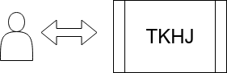
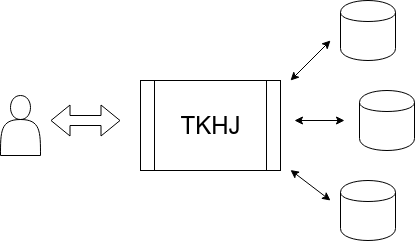
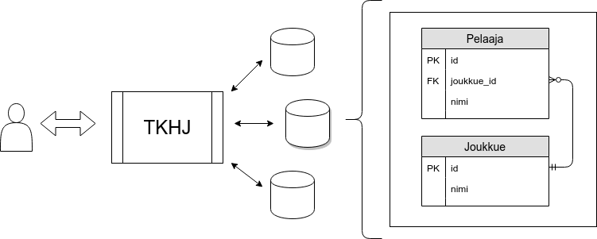

<text-box variant='learningObjectives' name='Oppimistavoitteet'>

- Tiedät esimerkkejä ohjelmistoista ja järjestelmistä, jotka käyttävät tietokantoja.
- Tunnet termit tietokannanhallintajärjestelmä, relaatiotietokanta, tietokantataulu, pääavain ja viitevain.

</text-box>

<quiznator id="5c3c44b5ddb6b814af31df5d"></quiznator>

Olemme tietoisesti ja tiedostamattomasti kytköksissä lukemattomiin järjestelmiin. Kotien sähkön- ja vedenkulutusta seurataan elektronisesti, lehti- ja palvelutilaukset tehdään digitaalisiin järjestelmiin, säätiedot tulevat automaattisesti mobiililaitteeseen, suurin osa kommunikaatiosta tapahtuu sähköpostitse tai pikaviestinten kautta, kaupat seuraavat varastosaldojen kehitystä automaattisesti ostosten perusteella, sairaaloilla on sähköiset potilasrekisterit, yritykset tarjoavat räätälöityjä palveluita digitaalisen käyttäytymisen perusteella, ja niin edelleen.

Lähes jokainen edellämainituista järjestelmistä ja palveluista perustuu tavalla tai toisella tiedon keräämiseen ja tallentamiseen. Sähkön- ja vedenkulutuksesta jää historia, jota käytetään laskutuksessa sekä kulutuksen ennustamisessa. Lehti- ja palvelutilaukset tallennetaan järjestelmiin, jotka muunmuassa automatisoivat laskutuksen, ja joiden kautta voidaan suositella vastaavia sopivia tuotteita. Sähköpostit ja pikaviestinviestit säilyvät tyypillisesti ainakin lähettäjällä ja vastaanottajalla, jonka lisäksi esimerkiksi pikaviestinpalveluita tarjoava operaattori voi tallentaa viestit omalle palvelimelleen mahdollista tulevaa käyttöä varten. Kauppojen varastosaldojen kehityksen perusteella voidaan optimoida sisäänostoa ja tätä kautta pienentää hävikkiä sekä toisaalta vähentää tavaroiden varastointiin menevää tilaa. Potilasrekisterit sisältävät mm. hoito- ja rokotehistorian, jolloin lääkärin on helpompi toimia yllättävissä tilanteissa.

<quiznator id="5c39c988c41ed4148d966f23"></quiznator>

Tällaisia palveluita kehitetään jatkuvasti. Alla olevalla videolla on kuvattuna yhdysvaltalaisen ruokajätin Tescon toimintaa Etelä-Koreassa. Tesco muutti ruokatoimijoiden pelikenttää luomalla digitaalisia ostosmahdollisuuksia mm. kaupunkien metroasemille. Tuotteiden tilaaminen ja maksaminen tapahtuu kännykällä, ja tuotteet toimitetaan tilaajan kotiin.

<youtube id='hGKoW-ouQlY'></youtube>

Tässä palveluiden siirtymisessä ja kehittymisessä sähköiseen muotoon on kyse **digitalisaatiosta**.  Digitalisaatio on tietoteknisten menetelmien ja sähköisessä muodossa olevan tiedon hyödyntämistä ja kehittämistä yksilöiden, yhteisöjen, yritysten ja yhteiskunnan toiminnan edesauttamiseksi. Tämä sisältää mm. tiedon perusteella tapahtuvaa liiketoimintamallien ja asiakaspalvelukokemusten kehittämistä, työn automatisointia ja virtaviivaistamista sekä uusien innovaatioiden luomista ja yritysten toiminnan parantamista.

**_Digitalisaation ytimessä on kyky tiedon sähköiseen käsittelyyn ja hallinnointiin._**

Vaikka moni palvelu kerää tietoa palveluiden käyttäjistä ja siirtää toimintaa sähköiseen muotoon, ei käyttäjien tietojen kerääminen ole itseisarvo. Arvoa voi tuottaa käyttäjille sekä yritykselle myös muilla tavoilla. Alla olevalla videolla on esimerkki eräästä IKEAn tuotteesta: IKEA on digitoinut (eli siirtänyt sähköiseen muotoon) tuotteiden tietoja sekä tehnyt tuotteistaan kolmiulotteisia malleja, jolloin niiden tuonti osaksi sovelluksia on suoraviivaista. Alla kuvattu tuote tarjoaa käyttäjille mahdollisuuden tarkastella miltä IKEAn tuote näyttäisi kotona.

<youtube id='vDNzTasuYEw'></youtube>

**Tietokantojen perusteet** -kurssilla keskitytään tiedon ymmärtämiseen sekä sen tallentamiseen ja hakemiseen. Puhekielessä termillä **tietokanta** tarkoitetaan yleisesti ottaen tiedon tallentamiseen tarkoitettua paikkaa, josta tietoa voi myös hakea. Esimerkiksi kirkonkirjat voidaan nähdä eräänlaisena sukujen historiaa dokumentoivana tietokantana, jonka kautta sukututkija pääsee käsiksi sukunsa historiaan. Vaikka tietokannat ovat digitalisaation myötä siirtymässä paperisesta muodosta sähköiseen muotoon, on niiden tavoite pysynyt pitkälti samana: _Haluamme säilöä tietoa ja haluamme päästä tähän tietoon käsiksi_.

Tietokannat ovat kaikkialla oleva -- ubiikki -- ilmiö. Tämä kurssimateriaali sijaitsee tietokannassa, kurssitehtäviin liittyvät pisteet kirjataan tietokantaan ja kurssin suoritusmerkintä kirjataan tietokantaan. Kännykässäsi on todennäköisesti kymmeniä erilaisia tietokantoja; yhteystiedot, kalenteri, herätyskello, aikavyöhykkeet, karttapalvelut, suosikkiverkkosivut, ym.

Tietokannat voivat olla paikallisia, eli ne voivat sijaita samalla koneella tietokantaa käyttävän ohjelmiston kanssa, esimerkiksi kännykässä, tai ne voivat sijaita erillisellä palvelimella, johon otetaan tarvittaessa yhteyttä. Loppukäyttäjän näkökulmasta tietokannan konkreettisella sijainnilla ei ole juurikaan merkitystä, sillä haetun tiedon näkee tyypillisesti käytössä olevan sovelluksen käyttöliittymän kautta. Mikäli tietokantaan ei saada yhteyttä, tietokantaa käyttävä sovelluskaan ei mahdollisesti käynnisty.

## Esimerkki tietokannasta: Hiski

Tässä kohtaa on hyvä hetki käydä tutustumassa muutamaan tietokantapalveluun. Osoitteessa <a href="http://hiski.genealogia.fi/hiski/" target="_blank" norel>http://hiski.genealogia.fi/hiski/</a> on Suomen Sukututkimusseuran ylläpitämä Historiakirjojen hakupalvelu. Käy sivulle, valitse kieli, etsi "Kaikista", ja valitse "Kastetut".

Kokeile minkälaisia tuloksia löydät omalla etunimelläsi? Entä, minkälaisia tuloksia löydät nimillä Matti ja Maija? Palvelu pyrkii muunmuassa sisällyttämään läheiset nimien muunnokset hakutuloksiin, sillä nimet muuttuvat ajan myötä.

<quiznator id="5c39cf13c41ed4148d966f2e"></quiznator>

### Tiedon tallentamiseen ja hakemiseen liittyviä haasteita

Olemme harjoitelleet ohjelmointikursseilla tiedostoon kirjoittavien ja tiedostosta lukevien ohjelmien tekemistä. Ohjelmointikursseilta muistamme, että mikäli ohjelman käyttämää tietoa ei tallenneta tiedostoon -- joka on tietokoneen pysyväismuistissa eli kovalevyllä -- ei tietoa ole olemassa ohjelman tai koneen uudelleenkäynnistyksen jälkeen.

Tiedon tallentamisessa sekä tiedon hakemisessa on muutamia ydinkysymyksiä ja ongelmakohtia. Nämä ovat seuraavia.

* **Tietoturva**. Keillä on pääsy tietoon? Onko käyttäjillä erilaisia oikeuksia ja onko tiedon kirjoittaminen rajattu vain tietyille käyttäjäryhmille? Minne tieto tallennetaan -- onko sijainti Suomessa vai jossain muualla? Miten yhteys tietokantaan suojataan? ...

* **Suorituskyky**. Miten tiedon hakeminen, tallentaminen ja päivittäminen toteutetaan tehokkaasti? Entä jos tietokannalla on samanaikaisesti satoja tai tuhansia käyttäjiä?

* **Eheys**. Miten säilyttää tiedon eheys, eli miten varmistaa, että tallennettu tieto noudattaa (joitakin) annettuja sääntöjä? Miten varmistetaan, että tietyllä arvoalueella olevat arvot (esim. syntymävuosi) tallennetaan ja luetaan numerona? Miten kytköksissä olevaa tietoa tulee käsitellä -- jos henkilön äiti poistetaan tietokannasta, tuleeko myös henkilö poistaa? Miten varmistaa, että käyttäjä ei saa koskaan "vaillinaista" tietoa (esim. tiedon hakeminen kesken tiedon poistamisen)?

* **Pysyvyys**. Miten tiedon tallentaminen toteutetaan siten, että järjestelmän toimintavirheet (esim. sähkökatkos) eivät johda tiedon katoamiseen?

Tietokannanhallintajärjestelmät ovat ohjelmistoja, jotka pyrkivät ratkaisemaan edelliset ongelmat.

### Tietokannanhallintajärjestelmä

**Tietokannahallintajärjestelmä** on ohjelma, jonka kautta voi luoda ja ylläpitää tietokantoja. Tietokannanhallintajärjestelmän vastuulla on tietokantaan kohdistuvien haku-, muokkaus- ja lisäystoimintojen lisäksi käyttöoikeuksien valvominen. Tietokannanhallintajärjestelmän vastuulla on myös tiedon eheyteen liittyvien sääntöjen noudattamisen valvonta. Tietokannassa voi olla esimerkiksi sääntö "Opiskelijan syntymävuoden tulee sisältää neljä numeroa", jolloin uusien opiskelijoiden lisääminen ilman oikein määriteltyä syntymävuotta ei onnistu. Vastaavia sääntöjä voidaan lisätä muunmuassa varausjärjestelmiin: esimerkiksi lentokoneiden paikkavarausjärjestelmissä halutaan varmistaa, että jokaisella istuimella on korkeintaan yksi varaus. Tietokannanhallintajärjestelmän vastuulla on myös varmistaa, ettei tietoa tuhoudu, vaikka tietokantaa käyttävä järjestelmä hajoaisi -- erilaiset varmuuskopiotoiminnallisuudet ovat tyypillisiä.

Edellisten lisäksi tietokannanhallintajärjestelmät tarjoavat välineitä tiedon hakemiseen liittyvien toimintojen tehokkuuden tarkastelemiseen. Vaikka esimerkiksi opintojen seurantaan liittyvä järjestelmä sisältäisi tiedot kaikista Helsingin yliopiston opiskelijoista (n. 35000) sekä kaikista kurssisuorituksista (rutkasti), tulisi tietokantaan tehtävien kyselyjen toimia nopeasti. Edellä mainittu tietomäärä on esimerkiksi Amazon-verkkokaupan mittakaavassa hyvin pieni.

Yksittäinen sovellus voi myös käyttää useampaa tietokantaa, jotka sijaitsevat eri tietokannanhallintajärjestelmissä. Tyypillinen esimerkki tällaisesta sovelluksesta on analytiikkapalvelu, joka yhdistää eri palveluiden tallentamaa tietoa yhteenvetoraporttien luomiseksi. Yksittäisessä tietokannanhallintajärjestelmässä voi toisaalta sijaita useampia erilaisiin sovelluksiin ja käyttötarkoituksiin liittyviä tietokantoja, joita jokaista käyttää eri käyttäjät tai eri yritys.

<figure>
  
  &nbsp;
  <figcaption>Käyttäjät ja sovellukset käyttävät tietokannanhallintajärjestelmää (TKHJ), jonka vastuulla on tiedon hakemiseen ja ylläpitoon liittyvien operaatioiden toteutus sekä mm. käyttäjien hallinta.</figcaption>
</figure>

### Tietokanta

**Tietokanta** on kokoelma tiettyyn aihepiiriin liittyviä säilytettäviä tietoja. Tietokannan luominen liittyy jonkinlaisen organisaation, yrityksen tai muun yhteisön tarpeeseen säilöä ja hakea tietoa. Esimerkiksi yliopiston tulee pitää kirjaa opiskelijoista sekä heidän opintomenestyksestä, hotellit tarvitsevat tietoa hotellin huoneiden varauksista, ja kauppaketjut pitävät kirjaa kirjaa asiakkaistaan sekä heidän ostoksista.

Tallennettava tieto liittyy tyypillisesti johonkin tavoitteeseen. Yliopisto haluaa seurata opintojen etenemistä muunmuassa valtionhallinnolle raportointia varten, huoneiden varaustilannetta seuraava hotelli haluaa tietää milloin huoneita on paljon tarjolla ja milloin huoneet ovat lopussa. Kauppaketjun ensisijaisena tavoitteena lienee asiakkaiden ostosten seuranta myynnin optimoimiseksi.

Tietokantojen rakennetta ja jäsentelyä suunniteltaessa ongelmaa lähestytään tunnistamalla ongelma-alueen oleelliset **käsitteet**. Käsitteitä tarkastelemalla tunnistetaan mikä osa tiedosta on epäoleellista ja mikä osa tulee säilöä. Käsitteiden tunnistamisen yhteydessä selvitetään käsitteiden ominaisuuksia sekä niiden yhteyksiä. Esimerkiksi hotellin varaustilannetta seuratessa oleellisia käsitteitä ovat ainakin *Huone* ja *Varaus*, kun taas opiskelijan opintomenestyksen seurannassa oleellisia ovat ainakin käsitteet *Opiskelija* ja *Kurssisuoritus*. Kummassakin esimerkissä käsittellä on yhteys: varaukseen liittyy yksi tai useampi huone, ja opiskelijalla voi olla kurssisuorituksia.

<figure>
  
  &nbsp;
  <figcaption>Tietokannanhallintajärjestelmä (TKHJ) voi sisältää ja käsitellä useita tietokantoja, joista kukin sisältää kokoelman tiettyyn aihepiiriin liittyviä säilytettäviä tietoja.</figcaption>
</figure>

### Tietokantataulu

Totesimme aiemmin, että tallennettava tieto liittyy jollain tavalla ongelma-alueesta tunnistettaviin käsitteisiin. Tämän kurssin keskiössä ovat relaatiotietokannat, joissa tietoa mallinnetaan *relaatioina* eli taulukoina. Puhekielessä (ja materiaalin tekstissä) näihin relaatioihin viitataan tietokantatauluina.

Jokaista ongelma-alueen käsitettä kuvaa tietokantataulu. Tietokantataulun sarakkeet kuvaavat käsitteen attribuutteja, ja kukin tietokannan rivi vastaa yhtä käsitteen ilmentymää.

Esimerkiksi hotellin varaustilanteen tallentava tietokanta voisi sisältää tietokantataulun Huone, joka voi sisältää tiedon huoneen numerosta, huoneen koosta, kerroksesta sekä huoneen tyypistä. Alla tietokantataulu Huone sekä siihen liittyvää esimerkkitietoa. Kukin rivi kuvaa yhden huoneen.

| Numero  |  Koko  |  Kerros  | Tyyppi   |
| --------| -------| ------   |----      |
| 1       | 32     | 8        | Premium  |
| 2       | 32     | 10       | Premium  |

Vastaavasti opintojen seurantaan käytettävä tietokanta voisi sisältää ainakin tietokantataulun Opiskelija, joka voi sisältää opiskelijanumeron, nimen ja pääaineen. Alla tietokantataulu Opiskelija sekä siihen liittyvää esimerkkitietoa. Kukin rivi kuvaa yhden opiskelijan.

| Opiskelijanumero  | Nimi   | Pääaine                 |
| ---               | ---    | ---                     |
| 9999999           | Pihla  | Tietojenkäsittelytiede  |
| 9999998           | Joni   | Tietojenkäsittelytiede  |

Tietokantataulujen väliset yhteydet tunnistetaan tietokantatauluun liittyvien *avainten* avulla. Avaimia on kahta eri tyyppiä: tietokantataulun rivin yksilöivä **pääavain** ja jonkun toisen tietokantataulun rivin yksilöivä **viiteavain**.

#### Pääavain ja viiteavain

Käsitteiden väliset yhteydet merkitään tietokantatauluihin pää- ja viiteavainten avulla. Tietokantataulussa oleva pääavain on kullekin riville (eli käsitteen ilmentymälle) uniikki, ja sitä voidaan käyttää käsitteen tunnistamiseen. Esimerkiksi hotellissa huoneen numero voisi olla Huone-käsitteen pääavain, ja opiskelijan tietoja tallentavassa palvelussa opiskelijanumero voisi olla Opiskelija-käsitteen pääavain. Tämä tarkoittaisi sitä, että jokaisella huoneella tulee olla eri numero, ja jokaisella opiskelijalla tulee olla eri opiskelijanumero.

Esimerkiksi opintosuorituksia kuvaava tietokantataulu Opintosuoritus voisi olla seuraava.

| (fk) Opiskelijanumero -> Opiskelija  | Kurssi     | Arvosana  |
| ---                                  | ---        | ---       |
| 9999999                              | Ohpe       | 5         |
| 9999999                              | Ohja       | 4         |
| 9999999                              | Tikape     | 5         |
| 9999998                              | Ohpe       | 2         |
| 9999998                              | Ohja       | 1         |

Tietokantataulu Opintosuoritus sisältää kolme opintosuoritusta Pihlalle ja kaksi opintosuoritusta Jonille. Pihla on saanut kursseista Ohpe ja Tikape arvosanan 5, kurssista Ohja arvosanan 4. Jonilla taas on kurssista Ohpe arvosana 2 ja kurssista Ohja arvosana 1.

<figure>
  
  &nbsp;
  <figcaption>Kukin tietokannanhallintajärjestelmän sisältämä tietokanta sisältää joukon tauluja. Taulujen välillä voi olla viitteitä. Esimerkiksi yllä olevassa kuvassa yksi tietokannoista sisältää taulut Pelaaja ja Joukkue. Pelaaja-taulussa on viite tauluun joukkue, eli jokaisella pelaajalla on joukkue.</figcaption>
</figure>

<quiznator id="5c39d13afd9fd71425c5e704"></quiznator>

<text-box variant='hint' name='Relaatiomalli'>

<a href="https://en.wikipedia.org/wiki/Relational_model" target="_blank">Relaatiomalli</a> on <a href="https://en.wikipedia.org/wiki/Edgar_F._Codd" target="_blank">Edgar F. Coddin</a> vuonna 1969 ehdottama tapa tiedon kuvaamiseen predikaattilogiikan avulla. Relaatiomallin ensimmäiset kaupalliset toteutukset julkaistiin 1970-luvun loppupuolella. Nykyään käytössä olevista tietokannoista merkittävä osa hyödyntää relaatiomallia.

Relaatiomallissa tieto esitetään järjestettyinä joukkoina, jotka ryhmitellään relaatioiksi eli tauluiksi. Kukin relaation monikko eli taulun rivi vastaa yhtä tietokantatauluun tallennettua tietuetta.

Esimerkiksi henkilörelaatio voi sisältää tietojoukkoina etunimet ja sukunimet. Tätä relaatiota vastaisi tietokantataulu, jossa on sarakkeet `etunimi` ja `sukunimi`, ja jossa kukin rivi vastaa yhtä henkilöä.

Relaatiomalliin liittyy vahvasti tiedon normalisointi -- johon tutustumme tämän kurssin neljännessä osassa -- sekä mahdollisuus liittää tauluja yhteen joukko-operaatioiden avulla. Tätä harjoittelemme jo ensimmäisessä osassa.

Ennen relaatiomallia tietokantoja ja tietoa kuvattiin muun muassa <a href="https://en.wikipedia.org/wiki/Hierarchical_database_model" target="_blank">hierarkisen mallin</a> ja <a href="https://en.wikipedia.org/wiki/Network_model" target="_blank">verkkomallin</a> avulla. Molempia käytetään yhä, mutta relaatiomalliin perustuvat tietokannat ovat edellä mainittuja malleja suositumpia. Vaikka relaatiomalliin perustuvat mallit ovat hyvin suosittuja, nykyään myös mm. dokumenttitietokantojen käyttö osana ohjelmistoja on kasvanut. Tutustumme kurssin seitsemännessä osassa muihin tietokannanhallintajärjestelmiin.

</text-box>
