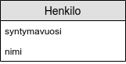

<text-box variant='learningObjectives' name='Oppimistavoitteet'>

- Tunnet tietokantakyselyiden muodostamiseen käytettävän SQL-kielen toimintaperiaatteet.
- Osaat hakea tietoa yhdestä tietokantataulusta.
- Osaat rajata ja järjestää kyselyiden tuloksia.
- Osaat hakea tietoa useammasta tietokantataulusta.

</text-box>


Tällä kurssilla keskitytään Structured Query Language -kieleen. Structured Query Language (jatkossa SQL) on 1980-luvulla standardoitu kieli tietokantakyselyiden tekemiseen. SQL-kielen avulla voidaan tiedon hakemisen lisäksi määritellä tallennettavan tiedon muoto, luoda ja muokata tietokantatauluja, lisätä tietoa tietokantatauluihin, ja muokata tietokantatauluissa olevaa tietoa. Merkittävä osa tällä hetkellä käytössä olevista tietokannanhallintajärjestelmistä tukee SQL-kielellä tehtyjen kyselyiden käyttämistä tietokannanhallintajärjestelmässä olevien tietokantojen ja tietokantataulujen käsittelyyn.


Vuosien mittaan SQL-kielestä on julkaistu useita versioita, joista viimeisin on vuodelta <a href="https://en.wikipedia.org/wiki/SQL:2016" target="_blank" norel>2016</a>. Tietokannanhallintajärjestelmät ja niiden eri versiot noudattavat SQL-kieltä vaihtelevasti. Yhtä tietokannanhallintajärjestelmää varten luodut kyselyt eivät ole aina suoraan siirrettävissä toiseen tietokannanhallintajärjestelmään. On siis syytä huomioida että tietokannanhallintajärjestelmästä toiseen siirryttäessä joudutaan usein tekemään SQL-kyselyihin (pieniä) muutoksia. Tyypillisimpiä tietotyyppejä, joiden käsittelytapa vaihtelee eri tietokannanhallintajärjestelmien välillä ovat päivämäärät. Vaikka tämä on hyvä tiedostaa, erot järjestelmien välillä ovat onneksi vähentyneet ajan myötä.


<text-box variant='hint' name='SQL-kyselyiden harjoittelu'>

Kurssi käyttää SQL-trainer -järjestelmää SQL-tehtävien harjoitteluun. Järjestelmä käyttää samoja käyttäjätunnuksia kuin tämä kurssimateriaali.

Pääset järjestelmään osoitteessa <a href"https://sql-t.herokuapp.com" target="_blank">http://sql-t.herokuapp.com</a>

Järjestelmää kehitetään kurssin edetessä. Mikäli jokin ei toimi, kysythän ongelmasta kurssin tukiväylien kautta.

</text-box>


##  Tietokantataulut ja avaimet


Muistamme johdannosta, että tietokannanhallintajärjestelmät hallinnoivat tietokantoja, jotka sisältävät tietokantatauluja. Tietokantatauluja voidaan ajatella taulukoina, joilla on sarakeotsikot. Jokainen rivi taulukossa kuvaa yhtä tietokantataulun kuvaaman asian ilmentymää.

Tietokantatauluissa voi olla avaimia. Avaimet ovat uniikkeja tunnisteita tietokantataulun riveille eli tietokantataulussa oleville ilmentymille. Pääavain liittyy juuri käsiteltävän taulun ilmentymään ja viiteavain viittaa jossain toisessa taulussa olevaan pääavaimeen.


###  Tiedon hakeminen yhdestä tietokantataulusta


Tiedon hakeminen tietokantataulusta onnistuu **SELECT**-lauseella. Avainsanaa `SELECT` seuraa haettavat sarakkeet, avainsana `FROM`, ja tietokantataulun nimi. Jokainen kysely päätetään puolipisteeseen.


```sql
SELECT sarakkeen_nimi FROM Taulun_nimi;
```


Oletetaan, että käytössämme on tietokantataulu `Henkilo`, johon on määritelty sarakkeet syntymävuosi ja nimi. Kuten ohjelmoinnissa luokkien ja muuttujien tapauksessa, tietokantataulujen ja sarakkeiden nimissä tyypillisesti vältetään ääkkösiä, koska ne voivat johtaa yllättäviin merkistöongelmiin. Tähän tauluun ei ole määritelty pääavaimia tai viiteavaimia.


<figure>
  
  &nbsp;
  <figcaption></figcaption>
</figure>


Tietokantataulu Henkilo sisältää tapauksessamme neljä henkilöä: Pihla (s. 1997), Joni (s. 1993), Raymond (s. 1947) ja Edgar (s. 1923).


| syntymavuosi     | nimi     |
| --               | ---      |
| 1997             | Pihla    |
| 1993             | Joni     |
| 1947             | Raymond  |
| 1923             | Edgar    |


Jokaisen nimen hakeminen ja listaaminen tapahtuu kyselyllä `SELECT nimi FROM Henkilo`.


```sql
SELECT nimi FROM Henkilo;
```

Kyselyn tulostaa seuraavanlaisen taulun.


| nimi     |
| ---      |
| Pihla    |
| Joni     |
| Raymond  |
| Edgar    |


Mikäli haluamme listata jokaisen tietokantatauluun Henkilo tallennetun henkilön nimen lisäksi syntymävuoden, kyselyn sarakkeisiin tulee lisätä (pilkulla erotettuna) uuden sarakkeen nimi, eli tässä tapauksessa `syntymavuosi`.


```sql
SELECT nimi, syntymavuosi FROM Henkilo;
```

Kyselyn tuottamassa taulussa sarakkeet ovat siinä järjestyksessä, mihin ne on kyselyssä määritelty. Yllä olevan kyselyn tuottama taulu sisältää sarakkeet nimi ja syntymävuosi, joista nimi tulostuu ensin.

Kysely voi pyytää saman sarakkeen myös useampaan kertaan. Esimerkiksi kysely `SELECT syntymavuosi, nimi, syntymavuosi FROM Henkilo` tuottaa seuraavanlaisen taulun.


| syntymavuosi     | nimi     | syntymavuosi     |
| --               | ---      | --               |
| 1997             | Pihla    | 1997             |
| 1993             | Joni     | 1993             |
| 1947             | Raymond  | 1947             |
| 1923             | Edgar    | 1923             |


SQL-kieli tarjoaa tuen laskujen tekemiseen. Mikäli syntymävuosi on tallennettu numerona (palaamme tallennusmuotoon kun opimme luomaan tietokantatauluja!), kunkin henkilön iän saa selville erottamalla syntymävuoden nykyvuodesta.

Esimerkiksi henkilön syntymävuoden, nimen, ja iän -- vuonna 2019 -- saa selville seuraavalla kyselyllä.

```sql
SELECT syntymavuosi, nimi, 2019 - syntymavuosi FROM Henkilo;
```


| syntymavuosi     | nimi     | 2019 - syntymavuosi     |
| --               | ---      | --                      |
| 1997             | Pihla    | 22                      |
| 1993             | Joni     | 26                      |
| 1947             | Raymond  | 72                      |
| 1923             | Edgar    | 96                      |


Kun tarkastelemme yllä olevaa tulosta, huomaamme että sarake `2019-syntymavuosi` on vähän hölmösti nimetty.


Kyselyn tuottamassa vastauksessa käytetään oletuksena sarakkeen niminä kyselyssä annettuja sarakkeita. Sarakkeet voi halutessaan nimetä myös uudestaan -- tämä onnistuu sarakkeen nimen jälkeen annettavalla `AS`-operaatiolla. Esimerkiksi edellisen kyselyn tuloksessa sarakkeen `2019-syntymavuosi` nimeksi voidaan vaihtaa `ika` seuraavalla tavalla.


```sql
SELECT nimi AS henkilo, 2019 - syntymavuosi AS ika FROM Henkilo;
```


| syntymavuosi     | nimi     | ika                   |
| --               | ---      | --                    |
| 1997             | Pihla    | 22                    |
| 1993             | Joni     | 26                    |
| 1947             | Raymond  | 72                    |
| 1923             | Edgar    | 96                    |


Sarakkeita ei ole aina pakko määritellä `SELECT`-kyselyssä. Mikäli kyselyssä halutaan listata kaikki sarakkeet, voidaan `SELECT`-komentoa seuraava sarakelistaus korvata tähtimerkillä `*`.


```sql
SELECT * FROM Henkilo;
```


<text-box variant='hint' name='SQL-kyselyiden kirjoitusmuoto'>

SQL-kieli on "case insensitive", eli isoilla ja pienillä kirjaimilla ei ole kyselyn suorituksen kannalta merkitystä. Voimme kirjoittaa komennon `SELECT` yhtä hyvin muodossa `select` tai `Select` -- sama pätee myös taulujen ja sarakkeiden nimille.

Yhteisen käytännön ja kyselyiden selkeyden takia noudatamme tällä kurssilla seuraavaa käytäntöä:


- Kaikki SQL-kielen komennot kuten `SELECT`, `FROM` ja `AS` kirjoitetaan isolla.
- Taulujen nimet kirjoitetaan isolla alkukirjaimella. Esimerkiksi `Henkilo` ja `Opiskelija`.
- Taulujen sarakkeet eli attribuutit kirjoitetaan pienellä. Esimerkiksi `nimi` ja `syntymavuosi`.
- Kyselyt rivitetään niin, että niiden luettavuus on mahdollisimman hyvä. Puolipiste lopettaa kyselyn.

</text-box>


<sqltrainer-exercise name="Tiedon hakeminen yhdestä tietokantataulusta">

Tee SQL-harjoittelujärjestelmän aiheesta "Simple select statements" vähintään kaksi harjoitustehtävää (nappi "START PRACTICE!") sekä luo aiheeseen yksi uusi tehtävä (nappi "CREATE NEW CONTENT!") . Voit kirjoittaa tehtävänannon englannin sijaan halutessasi myös suomeksi tai ruotsiksi.

</sqltrainer-exercise>


###  Kyselyn tulosten rajaaminen


Tarkastellaan seuraavaksi kyselyn tulosten rajaamista. Kyselyn tulosten rajausta määrittevät ehdot lisätään kyselyssä määritellyn taulun (tai määriteltyjen taulujen) jälkeen asetettavan avainsanan `WHERE` jälkeen. Yhdestä taulusta tietoa hakeva kysely, joka sisältää rajausehdon, näyttää seuraavalta.

```sql
SELECT sarake FROM Taulu WHERE rajausehto;
```

Esimerkiksi kaikki henkilöt, jotka ovat syntyneet ennen vuotta 1950, saa listattua seuraavalla kyselyllä.

```sql
SELECT * FROM Henkilo WHERE syntymavuosi < 1950;
```


Vastaavasti, mikäli kyselyn tuloksena haluaa vain henkilöiden nimet, vaihdetaan kaikki sarakkeet valitsevan `*`-merkin paikalle sarake `nimi`.


```sql
SELECT nimi FROM Henkilo WHERE syntymavuosi < 1950;
```

Kyselyissä toimivat kaikki ohjelmointikielistä tutuhkot ehdot:


- Yhtäsuuri kuin `=`. Esimerkiksi `SELECT * FROM Henkilo WHERE syntymavuosi = 2000` hakee vuonna 2000 syntyneet henkilöt.
- Pienempi kuin `<`. Esimerkiksi `SELECT * FROM Henkilo WHERE syntymavuosi < 2000` hakee ennen vuotta 2000 syntyneet henkilöt.
- Suurempi kuin `>`. Esimerkiksi `SELECT * FROM Henkilo WHERE syntymavuosi > 2000` hakee vuoden 2000 jälkeen syntyneet henkilöt.
- Pienempi tai yhtäsuuri kuin `<=`. Esimerkiksi `SELECT * FROM Henkilo WHERE syntymavuosi <= 2000` hakee vuonna 2000 ja sitä ennen syntyneet henkilöt.
- Suurempi tai yhtäsuuri kuin `>=`. Esimerkiksi `SELECT * FROM Henkilo WHERE syntymavuosi >= 2000` hakee vuonna 2000 ja sen jälkeen syntyneet henkilöt.
- Eri kuin `<>`. Esimerkiksi `SELECT * FROM Henkilo WHERE syntymavuosi <> 2000` henkilöt, jotka eivät ole syntyneet vuonna 2000.


Mikäli sarakkeen arvot ovat merkkijonoja, kuten nimi, täsmällisessä haussa käytetään `=`-operaatiota. Jos merkkijonosta haluaa hakea vain osaa, kyselyssä käytetään `LIKE`-operaatiota. Merkkijonot tulee merkitä kyselyyn hipsuilla -- jotkut tietokannanhallintajärjestelmät odottavat yksittäisiä hipsuja `'` kun taas jotkut odottavat tuplahipsuja `"`. Materiaalissa oletetaan, että käytössä on yksittäiset hipsut.


Henkilöt, joiden nimi on Joni, saa haettua seuraavalla kyselyllä.

```sql
SELECT * FROM Henkilo WHERE nimi = 'Joni';
```

Mikäli halutaan etsiä vaikkapa vain henkilöitä, joiden nimessä esiintyy kirjain 'a', kirjoitetaan kysely `LIKE` operaation avulla. Prosenttimerkillä ilmaistaan, että merkkijono voi sisältää mitä tahansa merkkejä. Henkilöt, joiden nimessä esiintyy 'a' saadaan selville seuraavalla kyselyllä.

```sql
SELECT * FROM Henkilo WHERE nimi LIKE '%a%';
```

Prosenttimerkkiä ei tarvitse käyttää haettavan merkin tai merkkijonon kummallakin puolella. Esimerkiksi kaikki henkilöt, joiden nimi päättyy kirjaimeen 'a' saa selville seuraavalla kyselyllä.

```sql
SELECT * FROM Henkilo WHERE nimi LIKE '%a';
```

Vastaavasti seuraava kysely hakee kaikki henkilöt, joiden nimi alkaa merkkijonolla 'abc'.


```sql
SELECT * FROM Henkilo WHERE nimi LIKE 'abc%';
```


###  Loogiset operaatiot


Rajausehtoihin voi lisätä loogisia operaatioita. Seuraavat kolme operaatiota ovat tässä vaiheessa kurssia meille oleellisimmat:

- Operaatio 'ja' eli `AND`. Esimerkiksi kysely `SELECT * FROM Henkilo WHERE nimi = 'Ted' AND syntymavuosi = 1920` listaa henkilöt, joiden nimi on 'Ted' ja joiden syntymävuosi on 1920.
- Operaatio 'tai' eli `OR`. Esimerkiksi kysely `SELECT * FROM Henkilo WHERE nimi = 'Matti' OR nimi = 'Maija'` listaisi kaikki ne henkilöt, joiden nimi on Matti tai Maija.
- Operaatio 'ei' eli `NOT`. Esimerkiksi kysely `SELECT * FROM Henkilo WHERE nimi NOT LIKE '%a%'` listaa henkilöt, joiden nimessä ei esiinny kirjainta 'a'.


Loogisia operaatioita voi lisätä kyselyyn käytännössä rajattomasti. Ehtojen suoritusjärjestystä voi ohjata suluilla. Esimerkiksi kysely `SELECT * FROM Opintosuoritus WHERE (kurssi = 'Ohpe' OR kurssi = 'Ohja') AND arvosana = 3` listaa kaikki ne opintosuoritukset, joissa kurssina on joko `Ohpe` tai `Ohja`, ja arvosanana on `3`.

Sulut toimivat samalla tavalla kuin ohjelmointikursseilla. Sulut ovat täälläkin tärkeät -- esimerkiksi edellä kuvatun kyselyn tulos muuttuu merkittävästi, mikäli se kirjoitetaan ilman sulkuja `SELECT * FROM Opintosuoritus WHERE kurssi = 'Ohpe' OR kurssi = 'Ohja' AND arvosana = 3`. Tämä kysely hakisi kaikki ne opintosuoritukset, joissa kurssi on `Ohpe`, sekä kaikki ne opintosuoritukset, joissa kurssi on `Ohja` ja arvosana on `3`.


###  Tulosten järjestäminen


Tietokantakyselyn tulosten järjestäminen tapahtuu kyselyn loppuun lisättävällä `ORDER BY`-komennolla, jota seuraa sarakkeet, joiden mukaan tulokset järjestetään. Tulokset järjestetään oletuksena nousevaan järjestykseen luonnollista järjestystä noudattaen, eli "pienimmät arvot tulevat ensin".


Esimerkkitaulumme `Henkilo` tulostuu kyselyn `SELECT syntymavuosi, nimi FROM Henkilo ORDER BY syntymavuosi` seurauksena siten, että tulokset on järjestetty syntymävuoden perusteella pienin ensin.


| syntymavuosi     | nimi     |
| --               | ---      |
| 1923             | Edgar    |
| 1947             | Raymond  |
| 1993             | Joni     |
| 1997             | Pihla    |


Kyselyn tulokset voi järjestää vastaavasti nimen perusteella. Kysely `SELECT syntymavuosi, nimi FROM Henkilo ORDER BY nimi` tuottaisi seuraavanlaisen tulostaulun.


| syntymavuosi     | nimi     |
| --               | ---      |
| 1923             | Edgar    |
| 1993             | Joni     |
| 1997             | Pihla    |
| 1947             | Raymond  |


Tulosten järjestys voi olla joko nouseva (_ascending_ eli `ASC` -- oletus) tai laskeva (_descending_ eli `DESC`). Mikäli järjestyksen haluaa määrätä, tulee se antaa sarakkeen (tai sarakkeiden) jälkeen. Esimerkiksi henkilöiden hakeminen nimien perusteella laskevaan järjestykseen järjestettynä onnistuisi kyselyllä  `SELECT syntymavuosi, nimi FROM Henkilo ORDER BY nimi DESC`. Tulos olisi tällöin seuraava.


| syntymavuosi     | nimi     |
| --               | ---      |
| 1947             | Raymond  |
| 1997             | Pihla    |
| 1993             | Joni     |
| 1923             | Edgar    |


<sqltrainer-exercise name="Tulosten rajaaminen ja järjestäminen">

Tee SQL-harjoittelujärjestelmän aiheesta "Filtering and ordering" vähintään kaksi harjoitustehtävää (nappi "START PRACTICE!") sekä luo aiheeseen yksi uusi tehtävä (nappi "CREATE NEW CONTENT!") . Voit kirjoittaa tehtävänannon englannin sijaan halutessasi myös suomeksi tai ruotsiksi.

</sqltrainer-exercise>

