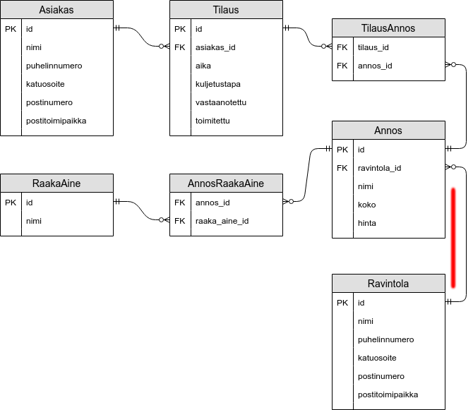
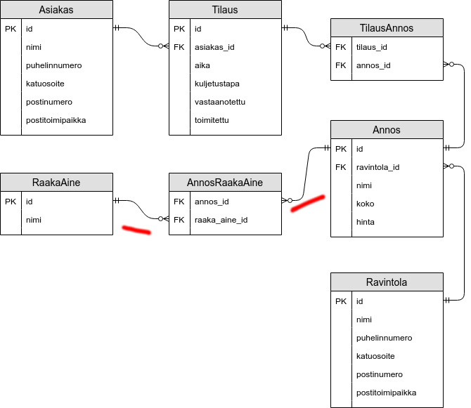
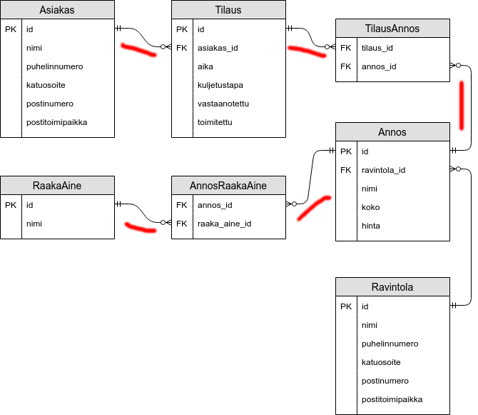
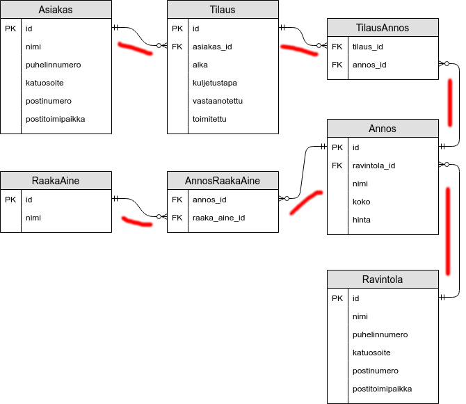

<text-box variant='learningObjectives' name='Oppimistavoitteet'>

- Osaat hakea ja yhdistää tietoa useammasta tietokantataulusta.

</text-box>

Harjoitellaan seuraavaksi tiedon hakemista useammasta tietokantataulusta.

Käytössämme on asiakkaita, ravintoloita, ruoka-annoksia, raaka-aineita, sekä ruokatilauksia sisältävä tietokanta.

Alla olevaan tietokannan kuvaukseen on merkitty tietokantataulujen ja sarakkeiden nimien lisäksi sarakkeiden tyypit -- esimerkiksi merkintä `id:Integer` tarkoittaa kokonaislukutyyppistä saraketta, jonka nimi on `id`, ja merkintä `postitoimipaikka:String` merkkijonomuotoista saraketta, jonka nimi on `postitoimipaikka`. Tietokantatauluihin on merkitty myös pää- ja viiteavaimet.

- Asiakas((pk) id:Integer, nimi:String, puhelinnumero:String, katuosoite:String, postinumero:Integer, postitoimipaikka:String)
- Ravintola((pk) id:Integer, nimi:String, puhelinnumero:String, katuosoite:String, postinumero:Integer, postitoimipaikka:String)
- Annos((pk) id:Integer, (fk) ravintola\_id -> Ravintola, nimi:String, koko:String, hinta:double)
- Tilaus((pk) id:Integer, (fk) asiakas\_id -> Asiakas, aika:Date, kuljetustapa:String, vastaanotettu:Boolean, toimitettu:Boolean)
- RaakaAine((pk) id:Integer, nimi:String)
- AnnosRaakaAine((fk) annos\_id - > Annos, (fk) raaka\_aine\_id -> RaakaAine)
- TilausAnnos((fk) tilaus\_id - > Tilaus, (fk) annos\_id -> Annos)


Kuvana tietokanta näyttää seuraavalta.


<figure>
  
  &nbsp;
  <figcaption>Asiakkaita, ravintoloita, ruoka-annoksia, raaka-aineita, sekä ruokatilauksia sisältävä tietokanta.</figcaption>
</figure>

Asiakkaasta tallennetaan asiakkaan yksilöivä pääavain (id), nimi, puhelinnumero, katuosoite, postinumero, ja postitoimipaikka. Jokaisesta tilauksesta tallennetaan tilauksen yksilöivä pääavain (id), tilauksen tehneen asiakkaan yksilöivä viiteavain (asiakas\_id), aika, kuljetustapa sekä tieto siitä onko tilaus vastaanotettu ja toimitettu.

Taulu TilausAnnos on **liitostaulu**, joka sisältää viiteavaimen tauluun Tilaus (tilaus\_id) ja viiteavaimen tauluun Annos (annos\_id). Käytännössä taulu kytkee tilaukset annoksiin: kussakin tilauksessa voi olla monta annosta.

Taulu Annos sisältää annoksen yksilöivät pääavaimen (id), viiteavaimen annosta tarjoavaan ravintolaan (ravintola\_id), sekä tiedon annoksen nimestä, koosta ja hinnasta. Taulu Ravintola sisältää ravintolan tiedot.

Annoksen sisältämät raaka-aineet saadaan selville taulujen RaakaAine ja AnnosRaakaAine avulla. Taulu RaakaAine sisältää raaka-aineen yksilöivät pääavaimen (id) sekä raaka-aineen nimen, ja Taulu AnnosRaakaAine on liitostaulu, joka kytkee RaakaAine-taulun ja Annos-taulun rivejä, ja joka kertoo mitä raaka-aineita kukin annos sisältää.


### Kunkin ravintolan tarjoamat annokset


Tarkastellaan kysymystä "Mitä annoksia kukin ravintola tarjoaa?".

Löytääksemme kysymykseen vastauksen, meidän tulee tunnistaa tietokannassa polku tietokantataulusta Ravintola tietokantatauluun Annos. Yhteys löytyy nopeasti -- jokaisella annoksella on tieto ravintolasta, missä annosta tarjoillaan. Tämä tieto on tallennettu tietokantataulun Annos sisältämään viiteavaimeen ravintola\_id, joka viittaa taulun Ravintola pääavaimeen id. Tämä tarkoittaa käytännössä sitä, että kun tiedämme annoksen, tiedämme myös missä ravintolassa kyseistä annosta tarjotaan.


<figure>
  
  &nbsp;
  <figcaption>Asiakkaita, ravintoloita, ruoka-annoksia, raaka-aineita, sekä ruokatilauksia sisältävä tietokanta. Tietokantakaaviossa on korostettuna ravintolan ja annoksen välinen yhteys.</figcaption>
</figure>


Aloitetaan kysely tietokantataulusta Ravintola. Listataan ensin kaikkien ravintoloiden nimet.

```sql
SELECT Ravintola.nimi AS ravintola
  FROM Ravintola
```

Liitetään tähän seuraavaksi tietokantataulu Annos. Liitos tapahtuu Annos-taulun sisältämän Ravintola-tauluun viittaavan viiteavaimen ravintola\_id ja Ravintola-taulun pääavaimen välillä.


```sql
SELECT Ravintola.nimi AS ravintola, Annos.nimi AS annos
  FROM Ravintola
  JOIN Annos ON Annos.ravintola_id = Ravintola.id
```

Lauseke `JOIN Annos ON Annos.ravintola_id = Ravintola.id` pyytää käytännössä tietokannanhallintajärjestelmää liittämään kyselyn edellisen osan tuloksen osaksi Annos-taulusta haettavaa tietoa. Liitos tapahtuu annetun liitosehdon (`ON Annos.ravintola_id = Ravintola.id`) avulla, eli rivit yhdistetään taulun Annos sarakkeen ravintola\_id ja taulun Ravintola sarakkeen id perusteella.

Järjestetään lopuksi tulokset ravintolan ja annoksen perusteella.


```sql
SELECT Ravintola.nimi AS ravintola, Annos.nimi AS annos
  FROM Ravintola
  JOIN Annos ON Annos.ravintola_id = Ravintola.id
  ORDER BY Ravintola.nimi, Annos.nimi
```

### Annoksen raaka-aineiden selvittäminen


Tarkastellaan seuraavaksi kysymystä "Mitä raaka-aineita annoksessa 'The Fortress Stilt Fisherman Indulgence' on?".

Löytääksemme kysymykseen vastauksen, meidän tulee tunnistaa tietokannassa polku tietokantataulusta Annos tietokantatauluun RaakaAine. Yhteys löytyy kulkemalla taulusta Annos taulun AnnosRaakaAine kautta tauluun RaakaAine.


<figure>
  
  &nbsp;
  <figcaption>Asiakkaita, ravintoloita, ruoka-annoksia, raaka-aineita, sekä ruokatilauksia sisältävä tietokanta. Tietokantakaaviossa on korostettuna annoksen ja raaka-aineen välinen yhteys.</figcaption>
</figure>

Aloitetaan kysely tietokantataulusta Annos. Haetaan ensin annos, jonka nimi on 'The Fortress Stilt Fisherman Indulgence'.

```sql
SELECT * FROM Annos
  WHERE Annos.nimi = 'The Fortress Stilt Fisherman Indulgence';
```

Kytketään kyselyyn seuraavaksi taulu AnnosRaakaAine.


```sql
SELECT * FROM Annos
  JOIN AnnosRaakaAine ON AnnosRaakaAine.annos_id = Annos.id
  WHERE Annos.nimi = 'The Fortress Stilt Fisherman Indulgence';
```


Ja kytketään kyselyyn tämän jälkeen tietokantataulu RaakaAine.


```sql
SELECT * FROM Annos
  JOIN AnnosRaakaAine ON AnnosRaakaAine.annos_id = Annos.id
  JOIN RaakaAine ON RaakaAine.id = AnnosRaakaAine.raaka_aine_id
  WHERE Annos.nimi = 'The Fortress Stilt Fisherman Indulgence';
```

Muutetaan tulostusta vielä niin, että tulostuksessa on vain raaka-aineen nimet, jotka on järjestetty aakkosjärjestykseen.

```sql
SELECT RaakaAine.nimi FROM Annos
  JOIN AnnosRaakaAine ON AnnosRaakaAine.annos_id = Annos.id
  JOIN RaakaAine ON RaakaAine.id = AnnosRaakaAine.raaka_aine_id
  WHERE Annos.nimi = 'The Fortress Stilt Fisherman Indulgence';
  ORDER BY RaakaAine.nimi
```


<sqltrainer-exercise name="Muutaman taulun yhdistäminen">

Tee SQL-harjoittelujärjestelmän aiheesta "Selecting data from a few tables" vähintään kaksi harjoitustehtävää (nappi "START PRACTICE!") sekä luo aiheeseen yksi uusi tehtävä (nappi "CREATE NEW CONTENT!") . Voit kirjoittaa tehtävänannon englannin sijaan halutessasi myös suomeksi tai ruotsiksi.

</sqltrainer-exercise>


### Asiakkaan syömät raaka-aineet


Oletetaan, että haluamme seuraavaksi etsiä kaikki raaka-aineet, joita Leevi-niminen asiakas on saattanut syödä. Ensimmäinen askeleemme ongelman ratkaisuun on polun etsiminen taulusta Asiakas tauluun RaakaAine. Polku löytyy.

<figure>
  
  &nbsp;
  <figcaption>Asiakkaita, ravintoloita, ruoka-annoksia, raaka-aineita, sekä ruokatilauksia sisältävä tietokanta. Tietokantakaaviossa on korostettuna yhteys asiakkaasta raaka-aineeseen.</figcaption>
</figure>


Aloitetaan polkua kuvaavan SQL-kyselyn rakentaminen. Aloitamme taulusta `Asiakas` ja etsimme polkua tauluun `RaakaAine`. Jotta pääsemme taulusta Asiakas tauluun RaakaAine, tulee meidän vierailla tauluissa `TilausAnnos`, `Annos` ja `AnnosRaakaAine`.

Haemme aluksi asiakkaan nimeltä Leevi.

```sql
SELECT Asiakas.nimi AS asiakas
  FROM Asiakas
  WHERE Asiakas.nimi = 'Leevi';
```

Kytketään tähän seuraavaksi kaikki Leevin tekemät tilaukset, jotka löytyvät taulusta Tilaus.

```sql
SELECT Asiakas.nimi AS asiakas
  FROM Asiakas
  JOIN Tilaus ON Asiakas.id = Tilaus.asiakas_id
  WHERE Asiakas.nimi = 'Leevi';
```

Yhdistetään edelliseen kyselyyn taulu TilausAnnos.


```sql
SELECT Asiakas.nimi AS asiakas
  FROM Asiakas
  JOIN Tilaus ON Asiakas.id = Tilaus.asiakas_id
  JOIN TilausAnnos ON TilausAnnos.tilaus_id = Tilaus.id
  WHERE Asiakas.nimi = 'Leevi';
```

Yhdistetään tähän taulu Annos.

```sql
SELECT Asiakas.nimi AS asiakas
  FROM Asiakas
  JOIN Tilaus ON Asiakas.id = Tilaus.asiakas_id
  JOIN TilausAnnos ON TilausAnnos.tilaus_id = Tilaus.id
  JOIN Annos ON Annos.id = TilausAnnos.annos_id
  WHERE Asiakas.nimi = 'Leevi';
```

Yhdistetään tähän seuraavaksi taulu AnnosRaakaAine.

```sql
SELECT Asiakas.nimi AS asiakas
  FROM Asiakas
  JOIN Tilaus ON Asiakas.id = Tilaus.asiakas_id
  JOIN TilausAnnos ON TilausAnnos.tilaus_id = Tilaus.id
  JOIN Annos ON Annos.id = TilausAnnos.annos_id
  JOIN AnnosRaakaAine ON AnnosRaakaAine.annos_id = Annos.id
  WHERE Asiakas.nimi = 'Leevi';
```

Olemme lähes perillä! Yhdistetään kyselyyn vielä taulu RaakaAine.

```sql
SELECT Asiakas.nimi AS asiakas
  FROM Asiakas
  JOIN Tilaus ON Asiakas.id = Tilaus.asiakas_id
  JOIN TilausAnnos ON TilausAnnos.tilaus_id = Tilaus.id
  JOIN Annos ON Annos.id = TilausAnnos.annos_id
  JOIN AnnosRaakaAine ON AnnosRaakaAine.annos_id = Annos.id
  JOIN RaakaAine ON RaakaAine.id = AnnosRaakaAine.raaka_aine_id
  WHERE Asiakas.nimi = 'Leevi';
```

Kyselymme yhdistää taulut ja löytää Leevi-nimiseen asiakkaaseen liittyvät tiedot. Edellisestä kyselystä raaka-aineiden tulostaminen tosin puuttuu, joten lisätään tämä vielä osaksi kyselyä.


```sql
SELECT Asiakas.nimi AS asiakas, RaakaAine.nimi AS raaka_aine
  FROM Asiakas
  JOIN Tilaus ON Asiakas.id = Tilaus.asiakas_id
  JOIN TilausAnnos ON TilausAnnos.tilaus_id = Tilaus.id
  JOIN Annos ON Annos.id = TilausAnnos.annos_id
  JOIN AnnosRaakaAine ON AnnosRaakaAine.annos_id = Annos.id
  JOIN RaakaAine ON RaakaAine.id = AnnosRaakaAine.raaka_aine_id
  WHERE Asiakas.nimi = 'Leevi';
```


Kyselyn tuloksessa sama raaka-aine voi esiintyä useammalla rivillä. Tämä johtuu siitä, että Leevi on voinut tilata saman ruuan useampaan otteeseen. Lisäämällä `SELECT`-komennon jälkeen määreen `DISTINCT` voimme rajata tulosrivit niin, että samansisältöinen rivi ei esiinny tulostuksessa useampaan kertaan. Alla olevassa esimerkissä kukin raaka-aine esiintyy korkeintaan kerran.


```sql
SELECT DISTINCT Asiakas.nimi AS asiakas, RaakaAine.nimi AS raaka_aine
  FROM Asiakas
  JOIN Tilaus ON Asiakas.id = Tilaus.asiakas_id
  JOIN TilausAnnos ON TilausAnnos.tilaus_id = Tilaus.id
  JOIN Annos ON Annos.id = TilausAnnos.annos_id
  JOIN AnnosRaakaAine ON AnnosRaakaAine.annos_id = Annos.id
  JOIN RaakaAine ON RaakaAine.id = AnnosRaakaAine.raaka_aine_id
  WHERE Asiakas.nimi = 'Leevi';
```


### Valkosipulia Unicafessa syöneet


Tarkastellaan yhä samaa tietokantaa. Etsitään tällä kertaa ne henkilöt, jotka ovat syöneet valkosipulia `Unicafe`-nimisessä ravintolassa.

Haluamme siis yhdistää taulut Asiakas, Ravintola, ja RaakaAine. Tämä onnistuu seuraamalla taulujen välisiä yhteyksiä. Asiakkaasta ravintolaan pääsee taulujen Tilaus, TilausAnnos, ja Annos kautta. Asiakkasta RaakaAineeseen pääsee taas taulujen Tilaus, TilausAnnos, Annos, ja AnnosRaakaAine kautta. Pääsemme ottamaan kaikki taulut mukaan kyselyymme!


<figure>
  
  &nbsp;
  <figcaption>Asiakkaita, ravintoloita, ruoka-annoksia, raaka-aineita, sekä ruokatilauksia sisältävä tietokanta. Tietokantakaaviossa on korostettuna kyselyssä tarvittavat yhteydet.</figcaption>
</figure>


Aloitetaan SQL-kyselyn rakentaminen. Aloitetaan taulusta Ravintola, sillä haemme Unicafe-nimistä ravintolaa, ja pyritään tauluun RaakaAine, sillä olemme kiinnostuneita valkosipulista.

Haemme aluksi ravintolan nimeltä Unicafe.

```sql
SELECT Ravintola.nimi AS ravintola
  FROM Ravintola
  WHERE Ravintola.nimi = 'Unicafe';
```

Kytketään tähän seuraavaksi kaikki ravintolan annokset. Annokset löytyvät taulusta Annos.

```sql
SELECT Ravintola.nimi AS ravintola
  FROM Ravintola
  JOIN Annos ON Annos.ravintola_id = Ravintola.id
  WHERE Ravintola.nimi = 'Unicafe';
```

Yhdistetään edelliseen kyselyyn taulu AnnosRaakaAine.

```sql
SELECT Ravintola.nimi AS ravintola
  FROM Ravintola
  JOIN Annos ON Annos.ravintola_id = Ravintola.id
  JOIN AnnosRaakaAine ON AnnosRaakaAine.annos_id = Annos.id
  WHERE Ravintola.nimi = 'Unicafe';
```

Yhdistetään tähän taulu RaakaAine.

```sql
SELECT Ravintola.nimi AS ravintola
  FROM Ravintola
  JOIN Annos ON Annos.ravintola_id = Ravintola.id
  JOIN AnnosRaakaAine ON AnnosRaakaAine.annos_id = Annos.id
  JOIN RaakaAine ON RaakaAine.id = AnnosRaakaAine.raaka_aine_id
  WHERE Ravintola.nimi = 'Unicafe';
```

Ja rajataan raaka-aineet valkosipuliin.

```sql
SELECT Ravintola.nimi AS ravintola
  FROM Ravintola
  JOIN Annos ON Annos.ravintola_id = Ravintola.id
  JOIN AnnosRaakaAine ON AnnosRaakaAine.annos_id = Annos.id
  JOIN RaakaAine ON RaakaAine.id = AnnosRaakaAine.raaka_aine_id
  WHERE Ravintola.nimi = 'Unicafe'
    AND RaakaAine.nimi = 'Valkosipuli';
```

Käytössämme on nyt polku ravintolasta raaka-aineeseen. Kyselyssä rajaudutaan vain Unicafe-nimiseen ravintolaan sekä sen tarjoamiin annoksiin, joissa on valkosipulia.

Etsitään seuraavaksi asiakkaat, jotka ovat tilanneet kyseisen ravintolan valkosipulia sisältäviä annoksia.

Aloitetaan kytkemällä edellä muodostettuun kyselyyn taulu TilausAnnos.

```sql
SELECT Ravintola.nimi AS ravintola
  FROM Ravintola
  JOIN Annos ON Annos.ravintola_id = Ravintola.id
  JOIN AnnosRaakaAine ON AnnosRaakaAine.annos_id = Annos.id
  JOIN RaakaAine ON RaakaAine.id = AnnosRaakaAine.raaka_aine_id
  JOIN TilausAnnos ON TilausAnnos.tilaus_id = Annos.id
  WHERE Ravintola.nimi = 'Unicafe'
    AND RaakaAine.nimi = 'Valkosipuli';
```

Kytketään tilaus tietoon tilauksessa tilattuihin annoksiin.

```sql
SELECT Ravintola.nimi AS ravintola
  FROM Ravintola
  JOIN Annos ON Annos.ravintola_id = Ravintola.id
  JOIN AnnosRaakaAine ON AnnosRaakaAine.annos_id = Annos.id
  JOIN RaakaAine ON RaakaAine.id = AnnosRaakaAine.raaka_aine_id
  JOIN TilausAnnos ON TilausAnnos.annos_id = Annos.id
  JOIN Tilaus ON Tilaus.id = TilausAnnos.tilaus_id
  WHERE Ravintola.nimi = 'Unicafe'
    AND RaakaAine.nimi = 'Valkosipuli';
```

Ja kytketään lopulta tilaukset niihin liittyviin asiakkaisiin.

```sql
SELECT Ravintola.nimi AS ravintola
  FROM Ravintola
  JOIN Annos ON Annos.ravintola_id = Ravintola.id
  JOIN AnnosRaakaAine ON AnnosRaakaAine.annos_id = Annos.id
  JOIN RaakaAine ON RaakaAine.id = AnnosRaakaAine.raaka_aine_id
  JOIN TilausAnnos ON TilausAnnos.annos_id = Annos.id
  JOIN Tilaus ON Tilaus.id = TilausAnnos.tilaus_id
  JOIN Asiakas ON Asiakas.id = Tilaus.asiakas_id
  WHERE Ravintola.nimi = 'Unicafe'
    AND RaakaAine.nimi = 'Valkosipuli';
```

Halusimme alunperin tiedon asiakkaista, jotka ovat tilanneet valkosipulia sisältävää ruokaa Unicafe-nimisestä ravintolasta. Tällä hetkellä kyselymme tulostaa ravintoloiden nimet -- muutetaan kyselyä siten, että se tulostaa asiakkaiden nimet.

```sql
SELECT Asiakas.nimi AS asiakas
  FROM Ravintola
  JOIN Annos ON Annos.ravintola_id = Ravintola.id
  JOIN AnnosRaakaAine ON AnnosRaakaAine.annos_id = Annos.id
  JOIN RaakaAine ON RaakaAine.id = AnnosRaakaAine.raaka_aine_id
  JOIN TilausAnnos ON TilausAnnos.annos_id = Annos.id
  JOIN Tilaus ON Tilaus.id = TilausAnnos.tilaus_id
  JOIN Asiakas ON Asiakas.id = Tilaus.asiakas_id
  WHERE Ravintola.nimi = 'Unicafe'
    AND RaakaAine.nimi = 'Valkosipuli';
```

Tälläkin kertaa asiakkaat tulostuvat useampaan kertaan mikäli he ovat tehneet useita valkosipulia sisältäviä tilauksia Unicafe-ravintolasta. Lisätään kyselyyn määre `DISTINCT`, jolloin kukin asiakas näkyy tuloksessa korkeintaan kerran.

```sql
SELECT DISTINCT Asiakas.nimi AS asiakas
  FROM Ravintola
  JOIN Annos ON Annos.ravintola_id = Ravintola.id
  JOIN AnnosRaakaAine ON AnnosRaakaAine.annos_id = Annos.id
  JOIN RaakaAine ON RaakaAine.id = AnnosRaakaAine.raaka_aine_id
  JOIN TilausAnnos ON TilausAnnos.annos_id = Annos.id
  JOIN Tilaus ON Tilaus.id = TilausAnnos.tilaus_id
  JOIN Asiakas ON Asiakas.id = Tilaus.asiakas_id
  WHERE Ravintola.nimi = 'Unicafe'
    AND RaakaAine.nimi = 'Valkosipuli';
```

Järjestetään tulokset vielä lopuksi asiakkaan nimen perusteella, mikä edesauttaa tulosten lukemista.

```sql
SELECT DISTINCT Asiakas.nimi AS asiakas
  FROM Ravintola
  JOIN Annos ON Annos.ravintola_id = Ravintola.id
  JOIN AnnosRaakaAine ON AnnosRaakaAine.annos_id = Annos.id
  JOIN RaakaAine ON RaakaAine.id = AnnosRaakaAine.raaka_aine_id
  JOIN TilausAnnos ON TilausAnnos.annos_id = Annos.id
  JOIN Tilaus ON Tilaus.id = TilausAnnos.tilaus_id
  JOIN Asiakas ON Asiakas.id = Tilaus.asiakas_id
  WHERE Ravintola.nimi = 'Unicafe'
    AND RaakaAine.nimi = 'Valkosipuli'
  ORDER BY Asiakas.nimi;
```


<sqltrainer-exercise name="Useamman taulun yhdistäminen">

Tee SQL-harjoittelujärjestelmän aiheesta "Selecting data from more tables" vähintään kaksi harjoitustehtävää (nappi "START PRACTICE!") sekä luo aiheeseen yksi uusi tehtävä (nappi "CREATE NEW CONTENT!") . Voit kirjoittaa tehtävänannon englannin sijaan halutessasi myös suomeksi tai ruotsiksi.

</sqltrainer-exercise>


## Muita liitoskyselyitä

Tutustuimme edellä `JOIN`-avainsanaan, jonka avulla liitetään tauluja toisiinsa. Taulut yhdistetään toisiinsa pää- ja viiteavainten perusteella seuraavasti:


```sql
SELECT * FROM Asiakas
    JOIN Tilaus ON Asiakas.id = Tilaus.asiakas_id;
```

Avainsana `JOIN` on lyhennetty kirjoitusmuoto komennosta `INNER JOIN`. Yllä olevan kyselyn voi kirjoittaa myös seuraavassa muodossa.


```sql
SELECT * FROM Asiakas
  INNER JOIN Tilaus ON Asiakas.id = Tilaus.asiakas_id;
```

Tarkastellaan kyselyn tulosta hieman pienemmillä tauluilla. Alla olevissa taulussa Asiakas asiakkaasta on tallennettu pääavain (id) sekä nimi. Tilauksesta on tallennettu viiteavain asiakkaaseen (asiakas\_id) ja tilauksen tekoajan.


| id  | nimi   |
| --  | --     |
| 1   | Sylvi  |
| 2   | Lilja  |
| 3   | Leevi  |
| 4   | Anton  |


| asiakas_id  | aika              |
| --          | --                |
| 1           | 2018-10-01 16:20  |
| 1           | 2017-11-01 14:18  |
| 2           | 2016-05-01 12:11  |

Kysely, joka käyttää `INNER JOIN`-muotoista liitosta palauttaa vain ne asiakkaat, jotka ovat tehneet tilauksia.

```sql
SELECT * FROM Asiakas
  INNER JOIN Tilaus ON Asiakas.id = Tilaus.asiakas_id;
```

Yllä oleva kysely tuottaa seuraavanlaisen taulun.


| id  | nimi   |  asiakas_id  | aika              |
| --  | --     | --           | --                |
| 1   | Sylvi  | 1            | 2018-10-01 16:20  |
| 1   | Sylvi  | 1            | 2017-11-01 14:18  |
| 2   | Lilja  | 2            | 2016-05-01 12:11  |

Kyselyn tuloksessa asiakkaita Leevi ja Anton ei esiinny lainkaan!

`JOIN` (eli `INNER JOIN`) tyyppinen kysely valitsee vastaukseen vain ne rivit, joiden kohdalla ehto *Asiakas.id = Tilaus.asiakas\_id* pätee. Vastauksessa on siis vain ne Asiakas-taulun ja Tilaus-taulun rivit, joissa Asiakas-taulun pääavaimelle löytyy vastine Tilaus-taulun viiteavaimista. Mikäli vastineita on useampi, kuten yllä, jokaiselle vastineelle luodaan kyselyn tulostauluun oma erillinen rivi.

Tämä tarkoittaa sitä, että osa riveistä voi jäädä tulostamatta. Tämä on usein toivottavaa: mikäli halutaan asiakkaat ja heidän tilaukset, ei kyselyssä todennäköisesti haluta tietoa asiakkaista, jotka eivät ole tehneet tilauksia.

Tutustutaan seuraavaksi liitoskyselyyn, jonka avulla voidaan saada selville myös ne asiakkaat, jotka eivät ole tehneet yhtäkään tilausta.


### LEFT JOIN

Vaihtamalla `JOIN`-liitoskysely `LEFT JOIN`-liitoskyselyyn vastaus sisältää myös ne `LEFT JOIN`-komentoa edeltävän taulun rivit, joille liitosehto ei täyttynyt.

Alla oleva kysely listaa tilauksia tehneiden asiakkaiden lisäksi myös ne asiakkaat, joilla ei ole yhtäkään tilausta. Tällöin tilaukseen liittyvä vastauksen osa jää tyhjäksi.


```sql
SELECT * FROM Asiakas
  LEFT JOIN Tilaus ON Asiakas.id = Tilaus.asiakas_id;
```

| id  | nimi   |  asiakas_id  | aika              |
| --  | --     | --           | --                |
| 1   | Sylvi  | 1            | 2018-10-01 16:20  |
| 1   | Sylvi  | 1            | 2017-11-01 14:18  |
| 2   | Lilja  | 2            | 2016-05-01 12:11  |
| 3   | Leevi  |              |                   |
| 4   | Anton  |              |                   |


Tyhjä arvo on `NULL`-arvo, jota voi käyttää myös osana kyselyn ehtoa. Ehto _sarake on tyhjä_ kirjoitetaan muodossa `sarake IS NULL`. Asiakkaat, jotka eivät ole tehneet yhtäkään tilausta löytyy esimerkiksi seuraavasti.

```sql
SELECT * FROM Asiakas
  LEFT JOIN Tilaus ON Asiakas.id = Tilaus.asiakas_id;
  WHERE Tilaus.asiakas_id IS NULL
```

Kyselyn tulos on seuraava.


| id  | nimi   |  asiakas_id  | aika              |
| --  | --     | --           | --                |
| 3   | Leevi  |              |                   |
| 4   | Anton  |              |                   |


### Liitoskyselytyypit lyhyesti

Kyselyn JOIN-tyypin voi muotoilla usealla eri tavalla:

- `INNER JOIN` -- palauta vain ne rivit, joihin valintaehto kohdistuu.

- `LEFT JOIN` -- palauta kaikki FROM-komentoa seuraavan taulun rivit, ja liitä niihin LEFT JOIN-komentoa seuraavan taulun rivit niiltä kohdin, kuin se on ON-liitosehdossa määritellyn ehdon mukaan mahdollista

- `RIGHT JOIN` -- palauta kaikki RIGHT JOIN-komentoa seuraavan taulun rivit, ja liitä niihin FROM-komentoa seuraavan taulun rivit niiltä kohdin, kuin se on ON-liitosehdossa määritellyn ehdon mukaan mahdollista

- `FULL JOIN` -- palauta kaikki FROM-komentoa seuraavan taulun rivit sekä kaikki FULL JOIN-komentoa seuraavan taulun rivit, ja liitä ne toisiinsa niiltä kohdin, kuin se on ON-liitosehdossa määritellyn ehdon mukaan mahdollista


<sqltrainer-exercise name="Muita liitostyyppejä">

Nämä tehtävät julkaistaan 16.1.

</sqltrainer-exercise>


