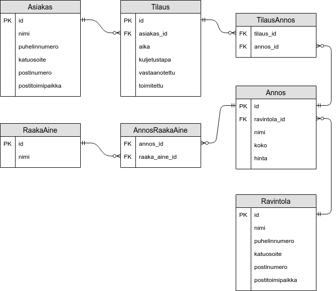

<text-box variant='learningObjectives' name='Oppimistavoitteet'>

- Tunnet usein käytettävyjä tietotyyppejä.
- Osaat luoda tietokantatauluja.
- Osaat määritellä tietokantataujen pää- ja viiteavaimet.
- Osaat poistaa tietokantatauluja.

</text-box>


Tietokannassa oleva tieto tallennetaan pysyväismuistiin kovalevylle, jossa se säilyy vaikka tietokantaa ylläpitävä tietokannanhallintajärjestelmä tai tietokannanhallintajärjestelmäohjelmistoa suorittava tietokone käynnistetään uudestaan. Tiedon tallennusmuoto vaikuttaa tietokannan tehokkuuteen -- täysin satunnaisessa muodossa ja sitä kautta täysin satunnaisessa paikassa olevan tiedon hakeminen on hitaampaa kuin määrätyssä muodossa ja sitä kautta määrätyssä paikassa olevan tiedon hakeminen.

Tiedon hakemiseen ja tallentamiseen liittyvän tehokkuuden lisäksi tietokantaan tallennettavan tiedon tyyppi halutaan määrittää, jotta tietokannanhallintajärjestelmä pystyy varmistamaan, että tallennettava tieto on oikean muotoista. Tämä ennaltaehkäisee tiedon väärästä muodosta johtuvia ongelmatilanteita, kuten vaikkapa tilanteita, missä tietokantaan on tallennettu kokonaisluvun sijaan merkkijono, ja käyttäjä yrittää lukea ja muuntaa merkkijonon luvuksi.

Tarkastellaan seuraavaksi tietokantataulujen luomista SQL-kielellä. Tietokantataulu luodaan `CREATE TABLE`-lauseella, jossa määritellään tietokantataulun sarakkeet ja niiden tietotyypit sekä tietokantatauluun kuuluvat rajoitteet kuten pääavaimet ja viiteavaimet. Syntaksi tietokantataulun luomiselle on seuraava.

```SQL
CREATE TABLE TaulunNimi (
    sarake1 tietotyyppi1,
    sarake2 tietotyyppi2,
    sarake3 tietotyyppi3,
    ... ...,
    rajoite1,
    rajoite2,
    ...
);
```

Tiedon tyyppi määrää minkämuotoista tietoa tietokantataulun sarakkeeseen voi tallentaa. Käytännössä tietokantataulua luotaessa sarakkeen määrittelyssä annettavat tiedot kertovat tietokannanhallintajärjestelmälle minkälaista tietoa sarakkeeseen voidaan lisätä, ja toisaalta minkälaista tietoa sarakkeeseen ei voida lisätä. Sarakkeen tietotyyppi vaikuttaa myös asioihin, joita sarakkeen arvoilla voi tehdä -- esimerkiksi keskiarvon laskeminen merkkijonotyyppisiä arvoja sisältävästä sarakkeesta ei ole kovin järkevää saatika mahdollista.

Tutustutaan seuraavaksi tietokantatauluissa käytettyihin tietotyyppeihin sekä rajoitteisiin.


## Tallennettavan tiedon tyyppi


Tiedon tyypin määrittelyssä käytetään SQL-standardissa määriteltyjä tietotyyppejä. Tutustutaan tässä seuraavaksi muutamaan usein käytettyyn kategoriaan.

- Merkkijonojen tallentamiseen tarkoitetut tietotyypit

  - Tietyn mittainen merkkijono `CHAR(pituus)` - käytetään mikäli merkkijonon pituus on aina täsmälleen sama.

  - Vaihtelevan pituinen merkkijono `VARCHAR(maksimipituus)` - käytetään mikäli merkkijonon pituus voi vaihdella.

  - Hyvin iso merkkijono `CLOB` - käytetään tarvittaessa hyvin isojen merkkijonojen tallentamiseen -- tietokannanhallintajärjestelmillä on tyypillisesti hyvin isojen merkkijonojen käsittelyä varten myös järjestelmäkohtaisia tietotyyppejä.


- Numerojen tallentamiseen tarkoitetut tietotyypit

  - Kokonaislukujen tallentamiseen käytetyt `SMALLINT`, `INTEGER` ja `BIGINT`. Tyyppiä `SMALLINT` käytetään pienten kokonaislukujen tallentamiseen, tyyppiä `INTEGER` käytetään keskikokoisten kokonaislukujen tallentamiseen, ja tyyppiä `BIGINT` käytetään isojen kokonaislukujen tallentamiseen. Näiden konkreettinen koko on tietokannanhallintajärjestelmäkohtainen. Esimerkiksi <a href="https://www.postgresql.org" target="_blank">PostgreSQL</a>-järjestelmässä `SMALLINT` tallennetaan 8 bitin kokoisena, `INTEGER` 32 bitin kokoisena, ja `BIGINT` 64 bitin kokoisena.

  - Tarkkojen (desimaalilukujenkin) tallentamiseen käytetty `NUMERIC`, jolle määritellään tallennettujen lukujen määrä sekä tallennettuihin lukuihin sisältyvien desimaalilukujen määrä `NUMERIC(lukujen_maara_yhteensa, desimaalilukujen_maara_korkeintaan)`. Esimerkiksi `NUMERIC(3,1)` tallentaa korkeintaan 3 lukua sisältävän numeron, jossa korkeintaan 1 desimaali -- esim. `32.1` ja `999`.

  - Epätarkkojen desimaalilukujen tallentamiseen käytetty `FLOAT`.


- Päivämäärän ja ajan tallentamiseen tarkoitetut tietotyypit

  - Päivämäärän tallentamiseen käytetty `DATE`. Päivämäärä tallennetaan ja haetaan tyypillisesti muodossa `yyyy-mm-dd` eli esimerkiksi `2019-06-09` ja `2013-08-23`.

  - Ajan tallentamiseen käytetty `TIME`. Aika tallennetaan ja haetaan tyypillisesti muodossa `hh:mm:ss` eli esimerkiksi `23:59:59` ja `13:01:32`.

  - Aikaleiman tallentamiseen käytetty `TIMESTAMP`. Aikaleima on kulunut aika ns. Unix-ajanlaskun alusta, eli 1.1.1970. Aikaleiman tallennustarkkuus riippuu tietokannanhallintajärjestelmästä -- tyypillisesti se tallennetaan joko sekuntien tai millisekuntien tarkkuudella.


- Binääridata
  - mm. `BLOB` isojen binääritiedostojen tallentamiseen.


- Totuusarvo `BOOLEAN`, jonka arvoksi voi asettaa `true`, `false` tai `null`. Näistä jälkimmäinen -- mikäli sitä käytetään -- tulkitaan yleensä epävarmuudeksi.


Yllä kuvattuja tietotyyppeja käyttävä tietokantataulu `Tietotyypit` luotaisiin seuraavasti.


```sql
CREATE TABLE Tietotyypit (
  neljan_merkin_merkkijono CHAR(4),
  korkeintaan_neljan_merkin_merkkijono VARCHAR(4),
  hyvin_iso_merkkijono CLOB,
  pieni_kokonaisluku SMALLINT,
  keskisuuri_kokonaisluku INTEGER,
  suuri_kokonaisluku BIGINT,
  tarkka_desimaaliluku NUMERIC(5,2),
  epatarkka_desimaaliluku FLOAT,
  paiva DATE,
  aika TIME,
  aikaleima TIMESTAMP,
  binaaridata BLOB,
  totuusarvo BOOLEAN
);
```


<text-box variant='hint' name='Lisää tietotyyppejä'>

Eri tietokannanhallintajärjestelmät kuten `SQLite`, `MySQL` ja `PostgreSQL` tarjoavat hieman erilaisia tietotyyppejä ohjelmoijan käyttöön. Seuraavissa dokumenteissa kerrotaan näistä enemmän.

- <a href="https://www.sqlite.org/datatype3.html" target="_blank" norel>https://www.sqlite.org/datatype3.html</a>
- <a href="http://www.postgresql.org/docs/9.4/static/datatype.html" target="_blank" norel>http://www.postgresql.org/docs/9.4/static/datatype.html</a>
- <a href="http://www.w3schools.com/sql/sql_datatypes.asp" target="_blank" norel>http://www.w3schools.com/sql/sql_datatypes.asp</a>

</text-box>


### Pääavaimen määrittely CREATE TABLE -lauseessa


Pääavain on taulukohtainen kunkin rivin yksilöivä tunniste, jonka arvon tulee olla uniikki jokaiselle tauluun lisättävälle riville. Pääavain ei saa olla tyhjä (null) millään rivillä. Pääavaimeksi valitaan joko olemassaoleva attribuutti (tällöin attribuutin tulee olla käytännössä muuttumaton -- esimerkiksi laskun numero), tai sitä varten luodaan uusi attribuutti.

Pääavain määritellään tietokantataulun luonnin yhteydessä lisäämällä sarakkeiden jälkeen `PRIMARY KEY` -rajoite, jota seuraa suluissa pääavaimeksi valittu sarake. Alla olevassa esimerkissä luodaan taulu `Opiskelija`. Opiskelijalla on sarakkeet `opiskelijanumero` sekä `nimi` -- esimerkissä sarake `opiskelijanumero` valitaan pääavaimeksi.

```sql
CREATE TABLE Opiskelija (
  opiskelijanumero INTEGER,
  nimi VARCHAR(32),
  PRIMARY KEY (opiskelijanumero)
);
```

Yllä olevassa esimerkissä jokaisella opiskelijalla tulee olla eri opiskelijanumero. Tämä mahdollistaa tilanteen, missä tietokannassa voi olla kaksi saman nimistä opiskelijaa, jotka kuitenkin ovat oikeasti eri henkilöt. Opiskelijat voidaan erottaa toisistaan opiskelijanumeron perusteella.

Tietokantataulussa oleva pääavain voi muodostua myös useammasta sarakkeesta. Alla olevassa esimerkissä `opiskelijanumero` ja `nimi` muodostavat yhdessä taulun `Opiskelija` pääavaimen.

```sql
CREATE TABLE Opiskelija (
  opiskelijanumero INTEGER,
  nimi VARCHAR(32),
  PRIMARY KEY (opiskelijanumero, nimi)
);
```

Yllä kuvatussa tietokantataulussa ei voi olla kahta opiskelijaa, jolla on sama opiskelijanumero ja sama nimi. Esimerkkimme kahden sarakkeen pääavain ei ole kuitenkaan kovin järkevä, sillä useammalla opiskelijalla voi olla sama opiskelijanumero, ja toisaalta useammalla opiskelijalla voi olla sama nimi.


<text-box variant='hint' name='Viiteavaimen määrittely sarakkeen osana'>

Mikäli tietokantataulun pääavain koostuu vain yhdestä sarakkeesta, voi pääavaimen määritellä myös sarakkeen määrittelyn yhteydessä. Tällöin määre `PRIMARY KEY` lisätään sarakkeen määrittelyn jälkeen. Alla edellinen `Opiskelija`-taulu siten, että pääavain määritellään suoraan sarakkeen `opiskelijanumero` määrittelyn yhteydessä.

```sql
CREATE TABLE Opiskelija (
  opiskelijanumero INTEGER PRIMARY KEY,
  nimi VARCHAR(32)
);
```

</text-box>


### Viiteavaimen määrittely CREATE TABLE -lauseessa


Viiteavaimet ovat sarakkeita, joissa olevat arvot viittaavat toisissa tauluissa oleviin pääavaimiin. Tietokantataulua määriteltäessä viiteavaimet listataan sarakkeiden ja pääavainten määrittelyn jälkeen. Jokaisen viiteavaimen yhteydessä kerrotaan sekä luotavan taulun sarake -- eli sarake, joka on viiteavain -- että taulu ja sarake, johon viiteavaimella viitataan.

Viiteavaimen määrittely tapahtuu CREATE TABLE -lauseen loppuun asetettavan määreen `FOREIGN KEY(sarake) REFERENCES ViitattavaTaulu(viitattavaSarake)` avulla. Viiteavaimia voidaan määritellä useampia.

Oletetaan, että käytössämme on edellisessä esimerkissä luotu tietokantataulu `Opiskelija`, jonka pääavaimena on sarake `opiskelijanumero`. Luodaan taulu `Opintosuoritus`, joka sisältää tiedon opintosuorituksesta sekä opinnon suorittaneesta opiskelijasta viitteenä käytettävän sarakkeen `opiskelijanumero` kautta.

```sql
CREATE TABLE Opintosuoritus (
    opiskelijanumero INTEGER,
    kurssi VARCHAR(64),
    suorituspaivamaara DATE,
    arvosana NUMERIC(1,0),
    FOREIGN KEY (opiskelijanumero)
        REFERENCES Opiskelija(opiskelijanumero)
);
```

Viiteavaimet ovat sarakkeita siinä missä muutkin sarakkeet. Niille määritellään erikseen tieto siitä, että ne ovat viiteavaimia sekä tieto siitä, että mihin tauluun ja sarakkeeseen kukin viiteavain viittaa. Taulussa käytettävien viiteavainten määrä ei ole rajattu -- voi olla, että niitä ei ole yhtäkään, tai niitä voi olla useita.

Yllä olevassa esimerkissä taululla `Opintosuoritus` ei myöskään ole pääavainta. Tämä olisi periaatteessa sallittua, mutta lisätään tauluun pääavain. Luodaan pääavaimen avulla rajoite, missä sama opiskelija ei voi suorittaa samaa kurssia saman päivän aikana kahdesti.

```sql
CREATE TABLE Opintosuoritus (
    opiskelijanumero INTEGER,
    kurssi VARCHAR(64),
    suorituspaivamaara DATE,
    arvosana NUMERIC(1,0),
    PRIMARY KEY (opiskelijanumero, kurssi, suorituspaivamaara),
    FOREIGN KEY (opiskelijanumero)
        REFERENCES Opiskelija(opiskelijanumero)
);
```


### Laajempi esimerkki tietokannasta

Käytimme edellisessä osassa ravintoloiden aterioihin ja tilauksiin keskittynyttä tietokantaa. Tarkastellaan lyhyesti tämän tietokannan luomista -- käytössämme on edellisestä osasta tuttu tietokannan kuvaus.

- Asiakas((pk) id:Integer, nimi:String, puhelinnumero:String, katuosoite:String, postinumero:Integer, postitoimipaikka:String)
- Ravintola((pk) id:Integer, nimi:String, puhelinnumero:String, katuosoite:String, postinumero:Integer, postitoimipaikka:String)
- Annos((pk) id:Integer, (fk) ravintola\_id -> Ravintola, nimi:String, koko:String, hinta:double)
- Tilaus((pk) id:Integer, (fk) asiakas\_id -> Asiakas, aika:Date, kuljetustapa:String, vastaanotettu:Boolean, toimitettu:Boolean)
- RaakaAine((pk) id:Integer, nimi:String)
- AnnosRaakaAine((fk) annos\_id - > Annos, (fk) raaka\_aine\_id -> RaakaAine)
- TilausAnnos((fk) tilaus\_id - > Tilaus, (fk) annos\_id -> Annos)


Kuvana tietokanta näyttää seuraavalta.


<figure>
  
  &nbsp;
  <figcaption>Asiakkaita, ravintoloita, ruoka-annoksia, raaka-aineita, sekä ruokatilauksia sisältävä tietokanta.</figcaption>
</figure>

Tietokantataulut luodaan yksi kerrallaan. Kun tietokannan kuvauksesta luodaan tietokantataulut, tulee taulut luoda järjestyksessä joka varmistaa viitattavien taulujen olemassaolon. Luomme siis ensin ne taulut, joissa on vain pääavaimia, ja vasta sitten niihin viittaavat taulut. Eräs mahdollinen luontijärjestys edellisille tauluille on seuraava.

Ensin vain pääavaimia sisältävät taulut.

1. Asiakas
2. Ravintola
3. RaakaAine

Sitten taulut, jotka viittaavat edellä luotuihin tauluihin, mutta eivät muihin tauluihin.

4. Annos
5. Tilaus

Ja sitten taulut, jotka viittaavat viiteavaimia sisältäviin tauluihin.

6. AnnosRaakaAine
7. TilausAnnos

SQL-kielellä em taulujen luonti onnistuu seuraavasti.

```sql
CREATE TABLE Asiakas (
    id INTEGER,
    nimi VARCHAR(200),
    puhelinnumero VARCHAR(20),
    katuosoite VARCHAR(50),
    postinumero INTEGER,
    postitoimipaikka VARCHAR(20),
    PRIMARY KEY (id)
);

CREATE TABLE Ravintola (
    id INTEGER,
    nimi VARCHAR(200),
    puhelinnumero VARCHAR(20),
    katuosoite VARCHAR(50),
    postinumero INTEGER,
    postitoimipaikka VARCHAR(20),
    PRIMARY KEY (id)
);

CREATE TABLE RaakaAine (
    id INTEGER,
    nimi VARCHAR(200),
    PRIMARY KEY (id)
);

CREATE TABLE Annos (
    id INTEGER,
    ravintola_id INTEGER,
    nimi VARCHAR(200),
    koko VARCHAR(30),
    hinta NUMERIC(5,2),
    PRIMARY KEY (id),
    FOREIGN KEY (ravintola_id) REFERENCES Ravintola(id)
);

CREATE TABLE Tilaus (
    id INTEGER,
    asiakas_id INTEGER,
    aika TIMESTAMP,
    kuljetustapa VARCHAR(40),
    vastaanotettu BOOLEAN,
    toimitettu BOOLEAN,
    PRIMARY KEY (id),
    FOREIGN KEY (asiakas_id) REFERENCES Asiakas(id)
);

CREATE TABLE AnnosRaakaAine (
    annos_id INTEGER,
    raaka_aine_id INTEGER,
    PRIMARY KEY (annos_id, raaka_aine_id),
    FOREIGN KEY (annos_id) REFERENCES Annos(id),
    FOREIGN KEY (raaka_aine_id) REFERENCES RaakaAine(id)
);

CREATE TABLE TilausAnnos (
    tilaus_id INTEGER,
    annos_id INTEGER,
    FOREIGN KEY (tilaus_id) REFERENCES Tilaus(id),
    FOREIGN KEY (annos_id) REFERENCES Annos(id)
);
```

<quiznator id="5c44988b14524713f959e8a1"></quiznator>

<quiznator id="5c4499c7244fe21455cb454d"></quiznator>


## Tietokantataulun poistaminen: DROP TABLE

Tietokantataulun poistaminen onnistuu `DROP TABLE`-lauseella, jota seuraa poistettavan taulun nimi. Esimerkiksi edellä luodun `Asiakas`-taulun poistaminen onnistuisi seuraavasti.


```sql
DROP TABLE Asiakas;
```

Tietokantataulun poistaminen poistaa myös kaiken tietokantataulussa olevan datan. Komennosta löytyy myös versio, joka poistaa tietokantataulun vain jos kyseinen taulu on olemassa.


```sql
DROP TABLE IF EXISTS Henkilo;
```

Tietokannanhallintajärjestelmät pyrkivät tyypillisesti ylläpitämään *viite-eheyttä*. Viite-eheydellä tarkoitetaan tilaa, missä viiteavaimet ovat jatkuvasti kunnossa ja toimivia. Tämä tarkoittaa mm. sitä, että edellä kuvatusta tilauksia sisältävästä tietokannasta ei voi poistaa pelkkää taulua `Asiakas`. Taulun `Asiakas` poistaminen onnistuu vasta kun siihen viittaava tai viittaavat taulut on poistettu.


<text-box variant='hint' name='Tietokantataulun muokkaaminen'>

On olemassa myös komento `ALTER TABLE`, jota voidaan käyttää olemassaolevan tietokantataulun muokkaamiseen. Sen avulla voidaan mm. lisätä sarakkeita sekä muokata sarakkeen tietotyyppiä. Lisätietoja komennosta löytyy mm. osoitteesta <a href="https://www.w3schools.com/sql/sql_alter.asp" target="_blank">https://www.w3schools.com/sql/sql_alter.asp</a>. Emme juurikaan käytä kyseistä komentoa tällä kurssilla.

</text-box>


<sqltrainer-exercise name="Tietokantataulujen luominen">

Tee SQL-harjoittelujärjestelmän aiheesta "Oh no, the database is empty!" vähintään kaksi harjoitustehtävää (nappi "START PRACTICE!") sekä luo aiheeseen yksi uusi tehtävä (nappi "CREATE NEW CONTENT!") . Voit kirjoittaa tehtävänannon englannin sijaan halutessasi myös suomeksi tai ruotsiksi.

</sqltrainer-exercise>
