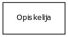
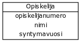
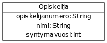
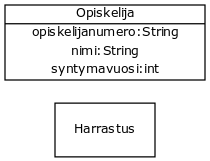
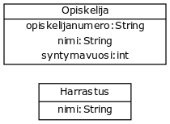
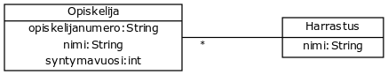
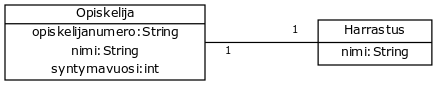
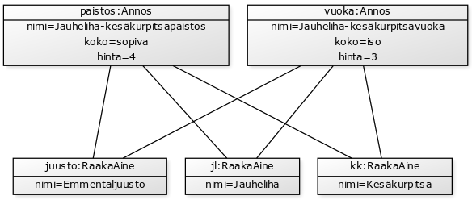
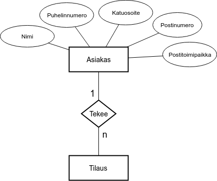

<text-box variant='learningObjectives' name='Oppimistavoitteet'>

- Tiedät miten tietoa kuvataan luokkakaavion avulla.
- Tiedät miten osallistumisrajoitteita merkitään luokkakaavioon.
- Tiedät mitä monen suhde moneen, yhden suhde moneen ja yhden suhde yhteen -osallistumisrajoitteet tarkoittavat.
- Tiedät pintapuolisesti miten tietoa kuvataan ER-kaavion avulla.

</text-box>


**Luokkakaavio** on kuvaus tarkasteltavan ongelman käsitteistä sekä käsitteiden välisistä yhteyksistä. Luokkakaavio voi sisältää myös käsitteisiin liittyvät attribuutit. Ohjelmistokehityksessä luokkakaavio kuvaa järjestelmän luokkarakennetta, eli ohjelman luokkia, luokkien attribuutteja sekä luokkien yhteyksiä.


Käytämme tällä kurssilla ensisijaisesti <a href="http://www.uml.org/" target="_blank" norel>UML</a>-kieltä kuvauskielenä. Käytämme <a href="https://fi.wikipedia.org/wiki/Luokkakaavio" target="_blank" norel>luokkakaavioita</a> käsitteiden ominaisuuksien ja yhteyksien mallintamiseen ja <a href="https://fi.wikipedia.org/wiki/Sekvenssikaavio" target="_blank" norel>sekvenssikaavioita</a> järjestelmien välisen kommunikoinnin mallintamiseen. Koko UML-spesifikaatio ei kuitenkaan ole tässä oleellinen -- luokkakaavioistakin esimerkiksi kooste- ja kompositiomerkintä ei ole tällä kurssilla tarpeen.

<br/>

<figure>
  
  <figcaption>Luokkakaavio, jossa on luokat Opiskelija ja Kurssisuoritus. Opiskelijalla on monta (nollasta äärettömään kurssisuoritusta). Jokaiseen kurssisuoritukseen liittyy yksi opiskelija.</figcaption>
</figure>

<br/>

## Luokkien kuvaaminen luokkakaaviossa

Luokkakaavion luominen lähtee luokan (käsitteen) määrittelystä. Luokkakaaviossa luokka piirretään laatikkona, jonka sisällä on luokan nimi. Alla on kuvattu luokka Opiskelija.


<figure>
  
  <figcaption>Luokka Opiskelija luokkakaaviossa. Yllä oleva luokkakaavio ei sisällä muita luokkia, eikä opiskelijalla ole attribuutteja.</figcaption>
</figure>

<br/>

Luokan määrittelyn jälkeen luokalle voidaan lisätä attribuutteja. Attribuutit lisätään luokkakaavioon luokan nimen alle. Alla olevassa esimerkissä jokaiseen Opiskelijaan liittyy opiskelijanumero, nimi ja syntymävuosi.

<figure>
  
  <figcaption>Luokka Opiskelija luokkakaaviossa. Opiskelijalle on määritelty attribuutit opiskelijanumero, nimi ja syntymävuosi.</figcaption>
</figure>

<br/>

Luokkakaavioon voidaan merkitä myös muuttujien tyypit. Alla olevassa esimerkissä yllä olevaa luokkaa on muokattu siten, että opiskelijan attribuutteihin on lisätty myös niiden tyypit. Opiskelijanumero ja nimi ovat merkkijonoja, syntymävuosi on kokonaisluku. Attribuutin tyyppi merkitään attribuutin nimen jälkeen kaksoispisteellä erotettuna, esimerkiksi `nimi:String`.

<figure>
  
  <figcaption>Luokka Opiskelija luokkakaaviossa. Opiskelijalle on määritelty attribuutit opiskelijanumero, nimi ja syntymävuosi. Attribuuteille on määritelty myös niiden tyypit.</figcaption>
</figure>

<br/>

Lisätään luokkakaavioon toinen luokka. Lisätään luokkakaavioon käsite Harrastus.

<figure>
  
  <figcaption>Luokkakaavio, joka sisältää luokat Opiskelija ja Harrastus. Opiskelijalle on määritelty attribuutit.</figcaption>
</figure>

<br/>

Lisätään harrastukselle seuraavaksi nimi-attribuutti. Sovitaan, että nimi on merkkijono.


<figure>
  
  <figcaption>Luokkakaavio, joka sisältää luokat Opiskelija ja Harrastus. Opiskelijalle ja harrastukselle on määritelty attribuutit.</figcaption>
</figure>

<br/>

Luokkakaaviossa on nyt sekä opiskelija että harrastus. Näillä ei ole tällä hetkellä kuitenkaan minkäänlaista yhteyttä.


## Yhteydet luokkakaaviossa

Tutustutaan seuraavaksi yhteyksien merkintään luokkakaaviossa. Yhteys luokkien välillä merkitään viivalla, johon lisätään osallistumisrajoitteet eli yhteyden tyyppiä kuvaavat määreet. Yhteydet voidaan karkeasti ottaen jakaa kolmeen kategoriaan: monen suhde moneen, yhden suhde moneen ja yhden suhde yhteen.


### Monen suhde moneen


Kahden käsitteen välillä on monen suhde moneen (`N-N`, `*-*`) -yhteys, jos ensimmäisen käsitteen ilmentymään voi liittyä monta toisen käsitteen ilmentymää, ja toisen käsitteen ilmentymään voi liittyä monta ensimmäisen käsitteen ilmentymää.

Monen suhde moneen yhteys merkitään luokkakaavioon viivalla, jonka kummassakin päässä on tähti. Alla olevassa kuvassa opiskelijan ja harrastuksen välillä on monesta moneen -yhteys. Tämä tarkoittaa käytännössä sitä, että opiskelijalla voi olla monta harrastusta ja yhtä harrastusta voi harrastaa useampi opiskelija.


<figure>
  
  <figcaption>
    Monen suhde moneen. Yllä opiskelijaan voi liittyä monta eri harrastusta, ja yksi harrastus voi liittyä moneen eri opiskelijaan. Monen suhde moneen merkitään luokkakaavioon piirrettyyn viivaan kahdella tähdellä, missä viivan kummassakin päässä on tähti.
  </figcaption>
</figure>

<br/>

### Yhden suhde moneen

Kahden käsitteen välillä on yhden suhde moneen (`1-N`, `1-*`) -yhteys, jos ensimmäisen käsitteen ilmentymään voi liittyä monta toisen käsitteen ilmentymää, mutta yhteen toisen käsitteen ilmentymään voi liittyä vain yksi ensimmäisen käsitteen ilmentymä.

Yhden suhde moneen yhteys merkitään luokkakaavioon viivalla, jonka sen monta kertaa esiintyvän käsitteen päässä on tähti. Alla olevassa kuvassa opiskelijan ja harrastuksen välillä on yhdestä moneen -yhteys. Tämä tarkoittaa käytännössä sitä, että opiskelijalla voi olla monta harrastusta, mutta kutakin harrastusta voi harrastaa korkeintaan yksi opiskelija.

<figure>
  
  <figcaption>
    Yhden suhde moneen. Yllä opiskelijaan voi liittyä monta eri harrastusta, mutta kutakin harrastusta saa harrastaa korkeintaan yksi opiskelija. Yhden suhde moneen merkitään luokkakaavioon piirrettyyn viivaan yhdellä tähdellä, joka on monta kertaa esiintyvän käsitteen päässä..
  </figcaption>
</figure>

<br/>

Tähden merkintä oikeaan kohtaan on oleellista. Tarkastellaan samaa esimerkkiä siten, että tähti on opiskelijan päädyssä. Nyt yhteen harrastukseen voi liittyä monta opiskelijaa, mutta jokaisella opiskelijalla on korkeintaan yksi harrastus.

<figure>
  
  <figcaption>
    Yhden suhde moneen, toinen esimerkki. Yllä jokaisella opiskelijalla on korkeintaan yksi harrastus, mutta harrastukseen voi liittyä monta opiskelijaa.
  </figcaption>
</figure>

<br/>

### Yhden suhde yhteen


Kahden käsitteen välillä on yhden suhde yhteen (`1-1`) -yhteys, jos ensimmäisen käsitteen ilmentymään voi liittyä vain yksi toisen käsitteen ilmentymä, ja toisen käsitteen ilmentymään voi liittyä vain yksi ensimmäisen käsitteen ilmentymä.

Oletuksen yhteys, missä osallistumisrajoitteita (eli viivan päissä olevia numeroita) tulkitaan yhden suhde yhteen -yhteydeksi. Osallistumisrajoitteet on kuitenkin hyvä merkitä eksplisiittisesti. Alla olevassa esimerkissä kuvataan tilanne, missä jokaisella opiskelijalla on täsmälleen yksi harrastus ja jokaiseen harrastukseen liittyy täsmälleen yksi opiskelija.

<figure>
  
  <figcaption>
    Yhden suhde yhteen. Yllä jokaisella opiskelijalla on yksi harrastus ja jokaiseen harrastukseen liittyy yksi opiskelija.
  </figcaption>
</figure>

<br/>

### Osallistumisrajoitteiden tarkempi määrittely

Osallistumisrajoitteiden avulla on myös mahdollista määritellä tarkempia rajoitteita. Esimerkiksi yhteys, missä käsitteeseen liittyy nollasta kahteen toista käsitettä merkitään muodossa `0..2`. Alla olevassa esimerkissä jokaisella opiskelijalla on nollasta kahteen harrastusta, mutta jokaiseen harrastukseen liittyy täsmälleen yksi opiskelija.

<figure>
  
  <figcaption>
    Yllä jokaisella opiskelijalla nollasta kahteen harrastusta. Jokaiseen harrastukseen liittyy korkeintaan yksi opiskelija. opiskelija.
  </figcaption>
</figure>

<br/>

Vastaavasti nollasta yhteen merkitään muodossa `0..1`. Alla olevassa esimerkissä jokaisella opiskelijalla on korkeintaan yksi harrastus (eli nolla tai yksi harrastusta), ja jokaiseen harrastukseen liittyy rajaton määrä opiskelijoita.


<figure>
  
  <figcaption>
    Yllä jokaisella opiskelijalla nollasta yhteen harrastusta eli korkeintaan yksi harrastus. Kuhunkin harrastukseen voi liittyä rajaton määrä opiskelijoita.
  </figcaption>
</figure>

<br/>


### Laajempi esimerkki

Alla on kuvattuna erään tilausjärjestelmän luokkakaavio. Tilausjärjestelmässä on asiakkaita, jotka voivat tehdä tilauksia. Tilauksiin liittyy joukko annoksia, joihin taas liittyy raaka-aineet sekä ravintola. Sama annos voi olla useammassa tilauksessa, ja useampi tilaus voi sisältää saman annoksen -- annos on toisaalta aina tietyn ravintolan tarjoama. Jokaisen annoksen kohdalla listataan annokseen kuuluvat raaka-aineet -- sama raaka-aine voi esiintyä useammassa annoksessa, ja yhdessä annoksessa voi olla useampia raaka-aineita.

<figure>
  
  <figcaption>
    Tilausjärjestelmän luokkakaavio
  </figcaption>
</figure>

<br/>

Jokaisen luokkakaaviossa olevan käsitteen kohdalle on merkitty käsitteeseen kuuluvat attribuutit sekä niiden tietotyypit. Esimerkiksi asiakkaalla on nimi, puhelinnumero, katuosoite, postinumero sekä postitoimipaikka. Edellisistä postinumero tallennetaan numerona, muut tallennetaan merkkijonona. Tilaukseen liittyy aika, kuljetustapa, tieto tilauksen vastaanottamisesta sekä tieto tilauksen toimittamisesta. Aika tallennetaan Date-tyyppisenä tietona, kuljetustapa on merkkijono (esim. "kuljetus" tai "nouto"), ja tieto tilauksen vastaanottamisesta sekä toimittamisesta on tallennettu totuusavoisena muuttujana.


## Tekstimuotoinen kuvaus


Yllä kuvattuja käsitteitä voi kuvata myös tekstimuotoisesti. Tällä kurssilla käytämme seuraavaa muotoa:

- Luokat (käsitteet) kuvataan hakasulkujen sisällä: [Annos], [Asiakas], [Tilaus]

- Luokkien attribuutit määritellään putki-merkin `|` jälkeen osaksi luokkien määrittelyä. Kukin attribuutti erotetaan toisistaan puolipisteellä:

  - [Annos|nimi;koko;hinta]
  - [Asiakas|nimi;puhelinnumero;katuosoite;postinumero;postitoimipaikka]
  - [Tilaus|aika;kuljetustapa;vastaanotettu;toimitettu]<br/><br/>

- Luokkien väliset yhteydet merkitään käsitteiden välille viivaa käyttäen. Viivan päätyihin merkitään osallistumisrajoitteet:
  - [Asiakas]1-*[Tilaus]
  - [Tilaus]*-*[Annos]


Koko tilausjärjestelmä voidaan kuvata tekstimuotoisessa esitysmuodossa seuraavalla tavalla:

- [Asiakas|nimi;puhelinnumero;katuosoite;postinumero;postitoimipaikka]<br/>
- [Ravintola|nimi;puhelinnumero;katuosoite;postinumero;postitoimipaikka]<br/>
- [Annos|nimi;koko;hinta]<br/>
- [Tilaus|aika;kuljetustapa;vastaanotettu;toimitettu]<br/>
- [RaakaAine|nimi]<br/>
- [Asiakas]1-\*[Tilaus]<br/>
- [Tilaus]\*-\*[Annos]<br/>
- [Annos]\*-\*[RaakaAine]<br/>
- [Ravintola]1-\*[Annos]<br/>


<quiznator id="5c4e275099236814c5bb7d06"></quiznator>

##  Yhteysrajoitteet ja oliot


Tarkastellaan edellä kuvattuja yhteystyyppejä yhdestä moneen ja monesta moneen olioiden näkökulmasta **oliokaavio**na. Oliokaavioita käytetään ohjelmien tilan muutosten tarkasteluun ohjelman suorituksen aikana. Keskiössä ovat ohjelman käsittelemät oliot, olioiden muuttujien arvot sekä viitteet olioiden välillä. Valmiit kokoelmaluokat (esim. `ArrayList`) sivuutetaan siten, että viitteet piirretään olioiden välille.

Oletetaan, että käytössämme on luokat `Annos` ja `RaakaAine`, jotka vastaavat aiemmassa esimerkissä näkemiämme luokkia.

```java
RaakaAine kk = new RaakaAine("Kesäkurpitsa");
RaakaAine jl = new RaakaAine("Jauheliha");
RaakaAine juusto = new RaakaAine("Emmentaljuusto");

Annos vuoka = new Annos("Jauheliha-kesäkurpitsavuoka", "iso", 3);
Annos paistos = new Annos("Jauheliha-kesäkurpitsapaistos", "sopiva", 4);

vuoka.lisaaRaakaAineet(kk, jl, juusto);
paistos.lisaaRaakaAine(kk, jl, juusto);
```

Ohjelman tila suorituksen lopussa piirretään oliokaaviona seuraavasti. Jokainen olio merkitään omana laatikkonaan, mikä sisältää sekä olion nimen ja tyypin että oliomuuttujat. Oliomuuttujien arvot merkitään myös oliokaavioon. Alla olevasta oliokaaviosta näkee, että annoksen ja raaka-aineen välillä on monesta moneen yhteys -- annoksella voi olla monta raaka-ainetta ja raaka-aine voi liittyä useampaan annokseen.


<figure>
  
  <figcaption>
      Edellä kuvatun raaka-aineita ja annoksia käsittelevän ohjelman tila suorituksen lopussa.
  </figcaption>
</figure>

Tarkastellaan seuraavaksi Asiakkaan ja Tilauksen välistä yhteyttä oliokaaviona. Oletetaan, että oliokaaviona piirretään alla kuvatun ohjelman lopputilanne.


```java
Asiakas kusti = new Asiakas("Kusti", "...", "...", 33100, "Tampere");
Asiakas pukki = new Asiakas("JP", "...", "...", 99999, "Korvatunturi");

Tilaus t1 = new Tilaus(kusti, "polkupyörä");
Tilaus t2 = new Tilaus(pukki, "helikopteri");
Tilaus t3 = new Tilaus(pukki, "helikopteri");

t1.vastaanotettu = true;
t3.vastaanotettu = true;
```

<figure>
  
  <figcaption>
      Edellä kuvatun asiakkaiden ja tilausten yhteyksiä käsittelevän ohjelman tila suorituksen lopussa.
  </figcaption>
</figure>

Yllä olevaa oliokaaviota tarkasteltaessa huomaamme, ettei jokaiseen tilaukseen liittyy vain yksi asiakas, mutta asiakkaalla voi olla useampia tilauksia.

<text-box variant='hint' name='Miten oliokaaviot liittyvät tietokantoihin?'>

Oliokaavioiden avulla näytetään ohjelman suorituksen aikainen olioiden tila, joka kertoo olioiden muuttujien arvoista. Tietokannanhallintajärjestelmien tehtävänä on tallentaa ja ylläpitää tietoa -- esimerkiksi olioiden tilaa. Ymmärtämällä miten olioiden tila voidaan esittää, löydämme ehkäpä selkeän kytköksen tietokantojen sisältämän tiedon esittämiselle.

</text-box>


## ER-kaavio

ER-malli (<a href="https://en.wikipedia.org/wiki/Entity–relationship_model" target="_blank">Entity-relationship model</a>) on toinen menetelmä ongelma-alueen käsitteiden sekä niiden suhteiden kuvaamiseen. ER-mallissa käsitteet kuvataan suunnikkaina, attribuutit ellipseinä ja käsitteiden suhteet vinoneliöiden avulla.

<br/>

Alla olevassa esimerkissä on kuvattuna käsitteet `Asiakas` ja `Tilaus` (kuvattu suunnikkaina). Käsitteelle `Asiakas` on määritelty attribuutit (kuvattu ellipseinä), käsitteelle `Tilaus` attribuutteja ei ole määritelty. Käsitteiden välinen yhdestä moneen -yhteys on merkitty kaavioon vinoneliön avulla -- vinoneliöön on määritelty myös osallistumisrajoitteet: kuhunkin tilaukseen liittyy aina yksi asiakas, kun taas asiakkaaseen voi liittyä monta (`n`) tilausta.

<figure>
  
  <figcaption>
    Käsitteet Asiakas ja Tilaus ER-kaaviossa.
  </figcaption>
</figure>

<br/>

Käytämme tällä kurssilla ensisijaisesti luokkakaavioita (sopivasti soveltaen), mutta pääset välillä lukemaan ja tuottamaan myös muunlaisia kaaviotyyppejä.


<moodle-exercise name="Tiedon kuvaaminen luokkakaaviona ja ER-kaaviona">

Tämä on kurssin ensimmäinen Moodle-järjestelmään palautettava tehtävä. Moodlessa on osakohtaiset tehtävien palautusalueet.

Piirrä alla olevaa yksinkertaista versiot säilyttävää wikisivustoa kuvaava käsitekaavio sekä luokkakaaviona että ER-kaaviona. Palauta piirrustuksesi yhtenä PDF-tiedostona Moodleen.

- [Sivu|nimi;osoite]
- [Sisalto|teksti;versionumero]
- [Henkilo|nimi]
- [Kommentti|teksi]
- [Sivu]1-\*[Sisalto]
- [Sisalto]\*-1[Henkilo]
- [Sisalto]1-\*[Kommentti]
- [Henkilo]1-\*[Kommentti]

Voit käyttää piirtämiseen esimerkiksi <a href="https://www.draw.io/" target="_blank">draw.io</a>-palvelua.

</moodle-exercise>
