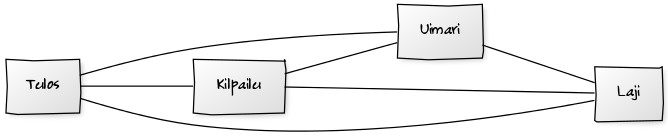
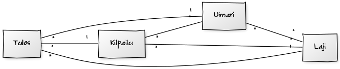
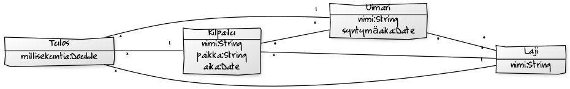
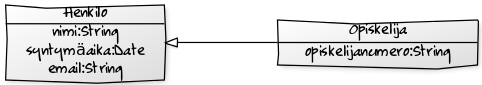

<text-box variant='learningObjectives' name='Oppimistavoitteet'>

- Tunnet käsiteanalyysin askeleet.
- Osaat luoda ongelma-alueen kuvauksesta luokkakaavion käsiteanalyysin askeleita noudattaen.

</text-box>

Käsiteanalyysia (conceptual modeling, domain modeling) käytetään ongelma-alueen käsitteellistämiseen ja kielentämiseen, mikä edesauttaa ongelma-alueeseen liittyvää keskustelua sekä päätöksentekoa. Käsiteanalyysi tehdään iteratiivisesti esimerkiksi ongelma-alueen tekstuaalista kuvausta läpikäyden.

Käsiteanalyysin tuloksena saadaan aikaan ongelma-aluetta kuvaava tietomalli, joka sisältää ongelma-alueen käsitteet ja niiden yhteydet sekä käsitteisiin liittyvät attribuutit selkeästi ja kuvaavasti nimettyinä. Käsiteanalyysin lopputuloksessa ei ole sellaisia käsitteitä tai attribuutteja, jotka ovat ongelma-aluetta varten rakennettavan järjestelmän tai ratkaisun kannalta epäoleellisia.

Käsiteanalyysin lopputulos voi olla esimerkiksi luokkakaavio tai ER-kaavio. Tämän materiaalin käsiteanalyysiesimerkkien lopputuloksena on luokkia, luokkien attribuutteja, sekä luokkien välisiä yhteyksiä, jotka kuvataan luokkakaaviossa.

 

## Käsite ja käsitteiden väliset yhteydet

Arkielämässä näkee useita saman tyyppisiä esineitä. Esimerkiksi suurin osa älypuhelimista on karkeasti ottaen saman mallisia -- jokainen puhelin on rakennettu tiettyä mallia noudattaen. Olio-ohjelmoinnin termejä noudattaen voimme sanoa, että omistamasi puhelin on `Puhelin`-luokasta tehty ilmentymä eli olio. Luokka on rakennuspiirrustus, jonka perusteella yksittäiset oliot luodaan.

Käsitteet ovat samalla tavalla abstrakteja kuin luokat, eli käsitteestä voi olla useampia ilmentymiä. Käsitteistä luodut ilmentymät voidaan toisaalta myös erottaa toisistaan jollain tavalla, tai niille tulee olla vähintään mahdollista määritellä jonkinlainen yksilöivä tunnus.

Käsitteiden välisillä yhteyksillä tarkoitetaan käsitteiden välisiä suhteita. Esimerkiksi puhelimella voi olla omistaja, ja toisaalta puhelimen omistaja voi opiskella jossain opinahjossa.

Käsitteitä voidaan ajatella myös hetkellisen olemassaolon kautta. Hyvät käsite-ehdokkaat eivät tyypillisesti ole (pysyvästi) olemassaoloriippuvaisia joistain toisista käsitteistä. Esimerkiksi puhelimen olemassaolo ei ole riippuvainen omistajasta, ja puhelimen omistaja ei ole riippuvainen opinahjosta. Käsitteen olemassaolosta riippuvaiset asiat -- kuten esimerkiksi henkilön nimi -- ovat hyviä attribuuttiehdokkaita käsitteille.

## Käsiteanalyysin vaiheet

Käsiteanalyysissä käytetään algoritmia, joka koostuu viidestä vaiheesta. Näitä vaiheita käydään läpi yksitellen. Vaiheita läpikäydessä voi tarvittaessa palata myös aiempaan vaiheeseen. Vaiheet ovat seuraavat:

1. **Tunnista käsite-ehdokkaat**. Käsite-ehdokkaat tunnistetaan etsimällä ongelma-alueen kuvauksesta oleellisia substantiiveja ja ilmiöitä. Tässä vaiheessa myös rajataan pois käsitteitä, jotka eivät ole oleellisia ongelma-alueen kannalta.

2. **Tunnista käsitteiden väliset yhteydet**. Yhteydet tunnistetaan etsimällä ongelma-alueen kuvauksesta verbejä, käsitteiden yhteyksiä sekä käsitteitä kuvaavia lausahduksia.

3. **Tunnista ja määrittele osallistumisrajoitteet**. Osallistumisrajoitteet tarkentavat lopputuloksena saatavaa tietomallia. Osallistumisrajoitteita saadaan selville ongelma-alueen kuvauksessa esiintyvien adjektiivien ja määreiden kautta.

4. **Tunnista attribuutit ja lisää ne käsitteille**. Tunnista käsitteisiin liittyvät tiedot eli attribuutit, joita halutaan tallentaa tietokantaan. Käsitteisiin liittyvät attribuutit tunnistaa muunmuassa olemassaoloriippuvaisista substantiiveista sekä käsitteiden yleisistä ominaisuuksista. Attribuutti saattaa olla joko yksittäinen arvo tai arvojoukko -- arvojoukot tunnistetaan tyypillisesti lukumäärien kuvauksista.

5. **Yleistä ja eriytä käsitteitä**. Tunnista käsitteistä yliluokkia ja aliluokkia. Näiden tunnistaminen tapahtuu esimerkiksi käsitteitä tarkastelemalla ja miettimällä "onko käsite toisen käsitteen erikoistapaus".

Sovelletaan käsiteanalyysin askeleita seuraavaan Uimaseuraesimerkkiin.

_Uimaseuramme Loch Nessin hirviöt on tähän päivään asti käyttänyt paperia uimareidensa tulosten seuraamiseen ja ylläpitoon. Uimaseuraamme juuri liittynyt valmennuspäällikkö vaatii kirjanpidon nykyaikaistamista, ja haluaa että tulokset tallennetaan tietokoneelle._

_Valmennuspäällikkömme antoi minulle tehtäväksi välittää tietoa seurastamme, eli tässäpä sitä: Meillä on noin sata mies- ja naispuolista uimaria. Uimarit kilpailevat yleensä yhdessä lajissa, esimerkiksi selkäuinnissa, mutta jotkut uimarit kilpailevat useammassakin lajissa. Tuloksia kirjataan sekä kuukausittain järjestettävistä seuran sisäisistä "kuukauden vesihiisi"-kisoista, että jokaisesta seuran ulkopuolella järjestettävästä kilpailusta. Valmentajien tulee pystyä käyttämään tietokoneelle tallennettuja tietoja myös kotoa esimerkiksi internetin välityksellä._

### Tunnista käsite-ehdokaat

Ensimmäinen käsiteanalyysin askel on käsite-ehdokkaiden tunnistaminen. Käsite-ehdokkaita tunnistaessa laaditaan luettelo ongelma-alueen oleellisista tietokohteista. Luettelon laatiminen alkaa substantiivien tunnistamisesta. Ensimmäisessä vaiheessa oleelliset käsite-ehdokkaat alleviivataan.

<em><u>Uimaseuramme</u> Loch Nessin hirviöt on tähän päivään asti käyttänyt <u>paperia</u> <u>uimareidensa</u> <u>tulosten</u> seuraamiseen ja ylläpitoon. <u>Uimaseuraamme</u> juuri liittynyt <u>valmennuspäällikkö</u> vaatii <u>kirjanpidon</u> nykyaikaistamista, ja haluaa että <u>tulokset</u> tallennetaan <u>tietokoneelle</u>.</em>

 

<em><u>Valmennuspäällikkömme</u> antoi minulle tehtäväksi välittää tietoa <u>seurastamme</u>, eli tässäpä sitä: Meillä on noin sata <u>mies- ja naispuolista</u> <u>uimaria</u>. <u>Uimarit</u> kilpailevat yleensä yhdessä <u>lajissa</u>, esimerkiksi <u>selkäuinnissa</u>, mutta jotkut uimarit kilpailevat useammassakin <u>lajissa</u>. Tuloksia kirjataan sekä kuukausittain järjestettävistä seuran sisäisistä "kuukauden vesihiisi"-<u>kisoista</u>, että jokaisesta seuran ulkopuolella järjestettävästä <u>kilpailusta</u>. Valmentajien tulee pystyä käyttämään tietokoneelle tallennettuja tietoja myös kotoa esimerkiksi internetin välityksellä.</em>

 

Yllä olevasta ongelma-alueen kuvauksesta tunnistettiin ja alleviivattiin joukko substantiiveja, joita käytetään käsite-ehdokkaina. Alla oleva lista sisältää käsite-ehdokkaat. Jokainen käsite-ehdokas on muutettu yksikkömuotoon.

- Uimaseura
- Paperi
- Uimari
- Tulos
- Valmennuspäällikkö
- Kirjanpito
- Tietokone
- Seura
- Miesuimari
- Naisuimari
- Selkäuinti
- Laji
- Kilpailu

Käsite-ehdokkaiden karsinta tapahtuu harkitsemalla jokaista ehdokasta erikseen ja miettimällä onko se oleellinen ongelma-alueen ratkaisun kannalta, eli tarvitseeko kyseistä käsitettä tai siihen liittyvää tietoa tallentaa. Alla on kuvattu eräs mahdollinen karsinta. Jokaisen käsitteen yhteydessä on myös perustelu karsinnalle.

- <s>Uimaseura</s> -- seuralle tehdään järjestelmää, voidaan jättää pois ainakin toistaiseksi.
- <s>Paperi</s> -- tästä haluttiin päästä eroon, tulokset kirjattiin aiemmin paperille.
- Uimari
- Tulos
- <s>Valmennuspäällikkö</s> -- valmennuspäällikkö haluaa uuden järjestelmän, mutta ei oleellinen käsite tietomallin kannalta.
- <s>Kirjanpito</s> -- järjestelmä tulee sisältämään kirjanpidon, mutta kirjanpito ei käsite järjestelmässä.
- <s>Tietokone</s> -- kts. edellinen
- <s>Seura</s> -- kts. uimaseura.
- <s>Miesuimari</s> -- Uimari on valittuna käsitteeksi, sukupuoli voi esim. olla uimarin attribuuttina.
- <s>Naisuimari</s> -- kts. edellinen
- <s>Selkäuinti</s> -- Selkäuinti on laji. Laji on valittuna käsitteeksi.
- Laji
- Kilpailu

Ehdokkaiden karsinnan jälkeen seuraavat käsitteet ovat jäljellä:

- Kilpailu
- Laji
- Uimari
- Tulos

### Tunnista käsitteiden väliset yhteydet

Käsiteanalyysin toinen askel on käsitteiden välisten yhteyksien tunnistaminen. Yhteydet tunnistetaan etsimällä tekstistä verbejä, käsitteiden yhteyksiä sekä käsitteitä kuvaavia lausahduksia. Tämän lisäksi aiempi aihealueen tietämys on lähes poikkeuksetta hyödyksi.

_Uimaseuramme Loch Nessin hirviöt on tähän päivään asti käyttänyt paperia uimareidensa tulosten seuraamiseen ja ylläpitoon. Uimaseuraamme juuri liittynyt valmennuspäällikkö vaatii kirjanpidon nykyaikaistamista, ja haluaa että tulokset tallennetaan tietokoneelle._

<em>Valmennuspäällikkömme antoi minulle tehtäväksi välittää tietoa seurastamme, eli tässäpä sitä: <u>Meillä on noin sata mies- ja naispuolista uimaria</u>. <u>Uimarit kilpailevat yleensä yhdessä lajissa</u>, esimerkiksi selkäuinnissa, mutta <u>jotkut uimarit kilpailevat useammassakin lajissa</u>. <u>Tuloksia kirjataan sekä kuukausittain järjestettävistä seuran sisäisistä "kuukauden vesihiisi"-kisoista, että jokaisesta seuran ulkopuolella järjestettävästä kilpailusta</u>. Valmentajien tulee pystyä käyttämään tietokoneelle tallennettuja tietoja myös kotoa esimerkiksi internetin välityksellä.</em>

 

Edellä tarkastellusta kuvauksesta nousee esille seuraavat tekstit:

- Meillä on noin sata mies- ja naispuolista uimaria

- Uimarit kilpailevat yleensä yhdessä lajissa

- jotkut uimarit kilpailevat useammassakin lajissa

- Tuloksia kirjataan sekä kuukausittain järjestettävistä seuran sisäisistä "kuukauden vesihiisi"-kisoista, että jokaisesta seuran ulkopuolella järjestettävästä kilpailusta

Teksteistä voidaan päätellä seuraavat yhteydet:

- Meillä on noin sata mies- ja naispuolista uimaria: seuraan liittyy uimareita. Poistimme aiemmin käsitteen seura, joten tämä yhteys ei ole relevantti.

- Uimarit kilpailevat yleensä yhdessä lajissa: uimariin liittyy laji, uimariin liittyy kilpailu, kilpailuun liittyy laji.

- jotkut uimarit kilpailevat useammassakin lajissa: (sama kuin yllä).

- Tuloksia kirjataan sekä kuukausittain järjestettävistä seuran sisäisistä "kuukauden vesihiisi"-kisoista, että jokaisesta seuran ulkopuolella järjestettävästä kilpailusta: tulos liittyy kilpailuun.

_Käsiteanalyysin tekijän tietämys aihealueeseen liittyen antaa olettaa, että tulokseen liittyy kilpailun lisäksi myös laji ja uimari._

Esille nousee siis seuraavat yhteydet:

- Uimariin liittyy laji

- Uimariin liittyy kilpailu

- Kilpailuun liittyy laji

- Tulokseen liittyy kilpailu

- Tulokseen liittyy laji

- Tulokseen liittyy uimari

<figure>
  
  &nbsp;
  <figcaption>Kun käsitteet on tunnistettu, hahmotellaan niiden välisiä yhteyksiä. Yllä on kuvattuna eräs mahdollisuus ongelma-alueen käsitteiden yhteyksiksi.</figcaption>
</figure>

### Tunnista ja määrittele osallistumisrajoitteet

Käsiteanalyysin kolmas vaihe on osallistumisrajoitteiden tunnistaminen ja määrittely. Osallistumisrajoitteilla tarkoitetaan lukumäärällisiä rajoitteita käsitteiden välillä. Osallistumisrajoitteet merkitään luokkakaavioon käsitteitä yhdistävien viivojen päätyihin. Osallistumisrajoitteita saadaan selville ongelma-alueen kuvauksessa esiintyvien adjektiivien ja määreiden kautta, jonka lisäksi aihealueeseen liittyvästä tietämyksestä on hyötyä.

Edellisessä askeleessa tunnistetuista yhteyksistä saadaan selville seuraavat tiedot: uimari voi osallistua yhteen tai useampaan lajiin, eli uimariin voi liittyä monta lajia. Toisaalta, yhtä lajia voi harrastaa useampi uimari. Kilpailussa voi olla monta lajia, ja lajia voidaan todennäköisesti uida monessa kilpailussa. Kilpailussa voi olla monta uimaria, ja uimari voi uida useammassa kilpailussa. Yksittäiseen tulokseen taas liittyy yksi uimari, yksi laji, ja yksi kilpailu -- mutta, yhteen uimariin voi liittyä monta tulosta, yhteen lajiin voi liittyä monta tulosta, ja yhteen kilpailuun voi liittyä monta tulosta.

Ehdotus käsitekaavioksi osallistumisrajoitteiden kanssa on seuraavanlainen:

<figure>
  
  &nbsp;
  <figcaption>Kun käsitteiden väliset yhteydet on tunnistettu, lisätään yhteyksiin osallistumisrajoitteet. Yllä on kuvattu eräs ehdotus osallistumisrajoitteiksi.</figcaption>
</figure>

### Tunnista attribuutit ja lisää ne käsitteille

Käsiteanalyysin neljäs vaihe on attribuuttien tunnistaminen sekä niiden lisääminen käsitteille. Käsitteisiin liittyvät attribuutit tunnistaa muunmuassa olemassaoloriippuvaisista substantiiveista sekä käsitteiden yleisistä ominaisuuksista. Attribuutti saattaa olla joko yksittäinen arvo tai arvojoukko -- arvojoukot tunnistetaan tyypillisesti lukumäärien kuvauksista. Samalla kuitenkin halutaan tallentaa vain ne attribuutit (ja käsitteet), jotka ovat ongelma-alueen kannalta oleellisua.

Ongelma-alueen kuvauksesta tiedämme, että kilpailuilla on paikka (esim. "paikalliset kilpailut", "seuran ulkopuoliset kilpailut") ja nimi (esim. "kuukauden vesihiisi"), jonka lisäksi nimestä voi päätellä, että kilpailuun liittyy aika. Vastaavasti uimareihin liittyy todennäköisesti nimi ja syntymäaika, vaikkei kuvauksessa kumpaakaan suoraan pyydetä. Nimen perusteella on helppo tarkastaa kenestä on kyse, ja syntymäaika auttaa seuraamaan tuloskehitystä. Tulokseen tarvitaan jonkinlainen tieto tuloksesta -- uimakisoissa kyseessä on tarkka aika, ja laji kerrotaan tässä nimenä.

<figure>
  
  &nbsp;
  <figcaption>Kun käsitteiden väliset yhteydet ja osallistumisrajoitteet on tunnistettu, lisätään käsitteille attribuutit.</figcaption>
</figure>

### Yleistä ja eriytä käsitteitä

Käsiteanalyysin viimeinen askel on käsitteiden yleistäminen ja eriyttäminen. Tässä tunnistetaan käsitteistä yliluokkia ja aliluokkia. Näiden tunnistaminen tapahtuu esimerkiksi käsitteitä tarkastelemalla ja miettimällä "onko käsite toisen käsitteen erikoistapaus". Vastaavasti toistuvat attribuutit saattavat antaa ilmi yli- ja aliluokkia.

Yli- ja aliluokkien etsintä kannattaa tehdä matriisina, missä jokaista käsitettä verrataan jokaiseen muuhun käsitteeseen. Käymällä läpi käsitteemme, huomaamme, ettei niissä ole yli- tai aliluokille tarvetta.

<table class="table">
  <tr>
    <th>
      -
    </th>
    <th>
      Kilpailu
    </th>
    <th>
      Laji
    </th>
    <th>
      Tulos
    </th>
    <th>
      Uimari
    </th>
  </tr>
  <tr>
    <th>
      Kilpailu
    </th>
    <td>
      -
    </td>
    <td>
      Kilpailu ei ole lajin erikoistapaus.
    </td>
    <td>
      Kilpailu ei ole tuloksen erikoistapaus.
    </td>
    <td>
      Kilpailu ei ole uimarin erikoistapaus.
    </td>
  </tr>
  <tr>
    <th>
      Laji
    </th>
    <td>
      Laji ei ole kilpailun erikoistapaus.
    </td>
    <td>
      -
    </td>
    <td>
      Laji ei ole tuloksen erikoistapaus.
    </td>
    <td>
      Laji ei ole uimarin erikoistapaus.
    </td>
  </tr>
  <tr>
    <th>
      Tulos
    </th>
    <td>
      Tulos ei ole kilpailun erikoistapaus.
    </td>
    <td>
      Tulos ei ole lajin erikoistapaus.
    </td>
    <td>
      -
    </td>
    <td>
      Tulos ei ole uimarin erikoistapaus.
    </td>
  </tr>
  <tr>
    <th>
      Uimari
    </th>
    <td>
      Uimari ei ole kilpailun erikoistapaus.
    </td>
    <td>
      Uimari ei ole lajin erikoistapaus.
    </td>
    <td>
      Uimari ei ole tuloksen erikoistapaus.
    </td>
    <td>
      -
    </td>
  </tr>
</table>

Yleistettävää tai eriytettävää ei tässä tapauksessa löydy.

Tarkastellaan vielä tilannetta, missä luokkakaaviosta löytyy tapaus, missä toinen käsite on toisen käsitteen erikoistapaus. Oletetaan, että käytössämme ovat käsitteet Henkilö ja Opiskelija. Henkilöllä on nimi, syntymäaika ja sähköpostiosoite. Opiskelijalla on nimi, syntymäaika, sähköpostiosoite ja opiskelijanumero.

<figure>
  
  &nbsp;
  <figcaption>Henkilö ja opiskelija luokkakaaviossa.</figcaption>
</figure>

  Huomaamme, että opiskelija on henkilön erikoistapaus. Opiskelijalla on muuten samat ominaisuudet kuin henkilöllä, mutta sillä on lisäksi opiskelijanumero. Voimme luoda tämän perusteella luokkakaavion, missä opiskelija perii henkilön. Tämä merkitään seuraavasti.

<figure>
  
  &nbsp;
  <figcaption>Henkilö ja opiskelija luokkakaaviossa. Opiskelija perii henkilön, eli opiskelijalla on kaikki henkilön attribuutit, jonka lisäksi opiskelijalla on myös omat attribuuttinsa.</figcaption>
</figure>

<moodle-exercise name="Käsiteanalyysi">

Tee alla olevaan ongelma-alueen kuvaukseen käsiteanalyysi kurssimateriaalin ohjeistusta seuraten ja palauta tulos PDF-muotoisena dokumenttina kurssin Moodle-järjestelmään. Kirjoita palautukseesi jokainen käsiteanalyysin vaihe erikseen, sekä käsiteanalyysin lopputuloksena syntynyt kaavio. Lopullisessa kaaviossa tulee esiintyä käsitteiden nimet, käsitteiden attribuutit sekä käsitteiden väliset yhteydet ja yhteysrajoitteet.

_Verkkohuutokauppamme tarjoaa rekisteröityneille asiakkaille mahdollisuuden laittaa tuotteitaan tarjolle huutokauppaan. Rekisteröityneistä asiakkaista tallennetaan asiakkaan yhteystiedot. Kukin tuote liittyy yhteen tai useampaan kategoriaan, joiden perusteella verkkohuutokaupasta etsitään tuotteita. Kussakin kategoriassa voi olla useita tuotteita. Tuotteen lisääminen verkkokauppaan on suoraviivaista: asiakas kirjoittaa tuotteen tiedot, merkitsee kategoriat joihin tuote kuuluu, määrittää huutokaupan alkamis- ja päättymisajan sekä asettaa minimihinnan. Kuka tahansa voi tehdä tarjouksen tuotteesta -- tarjouksen yhteydessä tarjoaja antaa yhteystietonsa. Tuotteesta kiinnostuneet voivat myös lähettää kysymyksiä myyjälle järjestelmän kautta. Kysymykset välitetään järjestelmän kautta myyjälle, samoin kuin myyjän mahdolliset kysymyksiin antamat vastaukset lähetetään järjestelmän kautta kysyjälle. Myyjä voi halutessaan merkitä kysymyksen ja vastauksen julkiseksi, jolloin ne julkaistaan tuotteen tietojen yhteydessä._

Voit käyttää piirtämiseen esimerkiksi <a href="https://www.draw.io/" target="_blank">draw.io</a>-palvelua.

</moodle-exercise>
