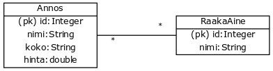
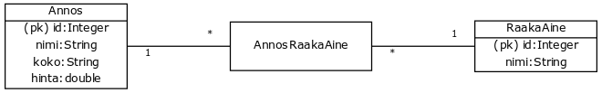
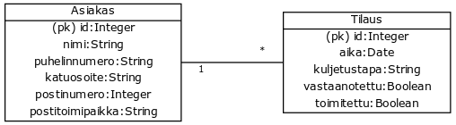
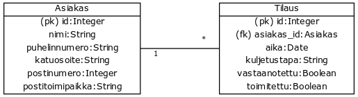
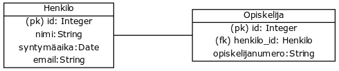

<text-box variant='learningObjectives' name='Oppimistavoitteet'>

- Osaat muuntaa käsiteanalyysin tuloksen tietokantakaavioksi.

</text-box>

**Tietokantakaavio** (myös relaatiokaavio) on kuvaus tietokantatauluista sekä tietokantatauluihin liittyvistä tiedoista. Relaatiokaavion perusteella luodaan tietokantataulujen luomiseen tarvittavat kyselyt. Tutustutaan ensin termiin *relaatio* ja harjoitellaan sen jälkeen luokkakaavion muuntamista relaatiokaavioksi.

##  Relaatiomalli

Relaatiomallin perusajatus on tallennettavan tiedon jakaminen käsitteisiin sekä käsitteiden välisiin yhteyksiin. Jokaista käsitettä vastaa relaatiotietokannassa taulu, ja jokaiselle käsitteen ominaisuudelle eli attribuutille on taulussa oma sarake. Jokainen taulun rivi vastaa yhtä käsitteen ilmentymää, ja tietokantatauluja määriteltäessä taululle määritellään tyypillisesti myös *avain*, jonka perusteella kukin rivi -- eli käsitteen ilmentymä -- voidaan yksilöidä.

Relaatiomallille on myös hieman formaalimpi määritelmä, johon tutustutaan seuraavaksi. Noudatamme tässä Edgar Coddin vuonna 1970 julkaistun artikkelin <a href="http://citeseerx.ist.psu.edu/viewdoc/download?doi=10.1.1.98.5286&rep=rep1&type=pdf" target="_blank" norel>"A Relational Model of Data for Large Shared Data Banks"</a> esitysasua.

 

###  Relaatio

Olkoon <em>S1, S2, ..., Sn</em> arvojoukkoja, joiden sisältämät arvot eivät ole välttämättä täysin erillisiä. Relaatio *R* on joukko *n* alkion kokoisia monikkoja. Jokaisen relaatiossa *R* olevan monikon ensimmäisen arvon tulee kuulua joukkoon <em>S1</em>, toisen arvon kuulua joukkoon <em>S2</em> jne.

 

Relaatio *R* on siis osajoukko joukkojen <em>S1, S2, ..., Sn</em> välisestä karteesisesta tulosta <em>S1 &#10799; S2 &#10799; ... &#10799; Sn</em>.

Relaatio esitetään tyypillisesti taulukkona, jolla on seuraavat ominaisuudet:

- Jokainen taulukon rivi kuvaa yhtä relaation *R* monikkoa.
- Taulukon rivien järjestyksellä ei ole väliä.
- Jokainen taulukon rivi on erilainen.
- Sarakkeiden järjestyksellä kuvataan relaation arvojoukkoja; ensimmäisen sarakkeen arvot tulevat arvojoukosta <em>S1</em>, toisen sarakkeen arvojoukosta <e,>S2</em> jne..
- Jokaiselle sarakkeelle annetaan nimi, joka kuvaa kunkin arvojoukon mahdollisia arvoja.

### Pääavain, viittaaminen ja viiteavain

Jokaisella relaatiolla on tyypillisesti yksi arvojoukko tai arvojoukkojen yhdistelmä, joiden arvojen perusteella voidaan yksilöidä relaation monikko (eli taulukon rivi). Tällaista arvojoukkoa tai arvojoukkojen yhdistelmää kutsutaan *pääavaimeksi*. Oleellinen ominaisuus relaatioissa on myös saman tai toisen relaation arvoihin *viittaaminen*. Tämä tapahtuu *viiteavaimen* avulla. Relaatiossa *R* oleva arvojoukko tai arvojoukkojen yhdistelmä, joka ei ole relaation *R* pääavain, mutta sisältää jonkun relaation pääavaimia, on viiteavain.

### Joukko-operaatiot ja kyselyt

Relaatiot ovat joukkoja, joten niitä voi käsitellä joukko-opin operaatioiden avulla. Tällä kurssilla näihin ei syvennytä tarkemmin, mutta teemasta kiinnostuneiden kannattanee lukea klassikkoteos <a href="http://citeseerx.ist.psu.edu/viewdoc/download?doi=10.1.1.98.5286&rep=rep1&type=pdf" target="_blank">"A Relational Model of Data for Large Shared Data Banks"</a>.

 

## Muunnos luokkakaaviosta relaatiokaavioksi

Tutustutaan seuraavaksi käsitekaavion (tässä luokkakaavion avulla kuvattuna) relaatiokaavioksi muuntamiseen. Muunnosta varten on kolme askelta sisältävä algoritmi, jota seuraamalla muunnos tapahtuu suoraviivaisesti. Askeleet ovat seuraavat.

1. Määrittele jokaiselle luokkakaavion käsitteelle käsitteen ilmentymän yksilöivä pääavain.

2. Muunna kaikki monen suhden moneen -yhteydet yhden suhde moneen -tyyppisiksi lisäämällä käsitteiden väliin liitostaulu.

3. Lisää yhden suhde moneen -tyyppisiin yhteyksiin viiteavain "moneen"-yhteyden (eli tähden) päässä olevaan tauluun.

Tarkastellaan edellä kuvattuja askeleita ja muunnetaan aiemmin materiaalissa käsitellyn tilausjärjestelmän luokkakaavio tietokantakaavioksi. Muunnoksen lopputulos tulee vastaamaan toisessa osassa käyttämäämme hieman laajempaa esimerkkiä.

<figure>
  
  <figcaption>
    Tietokantakaavioksi muunnettava tilausjärjestelmän luokkakaavio.
  </figcaption>
</figure>

### Käsitteen yksilöivän pääavaimen määrittely

Muunnoksen ensimmäisessä askeleessa määritellään jokaiselle luokkakaavion käsitteelle ilmentymän yksilöivä pääavain (primary key). **Pääavain** yksilöi käsitteen ilmentymän. Pääavaimella on muutamia ominaisuuksia: sen täytyy olla uniikki (sama arvo ei saa esiintyä samassa taulussa useampaan kertaan) ja se ei saa olla tyhjä. Pääavaimeksi valitaan (nykyään) tyypillisesti juokseva numero - lisäämme jokaiseen käsitteeseen sarakkeen `id`, joka merkitään pääavaimeksi. Käytössämme olevissa relaatiokaaviossa pääavain merkitään merkinnällä (pk).

Alla tilausjärjestelmän luokkakaavioon on merkitty pääavaimet.

<figure>
  
  <figcaption>
    Tilausjärjestelmän luokkakaavion muunnos relaatiokaavioksi, askel 1. Ensimmäisessä askeleessa jokaiseen käsitteeseen määritellään pääavain, jonka perusteella kukin käsitteen ilmentymä voidaan yksilöidä. Tässä käytetään numeerista tunnusta, eli esimerkiksi uutta asiakasta luodessa asiakkaan tunnus on numero, joka ei ole vielä yhdenkään muun asiakkaan käytössä (numerot merkitään tyypillisesti juoksevasti 1...n).
  </figcaption>
</figure>

### Monen suhde moneen -yhteyksien käsittely

Muunnoksen toisessa askeleessa muunnetaan monen suhde moneen -yhdeydet yhden suhde moneen -tyyppisiksi lisäämällä monen suhde moneen -yhteyksiin liitostaulu. **Liitostaulu** on tietokantataulu, jonka kukin rivi kytkee kahden (tai useamman) muun taulun rivit näiden taulujen pääavaimiin viittaamalla. Liitostaulun avulla saadaan selville mikä käsitteen ilmentymä liittyy mihinkin toisen käsitteen ilmentymään.

Käytännössä muunnos tapahtuu seuraavasti. Alla olevassa kuvassa on monen suhde moneen -yhteys käsitteiden `Annos` ja `RaakaAine` välillä. Käsitteille on jo määritelty pääavaimet.

<figure>
  
  <figcaption>
    Monen suhde moneen -yhteys annoksen ja raaka-aineen välillä. Käsitteille annos ja raaka-aine on määritelty pääavaimet askeleessa yksi.
  </figcaption>
</figure>

Luodaan käsitteiden välille liitostaulu `AnnosRaakaAine`. Liitostaulun nimi `AnnosRaakaAine` kuvaa liitostaulun tehtävää käsitteiden `Annos` ja `RaakaAine` rivien yhdistäjänä. Liitostaulusta `AnnosRaakaAine` on yhden suhde moneen -yhteys käsitteisiin `Annos` ja `RaakaAine`. Käytännössä yksi `AnnosRaakaAine`-käsitteen ilmentymä yksilöi aina yhden yksittäisen `Annos` - `RaakaAine` -parin.

<figure>
  
  <figcaption>
    Monen suhde moneen -yhteys annoksen ja raaka-aineen välillä muunnettu liitostaulun avulla kahdeksi yhden suhde moneen -yhteydeksi. Taulu (tai käsite) AnnosRaakaAine pitää kirjaa kuhunkin annokseen liittyvistä raaka-aineista.
  </figcaption>
</figure>

Jokainen monesta moneen suhde käsitellään yksitellen. Kun kaikki monen suhde moneen -yhteydet on käsitelty, kaavio on seuraavanlainen.

<figure>
  
  <figcaption>
    Tilausjärjestelmän muunnos relaatiokaavioksi, askel 2. Toisessa askeleessa jokainen monesta moneen -yhteys on pilkottu osiin lisäämällä yhteyteen liitostaulu. Liitostaulut yhdistävät monesta moneen -yhteyden käsitteet yhdestä moneen -yhteydellä.
  </figcaption>
</figure>

### Yhden suhde moneen -yhteyksien käsittely

Muunnoksen kolmannessa askeleessa käsitellään yhden suhde moneen -yhteydet lisäämällä yhteyden tähdellä merkittyyn käsitteeseen *viiteavain*, joka viittaa käsitteeseen, joka on merkitty yhteydessä ykkösellä. **Viiteavain** viittaa toisen käsitteen pääavaimeen. Viiteavain siis yksilöi (toisen) käsitteen ilmentymän, johon nykyinen käsite viittaa. Käytössämme olevissa relaatiokaaviossa viiteavain merkitään merkinnällä (fk), jonka lisäksi viiteavaimen nimi ja tyyppi kertoo minkä käsitteen pääavaimeen viiteavain viittaa.

<figure>
  
  <figcaption>
    Yhden suhde moneen. Yllä yhteen asiakkaaseen voi liittyä monta tilausta, mutta yksi tilaus liittyy aina täsmälleen yhteen asiakkaaseen.
  </figcaption>
</figure>

Yllä oleva yhden suhde moneen yhteys käsitellään lisäämällä Tilaus-käsitteeseen viiteavain, joka viittaa asiakkaaseen. Tämän viiteavaimen perusteella jokaisesta tilauksesta saa selville tilaukseen liittyvän asiakkaan.

<figure>
  
  <figcaption>
    Yhden suhde moneen. Yllä yhteen asiakkaaseen voi liittyä monta tilausta, mutta yksi tilaus liittyy aina täsmälleen yhteen asiakkaaseen.
  </figcaption>
</figure>

Jokainen yhdestä moneen suhde käsitellään yksitellen. Kun kaikki yhdestä moneen -yhteydet on käsitelty, kaavio on seuraavanlainen.

<figure>
  
  <figcaption>
    Tilausjärjestelmän muunnos relaatiokaavioksi, askel 3. Kolmannessa askeleessa jokaiseen yhdestä moneen -yhteyteen on lisätty viiteavain. Viiteavain lisätään päätyyn, jossa on yhteyden tähti.
  </figcaption>
</figure>

Edellä kuvatun tietokantakaavion voi kuvata myös tekstimuodossa seuraavasti. Pääavaimet merkitään etuliitteellä `(pk)`, jonka lisäksi niille kerrotaan tyyppi. Viiteavaimet merkitään etuliitteellä `(fk)`, jonka lisäksi niihin merkitään viitatun tietokantakaavion nimi, esim `(fk) tilaus_id -> Tilaus`.

- Asiakas((pk) id:Integer, nimi:String, puhelinnumero:String, katuosoite:String, postinumero:Integer, postitoimipaikka:String)
- Ravintola((pk) id:Integer, nimi:String, puhelinnumero:String, katuosoite:String, postinumero:Integer, postitoimipaikka:String)
- Annos((pk) id:Integer, (fk) ravintola\_id -&gt; Ravintola, nimi:String, koko:String, hinta:double)
- Tilaus((pk) id:Integer, (fk) asiakas\_id -&gt; Asiakas, aika:Date, kuljetustapa:String, vastaanotettu:Boolean, toimitettu:Boolean)
- RaakaAine((pk) id:Integer, nimi:String)
- AnnosRaakaAine((fk) annos\_id - &gt; Annos, (fk) raaka\_aine\_id -&gt; RaakaAine)
- TilausAnnos((fk) tilaus\_id - &gt; Tilaus, (fk) annos\_id -&gt; Annos)

<text-box variant='hint' name='Muunnoksen oikeellisuuden tarkastelu'>

Käsitekaavion (esim luokkakaavion) muunnos relaatiokaavioksi tapahtuu kolmen askeleen kautta. Voit tarkastella relaatiokaavion toimivuutta poistamalla kaikki yhteyksiä kuvaavat viivat.

Piirrä tämän jälkeen viivat takaisin viiteavainten perusteella. Viiteavaimen sisältävän käsitteen päätyyn päätyyn tulee aina tähti ja viivan toiseen päätyyn numero 1. Jos viiteavaimia seuraamalla tapahtunut piirtäminen tuottaa saman kaavion kuin mikä askelia seuraamalla saatu lopputulos oli, on kaavio hyvin suurella todennäköisyydellä kunnossa.

</text-box>

<text-box variant='hint' name='Perintä ja luokkakaaviosta tietokantakaavioksi'>

Perintä käsitellään tietokantakaaviossa yhden suhde yhteen -tyyppisenä yhteytenä. Kun perintänä merkittyä yhteyttä muunnetaan tietokantakaavioksi, lisätään perivään käsitteeseen viiteavain, joka viittaa perittävään käsitteeseen. Tarkastellaan tätä aiemmin käyttämämme opiskelija-henkilö -esimerkin avulla. Perintä merkittiin kaavioon seuraavalla tavalla:

<figure>
  
  &nbsp;
  <figcaption>Henkilö ja opiskelija luokkakaaviossa. Opiskelija perii henkilön, eli opiskelijalla on kaikki henkilön attribuutit, jonka lisäksi opiskelijalla on myös omat attribuuttinsa.</figcaption>
</figure>

Yllä kuvattu perintää sisältävä kaavio muuntuu seuraavanlaiseksi tietokantakaavioksi.

<figure>
  
  &nbsp;
</figure>

</text-box>

<moodle-exercise name="Ongelma-alueen kuvauksesta tietokantakaavioksi">

Tee alla olevaan ongelma-alueen kuvaukseen käsiteanalyysi kurssimateriaalin ohjeistusta seuraten. Muunna tämän tuloksena syntynyt käsitekaavio tietokantakaavioksi. Palauta tulos PDF-muotoisena dokumenttina kurssin Moodle-järjestelmään. Palautukseen ei tarvitse erikseen kirjata jokaista käsiteanalyysin vaihetta. Oleellista palautuksessa on kuitenkin (1) käsiteanalyysin lopputuloksena syntynyt kaavio, johon kuuluu käsitteiden nimet, käsitteiden attribuutit sekä käsitteiden väliset yhteydet ja yhteysrajoitteet; ja (2) käsiteanalyysin lopputuloksena syntyneestä kaaviosta muodostettu tietokantakaavio.

_Kyselyjärjestelmään voidaan luoda kursseja ja kursseihin voidaan luoda kysymyksiä. Jokaiseen kysymykseen kuuluu yksi tai useampi vastausvaihtoehto. Jokaiseen vastausvaihtoehtoon liittyy tieto siitä, onko vaihtoehto oikein. Kurssin kysymykset voidaan merkitä aktiivisiksi ja ne voidaan ottaa pois käytöstä (muuttaa epäaktiivisiksi). Opiskelijat tunnistautuvat järjestelmään opiskelijanumerollaan ja vastaavat kysymyksiin kyselyjärjestelmän tarjoamalla verkkosivulla. Vastaukset tallentuvat järjestelmään, mikä mahdollistaa kysymyskohtaisten tilastojen luomisen: opettaja näkee jokaisen kysymyksen kohdalla jakauman vastauksista eri vastausvaihtoehtojen välillä sekä oppii mahdollisista opiskelijoiden väärinkäsityksistä._

</moodle-exercise>
