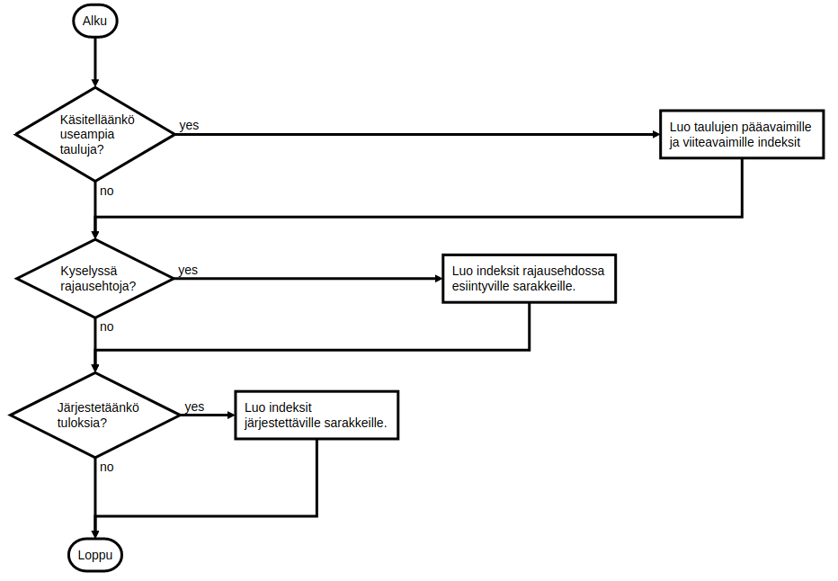

<text-box variant='learningObjectives' name='Oppimistavoitteet'>

- Tunnet menetelmiä tietokantakyselyiden tehokkuuden tarkasteluun.
- Tiedät mitä indeksit ovat ja tiedät milloin tietokantatauluihin tulee määritellä indeksejä.

</text-box>


<!--
kun tietokantakysely suoritetaan, tietokannanhallintajärjestelmä määrittelee ensin suunnitelman sille, miten tietoa haetaan (query plan) -- tapa voi vaikuttaa kyselyn suoritusnopeuteen merkittävästi (tästä pari esimerkkiä)
-->


Tietokantaan tehtävä SQL-kielinen kysely voidaan suorittaa useammalla eri tavalla. Kyselyn suoritus voi käydä läpi tietokantataulun jokaisen rivin, se voi tarkastella vain rajattua osaa tietokantataulun riveistä, tai suoritus voi olla useamman taulun tapauksessa jonkinlainen yhdistelmä edellisiä. Kyselystrategia perustuu tietokannanhallintajärjestelmän sisäisen kyselynoptimoijan sekä tietokantatauluihin määriteltyjen ominaisuuksien kuten indeksien perusteella.


## Tietokantakyselyn tarkastelu

Tietokantakyselyiden suoritusstrategiaa voi tarkastella tietokannanhallintajärjestelmäkohtaisen apukyselyn avulla. SQLitessä kyselyn sisältöön pääsee kommennolla `EXPLAIN QUERY PLAN`, jota seuraa konkreettinen kysely. Suoritusstrategia sisältää tiedon läpikäytävistä tietokannoista sekä kyselyn muodosta. Kyselyn muoto on joko "SCAN" tai "SEARCH". Muoto SCAN käy koko tietokantataulun läpi ja SEARCH tarkastelee tietokantatauluun liittyvää indeksiä.

Tarkastellaan tätä konkreettisen esimerkin kautta. Oletetaan, että käytössämme on tietokanta, jossa on seuraavat tietokantataulut.


```sql
CREATE TABLE Asiakas (
    id integer PRIMARY KEY,
    nimi varchar(200),
    puhelinnumero varchar(20),
    katuosoite varchar(50),
    postinumero integer,
    postitoimipaikka varchar(20)
);
```

```sql
CREATE TABLE Tilaus (
    id integer PRIMARY KEY,
    asiakas_id integer,
    aika date,
    kuljetustapa varchar(40),
    vastaanotettu boolean,
    toimitettu boolean,
    FOREIGN KEY (asiakas_id) REFERENCES Asiakas(id)
);
```

Jos haluamme listata asiakkaiden nimet ja puhelinnumerot, teemme kyselyn "SELECT nimi, puhelinnumero FROM Asiakas". Strategia on selvä -- käydään koko tietokantataulu läpi. Ensimmäisessä esimerkissä kytketään lisäksi SQLiten otsikot päälle ja vaihdetaan tulostusmuotoa kolumnimuotoon. Alla olevissa esimerkeissä on lisäksi käytetty .width -komentoa tulostuksen leveyden sovittamiseksi.


<sample-output>

sqlite> **.headers on**
sqlite> **.mode column**
sqlite> **EXPLAIN QUERY PLAN SELECT nimi, puhelinnumero FROM Asiakas;**
selectid order from detail
-------- ----- ---- ------------------
0        0     0    SCAN TABLE Asiakas

</sample-output>

Vastaava strategia liittyy myös tietyn nimisen asiakkaan etsimiseen. Alla kuvatussa esimerkissä tarkastellaan kyselyä, missä etsitään Cobb-nimistä asiakasta.


<sample-output>

sqlite> **EXPLAIN QUERY PLAN SELECT nimi, puhelinnumero
            FROM Asiakas WHERE nimi = 'Cobb';**
selectid order from  detail
-------- ----- ----  ------------------
0        0     0     SCAN TABLE Asiakas

</sample-output>


Myös Tilaus-taulun tietojen listaaminen vaatii koko tietokantataulun läpikäynnin. Alla listataan tilaukset, jotka on jo toimitettu.

<sample-output>

sqlite> **EXPLAIN QUERY PLAN SELECT * FROM Tilaus
            WHERE toimitettu = 1;**
selectid order from detail
-------- ----- ---- -----------------
0        0     0    SCAN TABLE Tilaus

</sample-output>

Tarkastellaan seuraavaksi hieman monimutkaisempaa kyselyä, missä tulostetaan niiden asiakkaiden nimet, jotka ovat tehneet vähintään yhden tilauksen.

<sample-output>

sqlite> **EXPLAIN QUERY PLAN SELECT nimi, puhelinnumero
            FROM Asiakas JOIN Tilaus
                ON Asiakas.id = Tilaus.asiakas_id;**
selectid order from detail
-------- ----- ---- --------------------------------------------------------
0        0     1    SCAN TABLE Tilaus
0        1     0    SEARCH TABLE Asiakas USING INTEGER PRIMARY KEY (rowid=?)

</sample-output>

Kysely onkin nyt erilainen. Kyselyssä käydään ensin läpi koko taulu Tilaus, jonka jälkeen etsitään tietokantataulusta Asiakas rivejä asiakas-taulun pääavaimen perusteella. Entä jos tietokantataulu Asiakas olisikin määritelty siten, että kenttä `id` ei olisi pääavain?

```sql
CREATE TABLE Asiakas (
    id integer,
    nimi varchar(200),
    puhelinnumero varchar(20),
    katuosoite varchar(50),
    postinumero integer,
    postitoimipaikka varchar(20)
);
```

<sample-output>

sqlite> **EXPLAIN QUERY PLAN SELECT nimi, puhelinnumero
            FROM Asiakas JOIN Tilaus
                ON Asiakas.id = Tilaus.asiakas\_id;**
selectid order from detail
-------- ----- ---- -----------------------------------------------------------------
0        0     0    SCAN TABLE Asiakas
0        1     1    SEARCH TABLE Tilaus USING AUTOMATIC COVERING INDEX (asiakas\_id=?)

</sample-output>

Tietokannanhallintajärjestelmä vaihtaa läpikäytävien taulujen järjestystä. Nyt kysely käy ensin läpi koko Asiakas-taulun, ja etsii tämän jälkeen Tilaus-taulusta tietoa automaattisesti luodun indeksin perusteella.


Tutustutaan seuraavaksi mikä tämä indeksi oikein on.


<quiznator id="5c5d614bfd9fd71425c64238"></quiznator>

## Indeksit

Indeksit ovat tietokantatauluista erillisiä yhden tai useamman sarakkeen tiedoista koostuvia tietorakenteita, jotka viittaavat tietokantataulun riveihin. Indeksirakenteita on useita erilaisia, mm. hajautustaulut ja puurakenteet. Indeksien tavoite on käytännössä -- tietokantojen yhteydessä -- tietokantakyselyiden nopeuttaminen.

*Indeksiä voi ajatella perinteikkään kirjaston korttiluettelona. Kirjaston tiskille mentäessä ja tiettyä kirjaa kysyttäessä, kirjastovirkailija käy läpi kirjan nimen perusteella aakkostettuja kortteja. Koska nimet ovat aakkosjärjestyksessä, jokaista korttia ei tarvitse tarkastella tiettyä kirjaa etsittäessä. Kortissa on tieto kirjan konkreettisesta paikasta kirjastossa -- kun kortti löytyy, kirjan voi hakea. Jos kirjan nimen sijaan kirjaa etsitään kirjoittajan perusteella, tulee käyttää toista korttipakkaa, joka sisältää kirjoittajien nimet sekä mahdollisesti myös tiedon kirjojen nimistä. Jos kirjaa etsitään sisällön perusteella joudutaan huonolla tuurilla käymään jokainen fyysinen kirjaston kirja läpi.*

Pohditaan tilannetta, missä miljardi riviä sisältävän taulun tiettyyn sarakkeeseen on määritelty indeksi. Oletetaan, että indeksi sisältää arvot järjestettynä. Tällöin, tiettyä arvoa haettaessa, voimme aloittaa keskimmäisestä arvosta -- jos haettava arvo on pienempi, tutkitaan "vasemmalla" olevaa puolikasta. Jos taas haettava arvo on suurempi, tutkitaan "oikealla" olevaa puolikasta. Alueen rajaaminen jatkuu niin pitkään, kunnes haettava arvo löytyy, tai rajaus päätyy tilanteeseen, missä tutkittavia arvoja ei enää ole. Tämä menetelmä -- *puolitushaku* tai *binäärihaku* lienee tuttu ohjelmointikursseilta.

Jos rivejä on yhteensä miljardi, voidaan ne jakaa kahteen osaan noin log<sub>2</sub> 1 000 000 000 kertaa, eli noin 30 kertaa. Jos oletamme, että arvoa ei löydy taulusta, tulee yhteensä tarkastella siis noin 30 riviä miljardin sijaan.

<br/>

Edellisessä luvussa olleessa esimerkissä huomasimme, että asiakkaan nimen perusteella tehty tietokantakysely käy koko `Asiakas`-taulun läpi.

<sample-output>

sqlite> **EXPLAIN QUERY PLAN SELECT nimi, puhelinnumero
            FROM Asiakas WHERE nimi = 'Cobb';**
selectid order from  detail
-------- ----- ----  ------------------
0        0     0     SCAN TABLE Asiakas

</sample-output>


Indeksin määrittely tietokantataulun sarakkeelle tapahtuu tietokantataulun luomisen jälkeen komennolla `CREATE INDEX`, jota seuraa uuden indeksin nimi, avainsana `ON`, sekä taulu ja taulun sarakkeet, joille indeksi luodaan. Tietokannanhallintajärjestelmä luo tietokantataulun pääavaimelle ja viiteavaimille indeksit tyypillisesti automaattisesti.

Oletetaan, että sovelluksessamme asiakkaita haetaan usein nimen perusteella. Luodaan aiemmin kuvattuun Asiakas-taulun sarakkeeseen nimi indeksi.

<sample-output>

sqlite> **CREATE INDEX idx\_asiakas\_nimi ON Asiakas (nimi);**

</sample-output>


Tarkastellaan aiemmin tehtyä Cobb-nimisen henkilön hakua uudelleen.

<sample-output>

sqlite> EXPLAIN QUERY PLAN SELECT nimi, puhelinnumero FROM Asiakas
						WHERE nimi = 'Cobb';
selectid order from detail
-------- ----- ---- ----------------------------------------------------------
0        0     0    SEARCH TABLE Asiakas USING INDEX idx\_asiakas\_nimi (nimi=?)

</sample-output>

Strategia muuttuu edellisestä. Aiemmin tietokannanhallintajärjestelmän strategia on ollut koko tietokantataulun Asiakas läpikäynti, nyt tietoa haetaan indeksistä. Jos käytössä oleva indeksi olisi esimerkiksi hajautustaulu, tapahtuisi haku vakioajassa -- eli "tarkasteluja" tehtäisiin "yksi" riippumatta tietomäärästä -- *tietorakenteisiin, niihin tehtäviin hakuihin sekä niiden tehokkuuksiin tutustutaan tarkemmin kurssilla tietorakenteet ja algoritmit.*


## Milloin tietokantatauluun kannattaa lisätä indeksi?

Taulut ja sarakkeet, joihin indeksejä kannattaa harkita, liittyvät paljon suoritettuihin (ja hitaahkoihin) tietokantakyselyihin. Ensimmäiset askeleet liittyvät (1) tietokantataulujen pää- ja viiteavainten indeksien luomiseen, (2) hakuehtoihin liittyvien sarakkeiden indeksien luomiseen sekä (3) järjestysehtoihin liittyvien sarakkeiden indeksien lumiseen. Alla on kuvattuna eräs suoraviivainen prosessi tietokantataulun indeksien päättämiselle: lähtökohtana on kysely.

<figure>
  start: Alku
				    join=>condition: Käsitelläänkö
				    useampia
				    tauluja?
				    where=>condition: Kyselyssä
				    rajausehtoja?
				    loppu=>end: Loppu
				    avaimet=>operation: Luo taulujen pääavaimille
				    ja viiteavaimille indeksit
				    rajaus=>operation: Luo indeksit rajausehdossa
				    esiintyville sarakkeille.
				    jarjestys=>condition: Järjestetäänkö
				    tuloksia?
				    jarj=>operation: Luo indeksit
				    järjestettäville sarakkeille.
				    alku->join
				    join(yes,right)->avaimet->where
				    join(no)->where
				    where(yes,right)->rajaus->jarjestys
				    where(no)->jarjestys
				    jarjestys(no)->loppu
				    jarjestys(yes,right)->jarj->loppu" />
</figure>


Indeksin luominen tietokantataululle luo tietorakenteen, jota käytetään tiedon hakemiseen. Jokaista indeksiä tulee päivittää myös tietokantaa muokkaavien operaatioiden yhteydessä, jotta indeksin tiedot ovat ajan tasalla. Käytännössä liiallinen indeksien luominen saattaa myös hidastaa sovelluksen toimintaa.


Lisää indekseistä mm. osoitteessa <a href="https://use-the-index-luke.com/" target="_blank">https://use-the-index-luke.com/</a>


<quiznator id="5c5d5f3a244fe21455cb872e"></quiznator>
