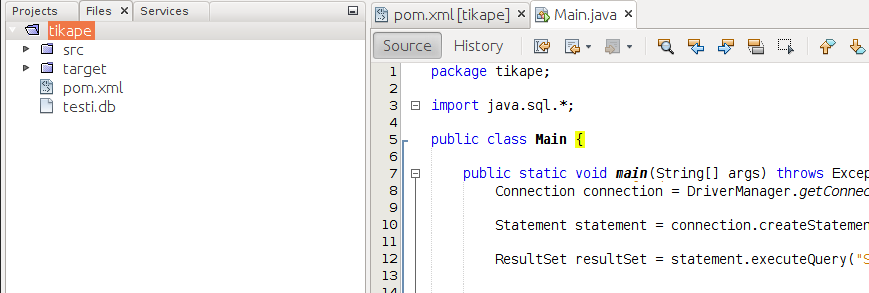

Lähes jokainen ohjelmointikieli tarjoaa jonkinlaisen rajapinnan tietokantakyselyiden tekemiseen. Nämä rajapinnat suoraviivaistavat kyselyiden tekemistä tietokantoihin ja tietokannanhallintajärjestelmien käyttöönoottoa, sillä rajapintaa noudattamalla yhteydenotto tietokannantallintajärjestelmään on lähes samankaltaista käytetystä tietokannanhallintajärjestelmästä riippumatta.

Java-kielessä tähän tehtävään on <a href="https://en.wikipedia.org/wiki/Java_Database_Connectivity" target="_blank" nodel>Java Database Connectivity</a> (JDBC) -rajapinta. JDBC tarjoaa tuen tietokantayhteyden luomiseen sekä kyselyiden suorittamiseen tietokantayhteyden yli. Jotta JDBCn avulla voidaan ottaa yhteys tietokantaan, tulee käytössä olla tietokannanhallintajärjestelmäkohtainen ajuri, jonka vastuulla on tietokantayhteyden luomiseen liittyvät yksityiskohdat sekä tietokannanhallintajärjestelmän sisäisten kyselytulosten muuntaminen JDBC-rajapinnan mukaiseen muotoon.

<br/>

TODO: tämä Springin JDBCTemplatella

<br/>

<text-box variant='learningObjectives' name='JDBC-ajurin noutaminen'>

JDBC-ajurit ovat käytännössä Java-kielellä kirjoitettuja ohjelmia, joita tietokannanhallintajärjestelmän toteuttajat tarjoavat ohjelmoijien käyttöön. Kurssin toisessa osassa ajurit on lisätty valmiiksi tehtäväpohjien `lib`-kansioon, jonka lisäksi niiden käyttö on valmiiksi määritelty tehtäväpohjissa.

Myöhemmissä osissa tutustumme kirjastojen käyttöönottoon ja hakemiseen <a href="https://maven.apache.org/" target="_blank" norel>Maven</a>-apuvälineen avulla.

</text-box>


## Ohjelmallinen tietokantakysely kokonaisuudessaan


Oletetaan, että käytössämme on seuraava tietokantataulu Opiskelija:

<table class="table">
  <thead>
    <tr>
      <th>opiskelijanumero (integer)</th>
      <th>nimi (varchar)</th>
      <th>syntymävuosi (integer)</th>
      <th>pääaine (varchar)</th>
    </tr>
  </thead>
  <tbody>
    <tr>
      <td>9999999</td>
      <td>Pihla</td>
      <td>1997</td>
      <td>Tietojenkäsittelytiede</td>
    </tr>
    <tr>
      <td>9999998</td>
      <td>Joni</td>
      <td>1993</td>
      <td>Tietojenkäsittelytiede</td>
    </tr>
    <tr>
      <td>...</td>
      <td></td>
      <td></td>
      <td></td>
    </tr>
  </tbody>
</table>

JDBCn avulla kyselyn tekeminen tietokantatauluun tapahtuu seuraavasti -- olettaen, että käytössämme on sekä tietokanta, että tietokannan ajuri.

```java
import java.sql.Connection;
import java.sql.DriverManager;
import java.sql.ResultSet;
import java.sql.Statement;

public class Main {
    public static void main(String[] args) throws Exception {
        // luodaan yhteys jdbc:n yli sqlite-tietokantaan nimeltä "tietokanta.db"
        Connection connection = DriverManager.getConnection("jdbc:sqlite:tietokanta.db");

        // luodaan kyely "SELECT * FROM Opiskelija", jolla haetaan
        // kaikki tiedot Opiskelija-taulusta
        PreparedStatement statement = connection.prepareStatement("SELECT * FROM Opiskelija");

        // suoritetaan kysely -- tuloksena resultSet-olio
        ResultSet resultSet = statement.executeQuery();

        // käydään tuloksena saadussa oliossa olevat rivit läpi -- next-komento hakee
        // aina seuraavan rivin, ja palauttaa true jos rivi löytyi
        while(resultSet.next()) {
            // haetaan nykyiseltä riviltä opiskelijanumero int-muodossa
            Integer opNro = resultSet.getInt("opiskelijanumero");
            // haetaan nykyiseltä riviltä nimi String-muodossa
            String nimi = resultSet.getString("nimi");
            // haetaan nykyiseltä riviltä syntymävuosi int-muodossa
            Integer syntVuosi = resultSet.getInt("syntymävuosi");
            // haetaan nykyiseltä riviltä pääaine String-muodossa
            String paaAine = resultSet.getString("pääaine");

            // tulostetaan tiedot
            System.out.println(opNro + "\t" + nimi + "\t" + syntVuosi + "\t" + paaAine);
        }

        // suljetaan lopulta yhteys tietokantaan
        connection.close();
    }
}
```

Ohjelman suoritus tuottaa (esimerkiksi) seuraavanlaisen tulostuksen:

<sample-output>

999999	Pihla	1997	Tietojenkäsittelytiede
999998	Joni	1993	Tietojenkäsittelytiede
999997	Anna	1991	Matematiikka
999996	Krista	1990	Tietojenkäsittelytiede
...

</sample-output>


## Ohjelman rakentaminen osissa

*Tässä oletetaan, että projektiin on lisätty tarvittava JDBC-ajuri.*

Avaa projektiin liittyvä *Source Packages* ja valitse (tai tarvittaessa luo) sopiva pakkaus. Oletetaan tässä, että käytössä on pakkaus `tikape`. Valitse tämän jälkeen *New* -> *Java Class*, jonka jälkeen avautuu valikko, missä voit antaa luokalle nimen. Anna luokan nimeksi `Main`.

Avaa tiedosto tuplaklikkaamalla sitä. Muokkaa tiedostoa vielä siten, että se on seuraavan näköinen:

```java
package tikape;

public class Main {

    public static void main(String[] args) throws Exception {

    }
}
```

### Tietokantayhteyden luominen

Lisää projektiin komento `import java.sql.*;`, joka hakee kaikki SQL-kyselyihin liittyvät Javan kirjastot.

```java
package tikape;

import java.sql.*;

public class Main {

    public static void main(String[] args) throws Exception {

    }
}
```

Avataan seuraavaksi tietokantayhteys tietokantatiedostoon nimeltä *testi.db* ja tehdään kysely "SELECT 1", jolla pyydetään tietokantaa palauttamaan luku 1 -- käytämme tätä yhteyden testaamiseksi. Jos yhteyden luominen onnistuu, tulostetaan "Hei tietokantamaailma!", muulloin "Yhteyden muodostaminen epäonnistui".

```java
package tikape;

import java.sql.*;

public class Main {

    public static void main(String[] args) throws Exception {
        Connection connection = DriverManager.getConnection("jdbc:sqlite:testi.db");

        PreparedStatement statement = connection.prepareStatement("SELECT 1");

        ResultSet resultSet = statement.executeQuery();

        if (resultSet.next()) {
            System.out.println("Hei tietokantamaailma!");
        } else {
            System.out.println("Yhteyden muodostaminen epäonnistui.");
        }
    }
}
```

<sample-output>

Hei tietokantamaailma!

</sample-output>


Kun suoritamme ohjelman ensimmäistä kertaa valitsemalla *Run* -> *Run Project*, puuttuvan tietokannan paikalle luodaan tietokanta (ainakin SQLiteä käyttäessä). Projektin kansiossa on nyt tiedosto `testi.db`, joka on tietokantamme.


<figure>
  
  <figcaption>Tietokantatiedosto *testi.db* löytyy projektin kansiosta. Tiedostot löytyvät *Files*-välilehdeltä.</figcaption>
</figure>


### Tietokantakyselyiden tekeminen

Osoitteessa <a href="https://materiaalit.github.io/tikape-k18/dbs/vuokraamo.db">vuokraamo.db</a> löytyy kuvitteellisen moottoripyörävuokraamon tietokanta. Lataa se edellä tehdyn projektin juureen ja kokeile kyselyn tekemistä kyseiseen tietokantaan.

Tietokannassa on tietokantataulu `Pyora`, jolla on sarakkeet `rekisterinumero` ja `merkki`. Jokaisen pyörän rekisterinumeron ja merkin tulostaminen tapahtuu seuraavasti -- huomaa myös, että olemme vaihtaneet käytössä olevaa tietokantaa.

```java
Connection connection = DriverManager.getConnection("jdbc:sqlite:vuokraamo.db");

PreparedStatement stmt = connection.prepareStatement("SELECT * FROM Pyora");
ResultSet rs = stmt.executeQuery();

while (rs.next()) {
    String rekisterinumero = rs.getString("rekisterinumero");
    String merkki = rs.getString("merkki");

    System.out.println(rekisterinumero + " " + merkki);
}

stmt.close();
rs.close();

connection.close();
```

Käydään ylläoleva ohjelmakoodi läpi askeleittain.

1. Luomme ensin JDBC-yhteyden tietokantaan *vuokraamo.db*.
```java
Connection connection = DriverManager.getConnection("jdbc:sqlite:vuokraamo.db");
```
2. Kysely luodaan antamalla yhteydelle merkkijono, jossa on kysely. Yhteys palauttaa `PreparedStatement`-olion, jota käytetään kyselyn suorittamiseen ja tulosten pyytämiseen. Metodi `executeQuery` suorittaa SQL-kyselyn ja palauttaa tulokset sisältävän `ResultSet`-olion.
```java
PreparedStatement statement = connection.prepareStatement("SELECT * FROM Pyora");
ResultSet resultSet = statement.executeQuery();
```
3. Tämän jälkeen `ResultSet`-oliossa olevat tulokset käydään läpi. Metodia `next()` kutsumalla siirrytään kyselyn palauttamissa tulosriveissä eteenpäin. Kultakin riviltä voi kysyä sarakeotsikon perusteella solun arvoa. Esimerkiksi kutsu `getString("rekisterinumero")` palauttaa kyseisellä rivillä olevan sarakkeen "rekisterinumero" arvon String-tyyppisenä.
```java
while(resultSet.next()) {
    String rekisterinumero = rs.getString("rekisterinumero");
    String merkki = rs.getString("merkki");

    System.out.println(rekisterinumero + " " + merkki);
}
```
4. Kun kyselyn vastauksena saadut rivit on käyty läpi, eikä niitä enää tarvita, vapautetaan niihin liittyvät resurssit.
```java
stmt.close();
rs.close();
```
5. Lopulta tietokantayhteys suljetaan.
```java
connection.close();
```


### Parametrien lisääminen kyselyyn

Kyselyihin halutaan usein antaa rajausehtoja. Ohjelmallisesti tämä tapahtuu lisäämällä kyselyä muodostaessa rajausehtoihin kohtia, joihin asetetaan arvot. Alla olevassa esimerkissä kyselyyn lisätään merkkijono.

```java
PreparedStatement statement =
    connection.prepareStatement("SELECT * FROM Pyora WHERE merkki = ?");
statement.setString(1, "Royal Enfield");

ResultSet resultSet = statement.executeQuery();
```

Kyselyiden paikat indeksoidaan kohdasta 1 alkaen. Alla olevassa esimerkissä haetaan Henkilo-taulusta henkilöitä, joiden syntymävuosi on 1952.


```java
PreparedStatement statement =
    connection.prepareStatement("SELECT * FROM Henkilo WHERE syntymavuosi  = ?");
statement.setInt(1, 1952);

ResultSet resultSet = statement.executeQuery();
```

Ohjelma voi toimia myös siten, että rajausehdot kysytään ohjelman käyttäjältä.


```java
Scanner lukija = new Scanner(System.in);
System.out.println("Minkä vuoden opiskelijat tulostetaan?");
int vuosi = Integer.parseInt(lukija.nextLine());

// ...

PreparedStatement statement =
    connection.prepareStatement("SELECT * FROM Henkilo WHERE syntymavuosi  = ?");
statement.setInt(1, vuosi);

ResultSet resultSet = statement.executeQuery();

// ...
```

<text-box variant='hint' name='PreparedStatement ja setterit'>

Kun kyselyt luodaan tietokantayhteyteen liittyvän olion prepareStatement oliolla, kyselyihin merkitään kysymysmerkeillä ne kohdat, joihin käyttäjän syöttämiä arvoja voidaan lisätä. Kun ns. setterimetodilla -- esim setInt -- asetetaan parametrin arvo kyselyyn, Java tarkastaa (1) että arvo on varmasti halutun kaltainen ja (2) että arvossa ei ole esimerkiksi hipsuja, jolloin parametrina annetulla arvolla voisi vaikuttaa kyselyyn.

</text-box>


<programming-exercise name='TODO: sovellus, joka hakee tietokannasta tietoa' tmcname='osa06-Osa06_01.MatemaattisetApuvalineet'>

TODO: ohjelmointitehtävä

</programming-exercise>


### Päivityskyselyiden tekeminen

Myös päivityskyselyiden kuten rivien lisäämisten ja rivien poistamisten tekeminen onnistuu ohjelmallisesti. Tällöin tuloksessa ei ole erillistä ResultSet-oliota, vaan luku, joka kertoo muuttuneiden rivien määrän. Allaoleva ohjelmakoodi lisää pyöriä sisältävään tietokantaan uuden pyörän.

```java
Connection connection = DriverManager.getConnection("jdbc:sqlite:vuokraamo.db");

PreparedStatement stmt =
    connection.prepareStatement("INSERT INTO Pyora (rekisterinumero, merkki) VALUES (?, ?)");
stmt.setString(1, "RIP-34");
stmt.setString(2, "Jopo");

int changes = stmt.executeUpdate();

System.out.println("Kyselyn vaikuttamia rivejä: " + changes);
stmt.close();

connection.close();
```


<programming-exercise name='TODO: sovellus, joka lisää tietokantaan tietoa' tmcname='osa06-Osa06_01.MatemaattisetApuvalineet'>

TODO: ohjelmointitehtävä

</programming-exercise>


## Oliot ja tietokantataulut

Käsittelimme äskettäin tietokantakyselyiden tekemistä ohjelmallisesti. Tietokantakyselyiden tekeminen koostuu oleellisesti muutamasta osasta: (1) yhteyden muodostaminen tietokantaan, (2) kyselyn muodostaminen, (3) kyselyn suorittaminen, (4) vastausten läpikäynti, ja (5) resurssien vapauttaminen sekä yhteyden sulkeminen. Edellisessä osassa käsiteltiin Pyora-taulun sisältävää tietokantaa seuraavasti.

```java
Connection connection = DriverManager.getConnection("jdbc:sqlite:vuokraamo.db");

PreparedStatement stmt = connection.prepareStatement("SELECT * FROM Pyora");
ResultSet rs = stmt.executeQuery();

while (rs.next()) {
    String rekisterinumero = rs.getString("rekisterinumero");
    String merkki = rs.getString("merkki");

    System.out.println(rekisterinumero + " " + merkki);
}

stmt.close();
rs.close();

connection.close();
```

Ohjelmoijan näkökulmasta on paljon mielekkäämpää jos tietoa pystyy käsittelemään olioiden avulla. Oletetaan, että käytössämme on luokka `Asiakas` sekä luokkaa vastaava tietokantataulu `Asiakas`. Tietokantataulu on luotu seuraavalla `CREATE TABLE` -lauseella.


```sql
CREATE TABLE Asiakas (
    id integer PRIMARY KEY,
    nimi varchar(200),
    puhelinnumero varchar(20),
    katuosoite varcar(50),
    postinumero integer,
    postitoimipaikka varchar(20)
);
```

Alla on taulua vastaava luokka.


```java
public class Asiakas {
    Integer id;
    String nimi;
    String puhelinnumero;
    String katuosoite;
    Integer postinumero;
    String postitoimipaikka;

    public Asiakas(Integer id, String nimi, String puhelinnumero, String
            katuosoite, Integer postinumero, String postitoimipaikka) {
        this.id = id;
        this.nimi = nimi;
        this.puhelinnumero = puhelinnumero;
        this.katuosoite = katuosoite;
        this.postinumero = postinumero;
        this.postitoimipaikka = postitoimipaikka;
    }

    // muita metodeja ym

}
```

Hakiessamme tietoa tietokantataulusta `Asiakas` voimme muuntaa kyselyn tulokset `Asiakas`-olioiksi.


```java
Connection connection = DriverManager.getConnection("jdbc:sqlite:*tietokanta.db*");

PreparedStatement stmt = connection.prepareStatement("SELECT * FROM Asiakas");
ResultSet rs = stmt.executeQuery();

List&lt;Asiakas&gt; asiakkaat = new ArrayList&lt;&gt;();

while (rs.next()) {
    Asiakas a = new Asiakas(rs.getInt("id"), rs.getString("nimi"),
        rs.getString("puhelinnumero"), rs.getString("katuosoite"),
        rs.getInt("postinumero"), rs.getString("postitoimipaikka"));

    asiakkaat.add(a);
}

stmt.close();
rs.close();

connection.close();

// nyt asiakkaat ovat olioina listassa
```

Myös uuden Asiakas-olion tallentaminen tietokantatauluun onnistuu.

```java
Connection connection = DriverManager.getConnection("jdbc:sqlite:*tietokanta.db*");

PreparedStatement stmt = connection.prepareStatement("INSERT INTO Asiakas"
+ " (nimi, puhelinnumero, katuosoite, postinumero, postitoimipaikka)"
+ " VALUES (?, ?, ?, ?, ?)");
stmt.setString(1, asiakas.getNimi());
stmt.setString(2, asiakas.getPuhelinnumero());
stmt.setString(3, asiakas.getKatuosoite());
stmt.setInt(4, asiakas.getPostinumero());
stmt.setString(5, asiakas.getPostitoimipaikka());

stmt.executeUpdate();
stmt.close();

// voimme halutessamme tehdä myös toisen kyselyn, jonka avulla saadaan selville
// juuri tallennetun olion tunnus -- alla oletetaan, että asiakkaan voi
// yksilöidä nimen ja puhelinnumeron perusteella
stmt = connection.prepareStatement("SELECT * FROM Asiakas"
    + " WHERE nimi = ? AND puhelinnumero = ?");
stmt.setString(1, asiakas.getNimi());
stmt.setString(2, asiakas.getPuhelinnumero());

ResultSet rs = stmt.executeQuery();
rs.next(); // vain 1 tulos

Asiakas a = new Asiakas(rs.getInt("id"), rs.getString("nimi"),
    rs.getString("puhelinnumero"), rs.getString("katuosoite"),
    rs.getInt("postinumero"), rs.getString("postitoimipaikka"));

stmt.close();
rs.close();

connection.close();
```


<programming-exercise name='TODO: sovellus, jossa voi lisätä ja poistaa jotain käsitteitä, tekstikäyttöliittymä valmiina' tmcname='osa06-Osa06_01.MatemaattisetApuvalineet'>

TODO: ohjelmointitehtävä

</programming-exercise>


