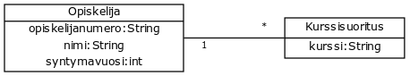
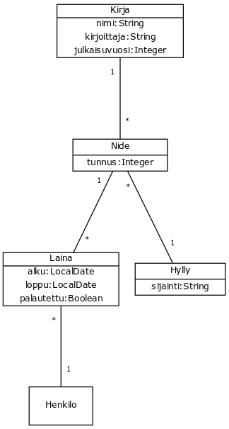

<text-box variant='learningObjectives' name='Oppimistavoitteet'>

- Kertaat luokkakaavioiden käyttöä.
- Tunnistat luokkien ja tietokantataulujen yhteyden.
- Osaat kirjoittaa ohjelman, joka muodostaa käsitteitä kuvaavia olioita tietokannasta haetusta tiedosta.

</text-box>

Olio-ohjelmointiin hieman perehtynyt tunnistaa tietokantaan tallennetut käsitteet ja niiden yhteydet myös olio-ohjelmoinnista. Käsitteet ja niiden attribuutit muistuttavat luokkia ja niiden oliomuuttujia, ja käsitteiden yhteydet muistuttavat viitteitä luokkien välillä.


## Luokkakaavio Java-luokkina

Tarkastellaan seuraavaa Opiskelijaa ja Kurssisuoritusta sekä näiden välistä yhteyttä kuvaavaa luokkakaaviota.

<figure>
  
  <figcaption>Luokkakaavio, jossa on luokat Opiskelija ja Kurssisuoritus. Opiskelijalla on monta (nollasta äärettömään kurssisuoritusta). Jokaiseen kurssisuoritukseen liittyy yksi opiskelija.</figcaption>
</figure>

Määritellään ensin luokat Opiskelija ja Kurssisuoritus siten, että niillä ei ole vielä yhteyksiä merkittynä. Luokilla ei ole myöskään konstruktoreja tai metodeja.


```java
public class Opiskelija {
    String opiskelijanumero;
    String nimi;
    int syntymavuosi;
}
```


```java
public class Kurssisuoritus {
    String kurssi;
}
```

Lisätään luokkien välille yhteys. Jokaiseen kurssisuoritukseen liittyy tasan yksi Opiskelija (kurssisuorituksen ja opiskelijan välisessä viivassa opiskelijan päädyssä on numero yksi). Lisätään luokkaan Kurssisuoritus viite luokkaan Opiskelija.


```java
public class Kurssisuoritus {
    Opiskelija opiskelija;
    String kurssi;
}
```

Lisätään seuraavaksi yhteys opiskelijasta kurssisuoritukseen. Jokaiseen opiskelijaan voi liittyä nollasta äärettömään kurssisuoritusta (kurssisuorituksen ja opiskelijan välisessä viivassa kurssisuorituksen päädyssä on tähti). Lisätään siis luokkaan Opiskelija äärettömän määrän kurssisuorituksia mahdollistava viite eli lista.


```java
import java.util.List;

public class Opiskelija {
    List<Kurssisuoritus> kurssisuoritukset;
    String opiskelijanumero;
    String nimi;
    int syntymavuosi;
}
```

Oleellista luokkakaavioiden ja lähdekoodin välisessä muunnoksessa on se, että luokkien väliset yhteydet eivät näy luokkakaaviossa, mutta luokat sisältävät yhteyksiä kuvaavat oliomuuttujat. Esimerkiksi yllä olevassa lähdekoodissa Kurssisuoritus sisältää tiedon opiskelijasta, mutta luokkakaaviossa opiskelija ei ole kurssisuorituksen oliomuuttuja.


<programming-exercise name='Luokkakaaviosta luokiksi' tmcname='osa06-Osa06_01.LuokkakaaviostaLuokiksi'>

Alla on kuvattuna erään kirjojen lainausjärjestelmän luokkakaavio. Luo tehtäväpohjaan luokkakaavion esittämät luokat ja lisää luokkiin tarvittavat oliomuuttujat. Huom! Luo luokat juuripakkaukseen (default package).


<figure>

</figure>


Kun olet valmis, aja testit ja palauta tehtävä TMC:lle.


</programming-exercise>


## Oliot ja tietokantataulut

Käsittelimme edellisessä osassa tietokantakyselyiden tekemistä ohjelmallisesti. Tietokantakyselyiden tekeminen koostuu oleellisesti viidestä osasta: (1) yhteyden muodostamisesta tietokantaan, (2) kyselyn muodostamisesta, (3) kyselyn suorittamisesta, (4) vastausten läpikäynnistä, ja (5) resurssien vapauttamisesta ja tietokantayhteyden sulkemisesta.

Edellisessä osassa käsiteltiin Opiskelija-taulun sisältävää tietokantaa seuraavasti.

```java
Connection connection = DriverManager.getConnection("jdbc:h2:./testi", "sa", "");

// myös "SELECT * FROM Opiskelija" olisi mahdollinen
PreparedStatement stmt = connection.prepareStatement("SELECT nimi, pääaine FROM Opiskelija");
ResultSet rs = stmt.executeQuery();

while (rs.next()) {
    String nimi = rs.getString("nimi");
    String aine = rs.getString("pääaine");

    System.out.println(nimi + " " + aine);
}

stmt.close();
rs.close();

connection.close();
```

Olio-ohjelmoijan näkökulmasta tiedon käsittely on mielekkäämpää olioiden avulla. Luodaan luokka `Opiskelija` ja luodaan tietokantakyselyn tuloksesta opiskelijaolioita.

```java
public class Opiskelija
    int opiskelijanumero;
    String nimi;
    int syntymavuosi;
    String paaAine;

    public Opiskelija(int opiskelijanumero, String nimi,
            int syntymavuosi, String paaAine) {
        this.opiskelijanumero = opiskelijanumero;
        this.nimi = nimi;
        this.syntymavuosi = syntymavuosi;
        this.paaAine = paaAine;
    }

    // muita konstruktoreja ja metodeja
}
```

Edellistä tietokantakyselyä tekevää metodia voidaan nyt muokata siten, että se luo jokaisesta rivistä opiskelijaolion.


```java
Connection connection = DriverManager.getConnection("jdbc:h2:./testi", "sa", "");

// myös "SELECT * FROM Opiskelija" olisi mahdollinen
PreparedStatement stmt = connection.prepareStatement("SELECT * FROM Opiskelija");
ResultSet rs = stmt.executeQuery();

List<Opiskelija> opiskelijat = new ArrayList<>();
while (rs.next()) {
    int numero = rs.getInt("opiskelijanumero");
    String nimi = rs.getString("nimi");
    int vuosi = rs.getInt("syntymävuosi");
    String aine = rs.getString("pääaine");

    Opiskelija o = new Opiskelija(numero, nimi, vuosi, aine);
    opiskelijat.add(o);
}

stmt.close();
rs.close();

connection.close();

// tehdään jotain opiskelijalistalla
```

Tarkastellaan toista esimerkkiä aiheesta.

Oletetaan, että käytössämme on luokka `Asiakas` sekä tietokantataulu `Asiakas`. Tietokantataulu on luotu seuraavalla `CREATE TABLE` -lauseella. Lauseessa oleva pääavaimeen liitetty määre `AUTO_INCREMENT` luo sarakkeen arvot automaattisesti (määre on tietokannanhallintajärjestelmäkohtainen ja toimii ainakin H2-tietokannanhallintajärjestelmässä).

```sql
CREATE TABLE Asiakas (
    id INTEGER AUTO_INCREMENT PRIMARY KEY,
    nimi VARCHAR(200),
    puhelinnumero VARCHAR(20),
    katuosoite VARCHAR(50),
    postinumero INTEGER,
    postitoimipaikka VARCHAR(20)
);
```

Alla on taulua vastaava luokka.


```java
public class Asiakas {
    Integer id;
    String nimi;
    String puhelinnumero;
    String katuosoite;
    Integer postinumero;
    String postitoimipaikka;


    // konstruktorit ja metodit
}
```

Hakiessamme tietoa tietokantataulusta Asiakas voimme muuntaa kyselyn tulokset Asiakas-olioiksi.

```java
Connection connection = DriverManager.getConnection("jdbc:h2:./asiakkaat", "sa", "");

PreparedStatement stmt = connection.prepareStatement("SELECT * FROM Asiakas");
ResultSet rs = stmt.executeQuery();

List<Asiakas> asiakkaat = new ArrayList<>();

while (rs.next()) {
    Asiakas a = new Asiakas(rs.getInt("id"), rs.getString("nimi"),
        rs.getString("puhelinnumero"), rs.getString("katuosoite"),
        rs.getInt("postinumero"), rs.getString("postitoimipaikka"));

    asiakkaat.add(a);
}

stmt.close();
rs.close();

connection.close();

// nyt asiakkaat ovat listassa ohjelman käsittelyä varten
```

Myös uuden Asiakas-olion tallentaminen tietokantatauluun onnistuu.

```java
Connection connection = DriverManager.getConnection("jdbc:h2:./asiakkaat", "sa", "");

PreparedStatement stmt = connection.prepareStatement("INSERT INTO Asiakas"
    + " (nimi, puhelinnumero, katuosoite, postinumero, postitoimipaikka)"
    + " VALUES (?, ?, ?, ?, ?)");
stmt.setString(1, asiakas.getNimi());
stmt.setString(2, asiakas.getPuhelinnumero());
stmt.setString(3, asiakas.getKatuosoite());
stmt.setInt(4, asiakas.getPostinumero());
stmt.setString(5, asiakas.getPostitoimipaikka());

stmt.executeUpdate();
stmt.close();
connection.close();
```

Sama onnistuu myös Spring-sovelluskehyksen avulla.

```java
List<Asiakas> = jdbcTemplate.query(
    "SELECT * FROM Asiakas;",
    (rs, rowNum) -> new Asiakas(rs.getInt("id"), rs.getString("nimi"),
    rs.getString("puhelinnumero"), rs.getString("katuosoite"),
    rs.getInt("postinumero"), rs.getString("postitoimipaikka")));

// Tee jotain Asiakas-olioilla
```

Ohjelmoija voi halutessaan tehdä `Asiakas`-luokkaan normaalin konstruktorin lisäksi konstruktorin, joka luo uuden `Asiakas`-olion annetun `ResultSet`-olion perusteella.


```java
public class Asiakas {
    Integer id;
    String nimi;
    String puhelinnumero;
    String katuosoite;
    Integer postinumero;
    String postitoimipaikka;

    public Asiakas(ResultSet rs) {
        this.id = rs.getInt("id");
        this.nimi = rs.getString("nimi");
        this.puhelinnumero = rs.getString("puhelinnumero");
        this.katuosoite = rs.getString("katuosoite");
        this.postinumero = rs.getInt("postinumero");
        this.postitoimipaikka = rs.getString("postitoimipaikka");
    }

    // muut konstruktorit ja metodit
}
```

Nyt aiemmin esitellyt kyselyt saadaan selkeämmiksi.


```java
List<Asiakas> = jdbcTemplate.query(
    "SELECT * FROM Asiakas;",
    (rs, rowNum) -> new Asiakas(rs));

// Tee jotain Asiakas-olioilla
```

`Asiakas`-luokan konstruktorin määrittely siten, että se saa parametrinaan `ResultSet`-olion, ei ole kuitenkaan aina hyvä idea. Lähestymistapa selkeyttää tietokantakyselyn käsittelyä, mutta samalla `Asiakas`-luokan tulee "tietää" siihen liittyvästä tietokantataulusta sekä tietokantataulun sarakkeiden nimestä. Mikäli sarakkeiden nimet muuttuvat, tulee myös `Asiakas`-luokkaa muuttaa.


<programming-exercise name='Sanakirjan sanaparit' tmcname='osa06-Osa06_02.SanakirjanSanaparit'>

Tehtäväpohjassa on edellisessä osassa nähty Sanakirja. Lisää tehtäväpohjan pakkaukseen `sanakirja` luokka `Sanapari`. Luokalla sanapari tulee olla kaksiparametrinen konstruktori `public Sanapari(String sana, String kaannos)` sekä metodit `public String getSana()` ja `public String getKaannos()`. Luokalta odotettu toiminnallisuus on arvattavissa:

```java
Sanapari pari = new Sanapari("yksi", "one");
System.out.println(pari.getSana());
System.out.println(pari.getKaannos());
```

<sample-output>
yksi
one
</sample-output>

Lisää tämän jälkeen luokkaan `Sanakirja` metodi `public List<Sanapari> sanaparit()`. Metodin tulee hakea tietokannasta kukin sana, kaannos -pari, ja palauttaa ne listana edellä luotua `Sanapari`-luokkaa hyödyntäen. Mikäli tietokannassa ei ole yhtäkään sanaa, palauta tällöin tyhjä lista.

Kuten edellisessä osassa, käytössäsi on valmiina tietokantataulu `Sanasto`, jossa on sarakkeet `id`, `sana` ja `kaannos`. Sovellukseen on määritelty Spring-sovelluskehyksen kannalta oleelliset konfiguraatiot.

Voit testata uutta metodiasi esimerkiksi lisäämällä ohjelman tekstikäyttöliittymään uuden toiminnallisuuden, joka -- esimerkiksi -- käy tietokannasta haetut sanat läpi.

</programming-exercise>
