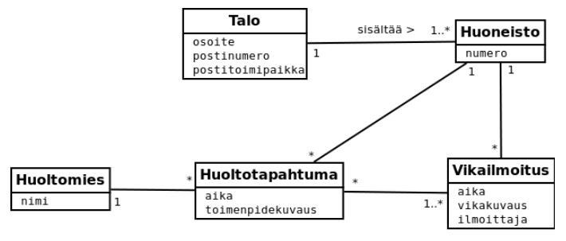

<text-box variant='learningObjectives' name='Oppimistavoitteet'>

- Kertaat koetta varten.

</text-box>

Tämän kurssin koe järjestetään lauantaina 9.3.2019 klo 10-14 kurssin Moodle-järjestelmässä. Katso kokeeseen liittyvät tiedot tarkemmin sivulta [arvostelu](/arvostelu). Mikäli tenttiaika ei sovi, mutta pystyt tekemään tentin välillä 10-12.3., ota yhteyttä kurssin vastuuhenkilöön arto.hellas@helsinki.fi.

Seuraavaksi esitellään kurssin eräs vanha koe, jota käytetään myös kertaamiseen -- vain osaan kysymyksistä kysytään tässä vastauksia.

## Käsitteistöä

Kaverisi aikoo osallistua tietokantojen perusteet-kurssin seuraavaan kokeeseen. Hänellä on kuitenkin vielä vaikeuksia muutamaan kurssiin liittyvän käsitteen kanssa. Kerro kaverillesi mitä kukin alla oleva käsitepari tarkoittaa ja anna kustakin käsiteparista esimerkki.

- tiedon normalisointi ja tiedon denormalisointi
- tietokannanhallintajärjestelmä ja tietokanta
- pääavain ja viiteavain
- JSON ja tieto

## Tietokannasta

Alla oleva tietokantataulu sisältää elokuvien suoratoistoon erikoistuneen H2O-yrityksen kirjanpidon.

| Nimi               | Titteli  | Email           | Katsotut elokuvat                  | Elokuvien kategoriat                      |
| --                 | --       | --              | --                                 | --                                        |
| Matti Meikäläinen  | Mr.      | matti@me.com    | Lord of the Rings, The Dark Knight | Action, Adventure, Crime, Drama, Fantasy  |
| Maija Meikäläinen  | Ms.      | maija@me.com    | Pulp Fiction                       | Crime, Drama                              |
| Essi Esimerkki     | Mrs.     | essi@em.com     | The Shawshank Redemption           | Crime, Drama                              |
| Tyrion Lannister   | Mr.      | pete@kindl.age  | Game of Thrones, Austin Powers     | Action, Adventure, Comedy, Drama          |

* Miten yllä olevaa tietokantataulua tulisi muuttaa, jotta se olisi ensimmäisessä normaalimuodossa?
* Miten yllä olevaa tietokantataulua tulisi muuttaa, jotta se olisi toisessa normaalimuodossa?
* Miten yllä olevaa tietokantataulua tulisi muuttaa, jotta se olisi kolmannessa normaalimuodossa?

## Käsiteanalyysi

Puhelinmyyntiyrityksen Luuri ja Pojat toimitusjohtaja Matti Luuri kertoo seuraavaa:

*Puhelinmyyntiyhtiö Luuri ja Pojat tarjoaa viikkolehdille (esim. 7 Päivää, Me Naiset, Anna, Aku Ankka) palvelua, jossa yhtiön puhelinmyyjät myyvät lehtiä kotitalouksiin. Palvelut myydään lehdille kampanjoina, joissa myyntiä varten sovitaan aina kattosumma. Palvelun hinnoittelu päivälehdille on provisioperusteista, eli lehdeltä veloitetaan jokaisesta tehdystä tilauksesta aina tietty summa.*

*Kotitaloudet, jonne Luuri ja Pojat -yrityksen työntekijät soittelevat, haalitaan Fonectan ja Eniron puhelinluetteloista. Tulikokeena uusille työntekijöille on kahden puhelinluetteloaukeaman läpisoittaminen, asiakaspalautteen kuuntelu ja toiminta siten, että ei-ostaviin asiakkaisiin käytetään mahdollisimman vähän aikaa. Jokaisen uuden työntekijän tulisi pystyä solmimaan vähintään muutama tilaus ensimmäisenä päivänä.*

*Luuri ja Pojat tarvitsee järjestelmän, joka mahdollistaa paremman kirjanpidon työntekijöiden kotitalouksiin tekemistä myynneistä. Jokaisesta myyntitapahtumasta tulee tulla selville lehden ostanut kotitalous sekä kampanja, johon myynti liittyi. Järjestelmän tulee mahdollistaa muun muassa seuraavat yhteenvetokyselyt:*

* Mitkä ovat suosituimpia lehtiä?
* Ketkä työntekijöistä saavat eniten myyntitapahtumia aikaan?
* Mihin aikaan mitkäkin lehdet myyvät parhaiten?
* Millä kampanjoilla on vielä rahaa jäljellä?

*Tee ylläolevasta kuvauksesta tietosisältöanalyysi, eli etsi järjestelmään liittyvät käsitteet. Luo käsitteiden pohjalta käsitekaavio (luokkakaavio). Yhteyksien ja osallistumisrajoitteiden merkintä on oleellista, attribuuteista tulee merkitä vain oleellisimmat. Lopulliseen vastaukseen riittää vain lopullinen kurssimateriaalin käytänteitä noudattava tekstimuotoinen käsitekaavio.*

<quiznator id="5c73a0c114524713f95a5b5c"></quiznator>

## Käsiteanalyysistä tietokantakaavioksi

*Ohjelmistojen mallintamiseen ja suunnitteluun erikoistunut yritys Softa ja Mallit on luonut eräälle kiinteistöjen hallintaan erikoistuneelle yritykselle seuraavanlaisen UML-luokkakaavion. Koska yrityksen Softa ja Mallit erikoisosaaminen on mallinnuspuolella, sinun tehtävänäsi on suunnitella järjestelmää tukeva tietokanta.*

*Muuta alla oleva luokkakaavio tietokantakaavioksi. Käytä vastauksessa seuraavan tehtävän merkintätapaa. Merkitse kaavioon attribuutit, avaimet ja viiteavaimet.*

<quiznator id="5c73a1a7017ffc13eddce954"></quiznator>

## Tietokantakyselyitä

Juhlien organisointiin erikoistunut saksalainen yritys "Schöne Feste und Feuerkumpeln mit ganz gut Organizierung" on rakentanut tietokantaekspertti Prof. Dr. auf der Relationin avulla  seuraavan reseptitietokannan.

* ruokalaji (tunnus, nimi, helppous, annoksia, valmistusaika)
* luokitus (ruokalaji -> ruokalaji, luokka)
* raaka_aine (ainetunnus, nimi, tyyppi, yksikkö, yksikkohinta)
* ainekset (ruokalaji -> ruokalaji, ainetunnus -> raaka_aine, määrä)
* ohje (ruokalaji -> ruokalaji, vaiheNumero, kuvaus)

Taulun ruokalaji sarake annoksia ilmoittaa, kuinka monta annosta reseptistä tulee. Valmistusaika ilmoitetaan minuutteina. Taulussa Luokitus ruokalaji voidaan määritellä vaikkapa keitoksi, salaatiksi, pääruoaksi tai jälkiruoaksi. Yksi ruokalaji voi kuulua moneen luokkaan. Taulun raaka_aine sarakkeessa tyyppi mahdollisia arvoja ovat esimerkiksi ’kala’, ’liha’ ja ’kasvis’. Ainetunnus ja ruokalajin tunnus ovat kokonaislukuja.

Taulussa ainekset määrä ilmoitetaan raaka-aineen yksikön mukaisesti. Määrä ilmoittaa koko reseptiin tarvittavan määrän. Taulu suurin_ruokalajitunnus sisältää suurimman käytössä olevan ruokalajin tunnuksen. Merkintä x -> y tarkoittaa, että x on tauluun y viittaava viiteavain.

Prof. Dr. auf der Relation on vihjannut saksalaiselle yritykselle että olet tuleva tietokantaekspertti ja he haluavat antaa sinulle näyttöpaikan. Luo seuraavat SQL-kyselyt.

1. Listaa ruokalajien nimet aakkosjärjestyksessä

2. Listaa kaikki ruokalajit, joiden valmistusaika on pienempi tai yhtäsuuri kuin 30 minuuttia

3. Listaa kaikki ruokalajit, jotka on luokiteltu keitoiksi.

4. Listaa niiden raaka-aineiden nimet, joita ei käytetä yhdessäkään ruokalajissa

5. Listaa ruokalajit, joiden valmistukseen tarvitaan yli 20 raaka-ainetta.

<sqltrainer-exercise name="Kyselyiden harjoittelu">

Tee SQL-harjoittelujärjestelmän jokaisesta aiheesta vielä kaksi harjoitustehtävää (nappi "START PRACTICE!"). Toisin kuin aiemmin, pääset nyt käsiksi myös muiden luomiin tehtäviin.

Huom! Mikäli järjestelmän tarjoama harjoitustehtävä on sellainen, ettet pysty ratkaisemaan sitä annetun ohjeen perusteella, saat uuden tehtävän palaamalla harjoitussivulle ("Practice") ja valitsemalla aiheen liittyvän harjoittelun uudestaan. Annathan palautetta myös ratkaisemistasi tehtävistä lomakkeen avulla -- tämä mahdollistaa tehtävien paremman suosittelun tulevaisuudessa.

</sqltrainer-exercise>
